# ADR-0001: Add Drift and Introspection Skills for Design Artifact Validation

## Context and Problem Statement

As projects evolve, implementation code drifts from the architectural decisions captured in ADRs and the formal requirements defined in OpenSpec specifications. The `design` plugin currently provides skills for creating ADRs (`/design:adr`), creating specs (`/design:spec`), listing artifacts (`/design:list`), changing statuses (`/design:status`), and generating documentation (`/design:docs`), but it has no skills for detecting when code no longer aligns with these governing documents.

How should the plugin provide drift detection and introspection capabilities so that teams can identify gaps, stale decisions, poor implementations, policy violations, and inconsistencies between their design artifacts and codebase?

## Decision Drivers

* **Actionable output**: Findings must be specific enough for developers to act on (file paths, line references, concrete mismatches), not vague warnings
* **Incremental adoption**: Teams should be able to start with quick checks and graduate to deeper analysis without learning multiple commands
* **Scope flexibility**: Users need both narrow checks ("does this file match its spec?") and broad sweeps ("what areas of the codebase have no governing ADR?")
* **Consistency with existing plugin UX**: The new skills should follow the same patterns as existing skills (argument hints, `--review` flag for team mode, SKILL.md format)
* **LLM-native analysis**: Drift detection in natural-language documents (ADRs, specs) against code requires semantic understanding, not just syntactic matching -- the plugin should lean into Claude's strengths
* **Manageable maintenance burden**: Adding skills increases the plugin's surface area; fewer, well-scoped skills are easier to maintain than many narrow ones

## Considered Options

* **Option 1**: A single unified `/design:drift` skill that handles all forms of drift detection
* **Option 2**: Multiple specialized skills (`/design:audit`, `/design:gaps`, `/design:compliance`) each focused on one type of analysis
* **Option 3**: A layered approach with a quick `/design:check` for fast checks and a deep `/design:audit` for comprehensive analysis

## Decision Outcome

Chosen option: "Option 3 -- Layered approach with `/design:check` and `/design:audit`", because it balances usability with depth. The quick check provides a low-friction entry point that developers will actually use in their workflow (analogous to running a linter), while the deep audit provides the comprehensive analysis needed for design reviews and milestone checkpoints. This avoids the "too many commands" problem of Option 2 while avoiding the "one command tries to do everything" problem of Option 1.

### Consequences

* Good, because developers get a fast feedback loop with `/design:check` for day-to-day work
* Good, because `/design:audit` with `--review` reuses the existing team review pattern, giving architectural reviewers a structured process
* Good, because two skills is a modest addition to the plugin's surface area (currently 5 skills, would become 7)
* Good, because the layered approach maps naturally to different stages of development (coding vs. reviewing)
* Bad, because two skills require clear documentation about when to use which
* Bad, because some analysis types (e.g., gap detection) span both quick and deep modes, requiring careful scoping of what each skill covers
* Neutral, because the `--review` flag on `/design:audit` introduces a second dimension of depth (quick/deep x single/team) that users must understand

### Confirmation

Implementation will be confirmed by:

1. Both SKILL.md files exist in `skills/check/SKILL.md` and `skills/audit/SKILL.md` and follow the established SKILL.md format
2. `/design:check` produces a structured findings table for at least: code-vs-spec drift, code-vs-ADR drift, and ADR-vs-spec inconsistencies
3. `/design:audit` produces a comprehensive report covering all analysis types including gap detection, stale artifact detection, and policy violations
4. Both skills gracefully handle projects with no ADRs, no specs, or no code to analyze
5. `/design:audit --review` spawns a team with an auditor and reviewer following the established handoff protocol

## Pros and Cons of the Options

### Option 1: Single Unified `/design:drift` Skill

A single `/design:drift` skill that accepts subcommands or flags to control scope (e.g., `/design:drift --gaps`, `/design:drift --spec auth-service`, `/design:drift --full`). All drift detection logic lives in one SKILL.md with conditional behavior based on arguments.

* Good, because there is a single entry point -- users only need to learn one command
* Good, because all drift logic is co-located in one SKILL.md, making it easier to keep analysis consistent
* Good, because a single skill can intelligently decide what to check based on context (e.g., if you only have ADRs, skip spec checks)
* Bad, because the SKILL.md becomes very large and complex, combining quick checks with deep analysis in one prompt
* Bad, because argument parsing becomes complicated (subcommands, flags, targets) and error-prone
* Bad, because it violates the single-responsibility principle -- one skill doing gap detection, compliance checking, and drift analysis
* Bad, because `--review` team mode becomes awkward: do you spawn a team for a quick check? The granularity does not fit the team review pattern well

### Option 2: Multiple Specialized Skills

Three or more new skills, each focused on one type of analysis:

- `/design:audit` -- Code-vs-spec and code-vs-ADR drift detection (does the implementation match?)
- `/design:gaps` -- Coverage analysis (what code has no governing ADR or spec?)
- `/design:compliance` -- Policy and constraint violation detection (does code violate stated MUST/MUST NOT rules?)

* Good, because each skill has a clear, well-defined scope and responsibility
* Good, because SKILL.md files stay focused and maintainable
* Good, because users can run exactly the analysis they need without wading through irrelevant output
* Good, because each skill can have its own `--review` team mode tailored to its analysis type
* Bad, because three new skills nearly doubles the plugin's command count (5 to 8), increasing cognitive load
* Bad, because users must learn which skill to use for which situation -- "Is my code wrong or is my spec missing?" requires knowing whether to run `audit` or `gaps`
* Bad, because there is significant overlap: checking code against a spec might reveal that the spec itself is inconsistent with an ADR, crossing the boundary between `audit` and `compliance`
* Bad, because cross-cutting findings (e.g., a gap in coverage that is also a compliance issue) would need to be reported by multiple skills or arbitrarily assigned to one

### Option 3: Layered Approach with `/design:check` and `/design:audit`

Two new skills differentiated by depth and use case:

- `/design:check [target]` -- Fast, focused check. Scans a specific file, directory, ADR, or spec for surface-level drift. Produces a concise findings table. Designed for use during development (like running a linter). Does not support `--review` (always single-agent).
- `/design:audit [scope] [--review]` -- Deep, comprehensive analysis. Examines the entire project (or a specified scope) for all forms of drift: code-vs-spec, code-vs-ADR, ADR-vs-spec inconsistencies, coverage gaps, stale artifact detection, and policy violations. Produces a structured report with prioritized findings. Supports `--review` for team-based audit with an auditor and reviewer agent.

* Good, because the two skills map to natural developer workflows: quick check while coding, deep audit at review time
* Good, because `/design:check` stays fast by limiting scope, making it practical for frequent use
* Good, because `/design:audit` can perform cross-cutting analysis (gaps + drift + compliance) in a single comprehensive pass
* Good, because the `--review` flag on audit naturally fits the team review pattern -- an auditor does the deep analysis and a reviewer validates findings
* Good, because two skills is a minimal addition to the plugin's surface area
* Neutral, because `/design:check` and `/design:audit` may produce overlapping findings when run on the same target, but this is acceptable since they serve different purposes
* Bad, because the boundary between "quick check" and "deep audit" requires clear documentation -- users may not know which to reach for initially
* Bad, because `/design:check` must be deliberately constrained to stay fast, which means it will miss some issues that only a full audit would catch

## Architecture Diagram

```mermaid
flowchart TB
    subgraph "Existing Skills"
        adr["/design:adr"]
        spec["/design:spec"]
        list["/design:list"]
        status["/design:status"]
        docs["/design:docs"]
    end

    subgraph "New Drift Skills"
        check["/design:check\n(fast, focused)"]
        audit["/design:audit\n(deep, comprehensive)"]
    end

    subgraph "Design Artifacts"
        adrs["docs/adrs/\nADR-XXXX-*.md"]
        specs["docs/openspec/specs/\n*/spec.md + design.md"]
    end

    subgraph "Codebase"
        code["Source Code\n(src/, lib/, etc.)"]
    end

    subgraph "Analysis Types"
        cvs["Code vs. Spec\nDrift"]
        cva["Code vs. ADR\nDrift"]
        avs["ADR vs. Spec\nInconsistencies"]
        gap["Coverage\nGap Detection"]
        pol["Policy Violation\nDetection"]
        sta["Stale Artifact\nDetection"]
    end

    adr -->|creates| adrs
    spec -->|creates| specs

    check -->|reads| adrs
    check -->|reads| specs
    check -->|reads| code
    check -.->|produces| cvs
    check -.->|produces| cva
    check -.->|produces| avs

    audit -->|reads| adrs
    audit -->|reads| specs
    audit -->|reads| code
    audit -.->|produces| cvs
    audit -.->|produces| cva
    audit -.->|produces| avs
    audit -.->|produces| gap
    audit -.->|produces| pol
    audit -.->|produces| sta

    subgraph "Output"
        checkreport["Findings Table\n(concise, per-target)"]
        auditreport["Audit Report\n(prioritized, comprehensive)"]
    end

    check -->|generates| checkreport
    audit -->|generates| auditreport

    subgraph "Team Mode (audit --review)"
        auditor["Auditor Agent\n(performs analysis)"]
        reviewer["Reviewer Agent\n(validates findings)"]
    end

    audit -->|spawns| auditor
    audit -->|spawns| reviewer
    auditor -->|"findings for review"| reviewer
    reviewer -->|"APPROVED / revisions"| auditor
```

## More Information

* This ADR was motivated by the observation that the `design` plugin's lifecycle currently ends at artifact creation. Real projects need ongoing validation that artifacts remain accurate.
* The layered approach is inspired by the distinction between linters (fast, frequent) and static analyzers (deep, periodic) in code quality tooling.
* The `/design:check` skill is analogous to `git diff` -- quick feedback on what has changed. The `/design:audit` skill is analogous to a code review -- thorough examination with optional peer validation.
* Both new skills should follow the established SKILL.md conventions: YAML frontmatter with `name`, `description`, `allowed-tools`, and `argument-hint`; the `--review` flag for team mode (audit only); and graceful handling of missing artifacts.
* Related future work: a `/design:sync` skill that not only detects drift but proposes updates to ADRs or specs to reflect the current state of the code. This is intentionally out of scope for this ADR.
* The output format for both skills should be structured markdown tables with severity levels (critical, warning, info) to enable downstream integration with the `/design:docs` skill.
