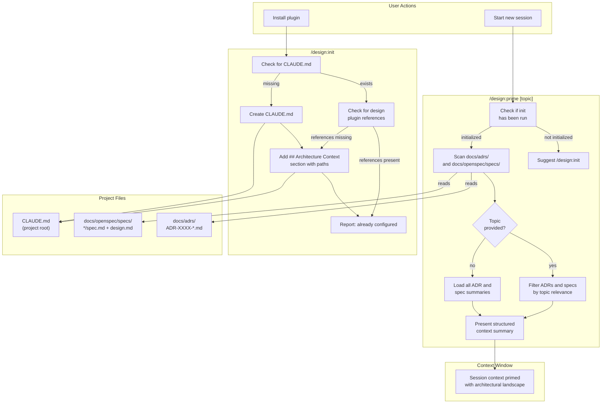

# ADR-0002: Add Initialization and Context-Priming Skills to the Design Plugin

## Context and Problem Statement

The design plugin currently provides skills for creating ADRs (`/design:adr`), specs (`/design:spec`), listing artifacts (`/design:list`), updating statuses (`/design:status`), and generating documentation (`/design:docs`), but it has no onboarding mechanism. When a user installs the plugin, there is no way to set up the project's `CLAUDE.md` with design-aware context, prime the context window with existing ADRs and specs so Claude understands the project's architectural landscape, or focus that priming on a specific topic to make sessions more productive.

How should the plugin provide initialization and context-priming capabilities so that new and returning users can get oriented quickly, and so that every Claude session starts with the architectural context it needs to give design-aware responses?

## Decision Drivers

* **First-run experience**: A user who just installed the plugin should be able to set up their project in one command, with `CLAUDE.md` correctly referencing `docs/adrs/` and `docs/openspec/specs/`
* **Session startup efficiency**: Returning users need a fast way to load relevant architectural context at the start of each session without manually reading files
* **Topic-focused priming**: Users working on a specific area (e.g., security, TUI, API) should be able to narrow the priming to relevant ADRs and specs rather than loading everything
* **Idempotency and safety**: Running initialization multiple times must not corrupt or duplicate content in `CLAUDE.md`; it should be safe to re-run at any time
* **Context window economy**: Priming should be selective -- loading all ADRs and specs into context wastes tokens when the user only cares about a subset
* **Separation of concerns**: One-time setup (creating/updating `CLAUDE.md`) and per-session priming (loading context) are conceptually different operations with different frequencies of use
* **Consistency with existing plugin UX**: New skills should follow the same conventions as existing skills (SKILL.md format, `argument-hint`, `--review` flag where appropriate)

## Considered Options

* **Option 1**: A single `/design:init` skill that handles both CLAUDE.md setup and context priming
* **Option 2**: Separate `/design:init` and `/design:prime` skills with distinct responsibilities
* **Option 3**: A single `/design:prime` skill that auto-detects whether init is needed and handles both

## Decision Outcome

Chosen option: "Option 2 -- Separate `/design:init` and `/design:prime` skills", because the two operations serve fundamentally different purposes at different frequencies. Initialization is a one-time (or rare) setup step that modifies project files, while priming is a per-session read-only operation that loads context. Separating them gives users clear mental models: `init` sets up the project, `prime` prepares a session. This avoids the confusion of a single command that sometimes writes files and sometimes does not, and it keeps each SKILL.md focused and maintainable. The slight cost of having two commands instead of one is offset by the clarity of intent and the ability to evolve each skill independently.

### Consequences

* Good, because `/design:init` can be run once (or after plugin updates) without any concern about context window usage -- it only modifies `CLAUDE.md`
* Good, because `/design:prime` can be run at the start of every session with a topic filter, giving users precise control over what context is loaded
* Good, because the separation makes each skill's SKILL.md simpler and easier to maintain
* Good, because `/design:prime [topic]` naturally supports topic filtering as a first-class feature, not an afterthought
* Good, because the two skills map to different points in the user journey: onboarding (`init`) vs. daily workflow (`prime`)
* Bad, because new users must learn two commands instead of one, and may not know they need to run `init` before `prime` is useful
* Bad, because two skills increases the plugin's command count from 5 to 7 (with the drift skills from ADR-0001, potentially 9)
* Neutral, because `/design:prime` can detect when `init` has not been run and suggest it, partially mitigating the two-command learning curve

### Confirmation

Implementation will be confirmed by:

1. `skills/init/SKILL.md` exists and follows the established SKILL.md format with appropriate frontmatter
2. `skills/prime/SKILL.md` exists and follows the established SKILL.md format with appropriate frontmatter
3. `/design:init` creates `CLAUDE.md` (or updates it) with an `## Architecture Context` section referencing `docs/adrs/` and `docs/openspec/specs/`, and is idempotent (running twice does not duplicate content)
4. `/design:prime` loads summaries of existing ADRs and specs into the context window and presents them in a structured format
5. `/design:prime [topic]` filters ADRs and specs by topic relevance, loading only those that match the topic keyword
6. `/design:prime` detects when `CLAUDE.md` lacks design plugin references and suggests running `/design:init` first
7. Both skills handle edge cases: no ADRs exist, no specs exist, `CLAUDE.md` already has the references, topic matches nothing

## Pros and Cons of the Options

### Option 1: Single `/design:init` Skill

A single `/design:init` skill that creates/updates `CLAUDE.md` with design plugin references and optionally primes the context window with existing ADRs and specs. Accepts an optional topic argument (e.g., `/design:init security`) to filter which artifacts are loaded into context after setup. First run does full setup plus priming; subsequent runs detect that `CLAUDE.md` is already configured and skip straight to priming.

* Good, because there is only one command for users to learn -- simple mental model for onboarding
* Good, because the first-run experience is seamless: one command does everything needed to get started
* Good, because the "init" name clearly communicates that this is the starting point
* Bad, because it conflates two different operations (file modification and context loading) behind one name, which may confuse users about what `/design:init` actually does on repeat runs
* Bad, because "init" implies a one-time operation, but priming is meant to be run every session -- users may think they only need to run it once
* Bad, because the SKILL.md becomes complex: it must handle conditional logic for first-run vs. repeat-run, optional topic filtering, and CLAUDE.md management all in one file
* Bad, because context window tokens are wasted if the user only wanted to update `CLAUDE.md` but the command also loaded all artifacts into context

### Option 2: Separate `/design:init` and `/design:prime` Skills

Two distinct skills with clear responsibilities:

- `/design:init` handles one-time project setup: creates `CLAUDE.md` if it does not exist, adds an `## Architecture Context` section with references to `docs/adrs/` and `docs/openspec/specs/`, and adds plugin usage hints. Idempotent and safe to re-run. Does not load artifacts into context.
- `/design:prime [topic]` handles per-session context loading: reads existing ADRs and specs, summarizes them, and presents them in structured form. Accepts an optional topic argument to filter by relevance (e.g., `/design:prime security` loads only security-related ADRs and specs). Detects if init has not been run and suggests it.

* Good, because each skill has a single, clear responsibility that matches its name
* Good, because `init` is obviously a setup command and `prime` is obviously a session command -- the names communicate intent
* Good, because topic filtering is a natural fit for `prime` and does not complicate `init`
* Good, because each SKILL.md stays focused and maintainable (under 100 lines each)
* Good, because `init` can evolve independently (e.g., adding plugin config, shared settings references) without affecting priming behavior
* Neutral, because `/design:prime` can gracefully handle the "init not run" case by suggesting `/design:init`, bridging the two-command gap
* Bad, because users must discover and understand two commands instead of one
* Bad, because a user who runs `/design:prime` before `/design:init` may get a suboptimal experience until they learn the intended order

### Option 3: Single `/design:prime` Skill That Handles Both

A smart `/design:prime [topic]` skill that checks if `CLAUDE.md` is set up with design plugin references. If not, it performs the init steps automatically (creating/updating `CLAUDE.md`), then proceeds to load context. First run does setup plus priming; subsequent runs skip setup and go straight to priming. The "init" concern is hidden inside `prime`.

* Good, because users only interact with one command that "just works" regardless of project state
* Good, because the first-run experience requires zero prior knowledge -- `/design:prime` handles everything
* Good, because topic filtering works the same way on first run and subsequent runs
* Bad, because the "prime" name does not communicate that it may modify project files (`CLAUDE.md`) -- this is a surprising side effect
* Bad, because users have no way to set up `CLAUDE.md` without also loading context into the window, which wastes tokens if they just want the file setup
* Bad, because the SKILL.md must handle conditional init logic, making it harder to maintain and test
* Bad, because if `CLAUDE.md` modification fails or produces unexpected results, the user has no separate command to retry just the init step
* Bad, because it violates the principle of least surprise -- a "prime" command that writes files breaks user expectations

## Architecture Diagram

## More Information

* This ADR was motivated by the observation that the design plugin has no onboarding story. Users install the plugin and must discover its capabilities through trial and error, with no way to orient Claude to the project's existing architectural landscape.
* The `/design:init` skill addresses a gap that is currently handled ad-hoc by individual skills: both `/design:adr` (line 36-41 of `skills/adr/SKILL.md`) and `/design:spec` (line 43-48 of `skills/spec/SKILL.md`) check for `CLAUDE.md` and offer to add references when creating the first artifact. A dedicated init skill centralizes this logic and ensures it runs before artifacts are created.
* The `/design:prime` skill is especially valuable in conjunction with the drift detection skills proposed in [ADR-0001](ADR-0001-drift-introspection-skills.md). Running `/design:prime` before `/design:check` or `/design:audit` ensures Claude has the full architectural context needed to accurately detect drift between design artifacts and code.
* Topic filtering in `/design:prime` should use semantic matching rather than simple keyword search. For example, `/design:prime security` should surface ADRs about authentication, authorization, encryption, and access control -- not just those with "security" in the title. This leverages Claude's natural language understanding as a strength.
* The `CLAUDE.md` content written by `/design:init` should include: references to `docs/adrs/` and `docs/openspec/specs/`, a brief explanation of the design plugin's skills, and a note that `/design:prime` can be used to load context at session start.
* Future work may include: `/design:init` setting up shared plugin settings (e.g., default review mode, preferred diagram types), integrating with the marketplace.json for version-aware initialization, or auto-running `/design:prime` via Claude Code hooks on session start.
