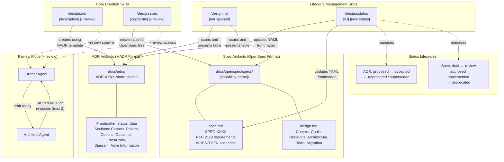

# ADR-0003: Foundational Design Artifact Formats and Core Skills

## Context and Problem Statement

The `design` plugin needed to establish standard formats for recording architectural decisions and formal specifications, along with utility skills for managing the lifecycle of these artifacts. Without standardized formats, teams would produce inconsistent documents that are hard to cross-reference, review, and maintain. Without management utilities, users would resort to manual file edits to list artifacts or update statuses.

What formats should the plugin adopt for ADRs and specifications, and what core skills are needed to create, list, and manage these design artifacts?

## Decision Drivers

* **Community adoption and tooling support**: Formats with established communities have better documentation, more examples, and interoperability with other tools
* **Structured format with clear sections**: Templates should guide authors toward completeness, ensuring decisions and requirements are not recorded as free-form prose
* **RFC 2119 compatibility for specifications**: Normative language (MUST, SHALL, MAY) enables unambiguous requirements that can be verified against code
* **Separation of "what" from "how"**: Specifications should separate requirements (what the system does) from design rationale (how and why), so each can evolve independently
* **Lifecycle management**: Artifacts move through statuses (proposed, accepted, deprecated for ADRs; draft, review, approved, implemented for specs) and need tooling to track transitions
* **Minimal but complete skill set**: The core skills should cover creation, discovery, and status management without requiring users to manually edit files or remember directory conventions
* **Consistent plugin UX**: All skills should follow the same patterns -- YAML frontmatter in SKILL.md, argument hints, and the `--review` flag for team-based drafting where appropriate

## Considered Options

### ADR Format Options

* MADR (Markdown Architectural Decision Records)
* Y-Statements
* Nygard format
* Custom format

### Specification Format Options

* OpenSpec with paired spec.md + design.md
* RFC-style single document
* Gherkin/BDD format
* Custom format

## Decision Outcome

Chosen option: "MADR for ADRs and OpenSpec with paired spec.md + design.md for specifications", because MADR provides a widely adopted, well-structured template that guides authors through context, options, and consequences, while OpenSpec's paired-document approach cleanly separates requirements from design rationale. These two formats are complemented by four core skills: `/design:adr` and `/design:spec` for artifact creation (with optional `--review` for team-based drafting), `/design:list` for discovery, and `/design:status` for lifecycle management.

### Consequences

* Good, because MADR's structured sections (Context, Decision Drivers, Considered Options, Pros and Cons) prevent incomplete decision records and encourage authors to articulate alternatives
* Good, because OpenSpec's paired spec.md + design.md separates "what" from "how", allowing requirements and design to evolve independently and be reviewed by different stakeholders
* Good, because RFC 2119 keywords in spec.md enable unambiguous normative statements that downstream skills (`/design:check`, `/design:audit`) can verify against code
* Good, because `/design:list` and `/design:status` provide lifecycle management without requiring users to manually edit YAML frontmatter or remember file paths
* Good, because the `--review` flag on `/design:adr` and `/design:spec` reuses a consistent team pattern (drafter + architect, max 2 revision rounds) across both creation skills
* Bad, because MADR's structured template adds overhead for trivial decisions that could be captured in a sentence
* Bad, because the paired spec.md + design.md requires authors to maintain two files per specification, increasing the surface area for drift between them
* Neutral, because adopting established formats means accepting their conventions even where a custom format might be a slightly better fit for this plugin's specific workflow

### Confirmation

Implementation will be confirmed by:

1. `skills/adr/SKILL.md` contains the complete MADR template with all required sections (Context, Decision Drivers, Considered Options, Decision Outcome, Pros and Cons, Architecture Diagram, More Information)
2. `skills/spec/SKILL.md` contains both spec.md and design.md templates, with RFC 2119 keywords documented and scenario format using `####` headings with WHEN/THEN
3. `skills/list/SKILL.md` scans both `docs/adrs/` and `docs/openspec/specs/` and presents results in a formatted table with ID, Title, Status, and Date columns
4. `skills/status/SKILL.md` supports all valid status transitions for both ADRs (proposed, accepted, deprecated, superseded) and specs (draft, review, approved, implemented, deprecated)
5. All four skills follow the established SKILL.md format with YAML frontmatter (`name`, `description`, `allowed-tools`, `argument-hint`)

## Pros and Cons of the Options

### ADR Format: MADR

[MADR](https://adr.github.io/madr/) (Markdown Architectural Decision Records) is a lean, structured template maintained by an active open-source community. Version 3.0 includes sections for context, decision drivers, considered options with pros/cons, decision outcome with consequences, and optional confirmation and more information sections.

* Good, because it is the most widely adopted ADR format with extensive community documentation and examples
* Good, because the structured sections (Decision Drivers, Considered Options, Pros and Cons) guide authors toward completeness rather than relying on discipline
* Good, because YAML frontmatter supports machine-readable metadata (status, date, decision-makers) that enables tooling like `/design:list` and `/design:status`
* Good, because the format is extensible -- the plugin adds an Architecture Diagram section with Mermaid support without breaking MADR compatibility
* Neutral, because MADR 3.0 made some sections optional (Confirmation, More Information) that previous versions required, giving authors flexibility
* Bad, because the full template has many sections, which can feel heavyweight for simple decisions

### ADR Format: Y-Statements

Y-Statements capture decisions as a single structured sentence: "In the context of [context], facing [concern], we decided for [option] to achieve [quality], accepting [downside]."

* Good, because the single-sentence format is extremely concise and fast to write
* Good, because the fixed structure ensures every Y-Statement captures context, concern, decision, goal, and tradeoff
* Bad, because the single-sentence format cannot accommodate detailed analysis of multiple options with pros and cons
* Bad, because there is no community-standard template for expanding Y-Statements into fuller documents when more detail is needed
* Bad, because the format does not support machine-readable metadata (status, date) without adding a custom wrapper

### ADR Format: Nygard Format

Michael Nygard's original ADR format from his 2011 blog post includes Title, Status, Context, Decision, and Consequences sections.

* Good, because it is the original ADR format and widely recognized
* Good, because the minimal structure (5 sections) keeps documents short and focused
* Bad, because it lacks sections for considered alternatives and their pros/cons, which means the rationale for choosing one option over another is often missing
* Bad, because there is no standard for frontmatter metadata, making tooling integration ad-hoc
* Bad, because the format has no maintained specification or versioning -- interpretations vary across teams

### ADR Format: Custom Format

A plugin-specific ADR template designed from scratch to fit the exact needs of the design plugin workflow.

* Good, because every section would be tailored to the plugin's specific requirements (e.g., mandatory Mermaid diagrams, review mode metadata)
* Good, because there would be no constraints from an external format's conventions
* Bad, because a custom format has zero community adoption, no external documentation, and no examples for users to reference
* Bad, because maintaining a custom format specification adds ongoing burden to the plugin maintainers
* Bad, because users who already know MADR or Nygard would need to learn a new format

### Specification Format: OpenSpec with Paired spec.md + design.md

[OpenSpec](https://github.com/Fission-AI/OpenSpec) separates specifications into a requirements document (spec.md) using RFC 2119 normative language and a companion design document (design.md) capturing architecture, rationale, and tradeoffs.

* Good, because separating "what" (spec.md) from "how" (design.md) allows each to be reviewed independently and by different stakeholders
* Good, because RFC 2119 keywords (MUST, SHALL, SHOULD, MAY) in spec.md provide unambiguous normative language that tools can parse and verify
* Good, because the WHEN/THEN scenario format in spec.md provides concrete, testable acceptance criteria for each requirement
* Good, because design.md's Decisions section with "Choice / Rationale / Alternatives considered" parallels MADR's decision structure, creating consistency across artifact types
* Neutral, because maintaining two files per specification increases the file count but provides clear separation of concerns
* Bad, because the paired-file approach means drift can occur between spec.md requirements and design.md architecture descriptions

### Specification Format: RFC-Style Single Document

A single markdown document modeled after IETF RFCs, combining requirements, design rationale, security considerations, and references in one file.

* Good, because everything about a capability is in one place -- no risk of drift between paired files
* Good, because the RFC format is universally recognized in software engineering
* Good, because RFC 2119 language is native to the format
* Bad, because single documents become very long for complex capabilities, mixing requirements with design rationale
* Bad, because different reviewers (product managers for requirements, architects for design) must wade through irrelevant sections
* Bad, because the format is rigid and verbose, with boilerplate sections (IANA Considerations, Security Considerations) that do not apply to most software specifications

### Specification Format: Gherkin/BDD

Requirements expressed as Gherkin features with Given/When/Then scenarios, optionally paired with a design document.

* Good, because Given/When/Then scenarios are directly executable as automated tests
* Good, because the format is widely known in the BDD community
* Bad, because Gherkin's strict syntax (Feature, Scenario, Given, When, Then, And) constrains how requirements can be expressed -- not all requirements fit the behavioral pattern
* Bad, because Gherkin is designed for test automation, not for capturing architectural decisions, tradeoffs, or non-functional requirements
* Bad, because the format does not support RFC 2119 normative language, making it impossible to express obligation levels (MUST vs. SHOULD vs. MAY)

### Specification Format: Custom Format

A plugin-specific specification template designed from scratch.

* Good, because every section would be optimized for the plugin's workflow
* Bad, because no community adoption or external tooling support
* Bad, because maintaining a custom specification format adds ongoing burden
* Bad, because users familiar with OpenSpec, RFCs, or Gherkin would need to learn something new

## Architecture Diagram

## More Information

* This ADR documents the foundational decisions that were made when the design plugin was first created. The MADR and OpenSpec format choices, along with the four core skills, form the base on which all subsequent plugin capabilities are built.
* [ADR-0001](ADR-0001-drift-introspection-skills.md) added `/design:check` and `/design:audit` skills that depend on the artifact formats defined here -- they read MADR and OpenSpec documents to detect drift between design artifacts and code.
* [ADR-0002](ADR-0002-init-and-context-priming-skill.md) added `/design:init` and `/design:prime` skills that depend on the directory conventions defined here -- they reference `docs/adrs/` and `docs/openspec/specs/` for initialization and context priming.
* The MADR template used by this plugin extends the standard MADR 3.0 format with a mandatory Architecture Diagram section requiring Mermaid diagrams. This was a deliberate choice to ensure every decision record includes a visual representation of the architecture or decision flow.
* The OpenSpec scenario format uses `####` headings (not `###` or bullet lists) with WHEN/THEN structure. This specific heading level was chosen to enable downstream tooling such as the `/design:docs` Docusaurus generator to reliably parse and render scenarios with requirement box components.
* The `/design:list` skill is intentionally read-only (allowed-tools: Read, Glob, Grep) to ensure it never accidentally modifies artifacts. Similarly, `/design:status` is limited to editing YAML frontmatter and will not alter document content.
