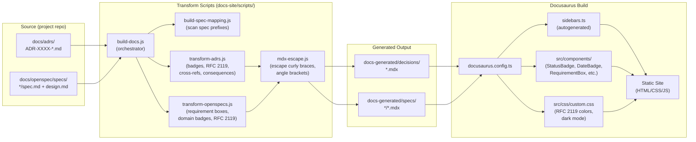

# ADR-0004: Docusaurus for Documentation Site Generation

## Context and Problem Statement

Teams using the `design` plugin accumulate ADRs in `docs/adrs/` and OpenSpec specifications in `docs/openspec/specs/`. These markdown files are useful in a repository, but they lack discoverability: there is no search, no cross-referencing between documents, no visual distinction for RFC 2119 keywords, and no way to share a browsable site with stakeholders who do not use Git.

How should the plugin provide documentation site generation so that teams can publish their ADRs and specs as a polished, searchable, browsable website?

## Decision Drivers

* **Static site generation**: The output must be a static site that can be hosted on GitHub Pages, Netlify, or any CDN without a backend
* **React component support**: ADRs and specs need custom visual components (status badges, RFC 2119 keyword highlighting, requirement boxes, consequence keyword coloring) that go beyond what plain markdown renderers offer
* **MDX support**: The transform pipeline needs to inject JSX components into markdown content; the chosen platform must natively support MDX
* **Mermaid diagram rendering**: ADRs and specs include Mermaid diagrams by convention; the platform must render them without external plugins or fragile workarounds
* **Low maintenance**: The docs skill should scaffold a site that works out of the box and does not require users to maintain custom build infrastructure
* **Template-based approach**: The plugin should ship production-ready templates that are copied into the user's project and then customized, keeping the plugin itself simple and the user's site fully under their control

## Considered Options

* **Option 1**: Docusaurus with MDX and a template-based scaffolding approach
* **Option 2**: MkDocs with Material theme
* **Option 3**: VitePress
* **Option 4**: Astro Starlight

## Decision Outcome

Chosen option: "Option 1 -- Docusaurus with MDX and template-based scaffolding", because it provides the best combination of React component support, native MDX, built-in Mermaid rendering, and a mature ecosystem. The template-based approach (copy templates into the project, customize two files, run `npm install`) keeps the plugin simple while giving users full ownership of their docs site.

The implementation follows a transform pipeline architecture: source markdown files are read from the project's `docs/` directory, transformed by Node.js scripts that inject custom React components and MDX-safe syntax, and written to a `docs-generated/` directory that Docusaurus serves.

### Consequences

* Good, because Docusaurus's React component model enables rich visual elements (StatusBadge, DateBadge, RequirementBox, RFC 2119 keyword highlighting) that make ADRs and specs genuinely more readable
* Good, because the template-based approach means the plugin has zero runtime dependencies -- it copies files and the user owns the result
* Good, because Mermaid diagrams render natively via `@docusaurus/theme-mermaid` without custom plugins
* Good, because the transform pipeline cleanly separates concerns: markdown source files remain pure markdown, while MDX generation is a build-time step
* Good, because users can customize the Docusaurus site (add pages, change theme, add plugins) without modifying the plugin itself
* Bad, because the transform scripts must handle MDX v3 escaping (curly braces, angle brackets), which adds complexity to the build pipeline
* Bad, because Docusaurus requires Node.js >= 20, adding a runtime dependency for documentation generation
* Neutral, because the `docs-generated/` directory is a build artifact that must be gitignored, adding a step to the project's setup

### Confirmation

Implementation will be confirmed by:

1. The `/design:docs` skill (in `skills/docs/SKILL.md`) scaffolds a working Docusaurus site from the `templates/docusaurus/` directory
2. The transform pipeline correctly converts ADR markdown into MDX with status badges, RFC 2119 keyword highlighting, ADR cross-references, and consequence keyword coloring
3. The transform pipeline correctly converts OpenSpec markdown into MDX with requirement boxes, domain badges, spec cross-references, and RFC 2119 highlighting
4. The MDX escaping utility handles curly braces, angle brackets, and other MDX v3 unsafe patterns without breaking JSX components
5. `npm run dev` starts a working development server and `npm run build` produces a deployable static site
6. The site includes auto-generated sidebars for both ADRs and specs

## Pros and Cons of the Options

### Option 1: Docusaurus with MDX and Template-Based Scaffolding

A complete Docusaurus site shipped as templates in `templates/docusaurus/`. The `/design:docs` skill copies these templates into `docs-site/` in the user's project, customizes `package.json` and `docusaurus.config.ts` for the project, and runs `npm install`. Build-time transform scripts convert source markdown into MDX with custom React components.

* Good, because Docusaurus has native MDX support, allowing JSX components to be embedded directly in generated documentation
* Good, because `@docusaurus/theme-mermaid` provides first-class Mermaid rendering with no configuration needed beyond enabling the theme
* Good, because React components (StatusBadge, DateBadge, DomainBadge, RequirementBox, etc.) can be registered globally via MDXComponents.tsx and used across all pages
* Good, because the `docs` preset handles routing, sidebar generation, search, dark mode, and versioning out of the box
* Good, because the template-based approach (copy, customize, build) is simple to implement in the plugin and gives users full control
* Good, because the dev server with hot reload (`npm run dev`) and file watching (`chokidar`) provides a fast feedback loop when editing ADRs and specs
* Bad, because MDX v3 is strict about JSX syntax -- curly braces, angle brackets, and other characters must be escaped in content, requiring a dedicated `mdx-escape.js` utility
* Bad, because Docusaurus sites are relatively heavy (large `node_modules`) compared to lighter static site generators
* Bad, because the transform pipeline (5 scripts) adds build complexity that users must understand if they want to customize transforms

### Option 2: MkDocs with Material Theme

Use MkDocs with the Material for MkDocs theme to generate documentation from markdown files. MkDocs is Python-based and uses Jinja2 templates for customization.

* Good, because MkDocs is lightweight and fast to build
* Good, because Material for MkDocs has excellent search, navigation, and dark mode built in
* Good, because Python is often already available in development environments
* Bad, because MkDocs uses standard markdown with limited extension points -- no native JSX component support
* Bad, because custom components (badges, requirement boxes, RFC 2119 highlighting) would require Jinja2 macros or custom plugins, which are less expressive than React components
* Bad, because Mermaid support requires the `pymdownx.superfences` extension with custom configuration
* Bad, because the plugin team has deeper expertise in TypeScript/React than Python, increasing maintenance burden

### Option 3: VitePress

Use VitePress (Vue-based) to generate documentation. VitePress supports Vue components in markdown and has a fast Vite-powered dev server.

* Good, because VitePress is extremely fast (Vite-powered HMR and builds)
* Good, because Vue components can be embedded in markdown for custom rendering
* Good, because the default theme is clean and includes dark mode, search, and sidebar generation
* Bad, because the plugin ecosystem is smaller than Docusaurus -- fewer community plugins for features like Mermaid
* Bad, because Vue components require a different mental model than React, and the rest of the Docusaurus ecosystem (components, themes) is React-based
* Bad, because MDX is not natively supported -- VitePress uses Vue's template syntax in markdown, which has different escaping rules and limitations
* Bad, because cross-reference linking and RFC 2119 keyword transforms would need to be implemented as Vite plugins or markdown-it plugins, which have a different API surface

### Option 4: Astro Starlight

Use Astro with the Starlight documentation theme. Astro supports multiple component frameworks (React, Vue, Svelte) and generates static HTML with minimal JavaScript.

* Good, because Astro produces the smallest output bundles (minimal client-side JavaScript)
* Good, because Starlight is purpose-built for documentation with excellent defaults
* Good, because Astro supports React components, so existing component code could be reused
* Good, because MDX is supported as a first-class content format
* Bad, because Starlight is newer and less mature than Docusaurus -- fewer examples, smaller community, more frequent breaking changes
* Bad, because Mermaid support requires additional configuration and does not work as seamlessly as Docusaurus's theme-mermaid
* Bad, because Astro's island architecture adds conceptual overhead for what is fundamentally a content-only site

## Transform Pipeline

The following diagram shows how source markdown flows through the build pipeline to produce the final static site:



## More Information

### Template Directory Structure

The plugin ships production-ready templates in `templates/docusaurus/`:

```
templates/docusaurus/
├── docusaurus.config.ts      # Site config (title, URLs, Mermaid theme)
├── package.json              # Dependencies (Docusaurus 3.9, React 18)
├── sidebars.ts               # Autogenerated from docs-generated/
├── tsconfig.json
├── scripts/
│   ├── build-docs.js         # Orchestrator: runs all transforms
│   ├── build-spec-mapping.js # Scans specs for ID prefixes
│   ├── transform-adrs.js     # ADR → MDX with badges + highlighting
│   ├── transform-openspecs.js# Spec → MDX with requirement boxes
│   ├── transform-utils.js    # Shared: RFC 2119, cross-refs, link fixing
│   └── mdx-escape.js         # MDX v3 safety (curly braces, brackets)
└── src/
    ├── components/            # React components for MDX
    │   ├── StatusBadge.tsx    # Accepted/proposed/draft/deprecated
    │   ├── DateBadge.tsx      # Calendar date display
    │   ├── DomainBadge.tsx    # Domain/category badge
    │   ├── RequirementBox.tsx # Bordered box with ID anchor
    │   ├── Field.tsx          # Label-value metadata pair
    │   └── FieldGroup.tsx     # Horizontal field layout
    ├── theme/
    │   └── MDXComponents.tsx  # Global component registration
    └── css/
        └── custom.css         # RFC 2119 colors, dark mode, badges
```

### Key Design Decisions Within the Implementation

* **Copy-then-customize**: The `/design:docs` skill uses `cp -r` to copy the entire template directory, then modifies only `package.json` (project name) and `docusaurus.config.ts` (title, URLs). This means the templates are production-ready defaults, not skeletons that require extensive filling in.
* **Separate `docs-generated/` directory**: Transform output goes to `docs-generated/` at the project root rather than into `docs-site/docs/`. This keeps generated MDX out of the Docusaurus source tree and makes it clear what is a build artifact versus source.
* **File watching with chokidar**: The `npm run dev` script uses `concurrently` to run both the chokidar file watcher (re-running transforms when ADRs or specs change) and the Docusaurus dev server, so edits to source markdown are reflected in the browser automatically.
* **MDX escaping as a separate utility**: Rather than scattering escape logic across transform scripts, all MDX v3 escaping is centralized in `mdx-escape.js`. This utility preserves JSX component tags while escaping literal curly braces and angle brackets that MDX would interpret as expressions.
* **Auto-discovered domain config**: The spec transform auto-discovers domains from the directory structure rather than requiring manual configuration, reducing setup friction.

### Related Decisions

* ADR-0001 introduced `/design:check` and `/design:audit`, which produce findings that appear in the generated documentation site.
* The OpenSpec format (spec.md + design.md paired files) directly influences the spec transform pipeline, which must handle both file types with different metadata extraction and component injection strategies.
