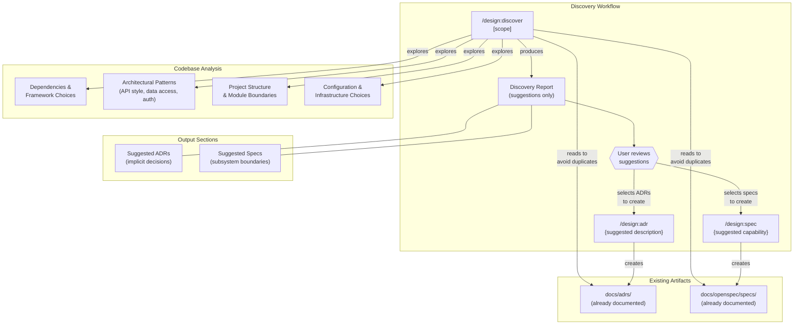

# ADR-0005: Add a Codebase Discovery Skill for Reverse-Engineering Design Artifacts

## Context and Problem Statement

The design plugin currently assumes a "decisions first, code second" workflow: users create ADRs and specs, then write code that implements them. However, most real-world projects already have a codebase with implicit architectural decisions baked into the code, dependencies, and project structure. There is no skill that bridges this gap -- a developer adopting the design plugin on an existing project has no way to bootstrap their ADR and spec library from what already exists.

How should the plugin help users discover implicit architectural decisions and specification-worthy subsystems in an existing codebase, so they can selectively formalize them as ADRs and specs?

## Decision Drivers

* **Existing project onboarding**: The most common adoption path is adding the plugin to a project that already has code, not starting greenfield
* **User agency over artifact creation**: Discovery should recommend, not auto-generate -- users must choose which decisions and specs are worth formalizing
* **Read-only analysis**: The discovery skill should not create files; it produces a report that the user acts on with existing skills (`/design:adr`, `/design:spec`)
* **Composability with existing skills**: The output should naturally feed into the existing creation workflow rather than introducing a parallel path
* **Breadth of analysis**: Discovery should cover technology choices, architectural patterns, API boundaries, data models, and project structure -- not just one dimension
* **Actionable output**: Each suggestion should include enough context (rationale, evidence from code) that the user can immediately run `/design:adr` or `/design:spec` with a clear description

## Considered Options

* **Option 1**: A single `/design:discover` skill that produces a report of suggested ADRs and specs
* **Option 2**: Two separate skills -- `/design:discover:adrs` for decision discovery and `/design:discover:specs` for spec boundary discovery
* **Option 3**: Extend `/design:audit` with a `--discover` flag to add discovery to the existing audit workflow
* **Option 4**: A `/design:discover` skill that automatically generates draft ADRs and specs

## Decision Outcome

Chosen option: "Option 1 -- A single `/design:discover` skill that produces a report", because it keeps the plugin's surface area minimal (one new skill), maintains user control by only suggesting artifacts rather than creating them, and naturally feeds into the existing `/design:adr` and `/design:spec` workflows. A single skill can analyze both implicit decisions and spec boundaries in one pass since they draw on the same codebase exploration.

### Consequences

* Good, because existing projects can bootstrap their design artifact library with a single command
* Good, because the read-only, suggestion-based approach means users maintain full control over what gets formalized
* Good, because the output provides ready-to-use descriptions that can be passed directly to `/design:adr` and `/design:spec`
* Good, because one skill addition is minimal surface area (9 skills to 10)
* Bad, because comprehensive codebase analysis may be slow on large projects -- the skill needs scope controls
* Bad, because the quality of suggestions depends heavily on codebase conventions and how explicit the code structure is
* Neutral, because the skill complements but does not replace manual architectural review -- it accelerates the process but still requires human judgment

### Confirmation

Implementation will be confirmed by:

1. `skills/discover/SKILL.md` exists and follows the established SKILL.md format with YAML frontmatter
2. The skill produces a structured report with two sections: Suggested ADRs and Suggested Specs
3. Each suggestion includes a title, evidence from the codebase, and a ready-to-use description for the corresponding creation skill
4. The skill is read-only (allowed-tools limited to Read, Glob, Grep, and Task for parallel exploration)
5. The skill accepts an optional scope argument to limit analysis to a subdirectory or domain
6. The skill accounts for existing ADRs and specs, avoiding suggestions that duplicate already-documented decisions
7. Running `/design:discover` on the design plugin's own codebase produces meaningful suggestions

## Pros and Cons of the Options

### Option 1: Single `/design:discover` Skill with Report Output

A single new skill that explores the codebase, identifies implicit architectural decisions and specification-worthy subsystems, and produces a structured report of suggestions. The user then selectively runs `/design:adr` and `/design:spec` to formalize the ones they want.

* Good, because one skill keeps the command surface minimal and easy to discover
* Good, because analyzing decisions and spec boundaries in a single pass leverages overlapping codebase exploration (e.g., understanding the auth system reveals both "chose JWT over sessions" and "auth API is a spec boundary")
* Good, because the suggestion-only approach respects user agency -- no files are created without explicit action
* Good, because the output format can include copy-paste-ready descriptions for `/design:adr` and `/design:spec` invocations
* Neutral, because a single skill must cover a broad analysis scope, making the SKILL.md prompt more complex
* Bad, because on very large codebases, analyzing everything in one pass may be slow without scope controls

### Option 2: Two Separate Discovery Skills

Split discovery into `/design:discover:adrs` (finds implicit decisions) and `/design:discover:specs` (finds specification boundaries), each with a focused scope.

* Good, because each skill has a tightly focused responsibility and a simpler SKILL.md
* Good, because users can run only the type of discovery they need
* Bad, because two skills doubles the surface area addition and introduces a sub-namespace pattern (`discover:adrs`) not used elsewhere in the plugin
* Bad, because decision discovery and spec boundary discovery overlap significantly -- the same codebase exploration informs both, leading to redundant analysis
* Bad, because users who want both types of suggestions must run two commands and mentally merge the results

### Option 3: Extend `/design:audit` with a `--discover` Flag

Add a `--discover` flag to the existing `/design:audit` skill that, in addition to checking for drift, also identifies areas of the codebase that lack governing ADRs or specs and suggests new artifacts.

* Good, because it reuses an existing skill rather than adding a new one
* Good, because discovery and audit are conceptually related -- both analyze the relationship between code and design artifacts
* Bad, because it overloads `/design:audit` with a fundamentally different purpose: audit validates existing artifacts, discovery suggests new ones
* Bad, because the audit skill's report format (findings table with severity levels) is not well-suited to discovery suggestions, which need descriptive context rather than severity ratings
* Bad, because audit already supports `--review` for team mode, and combining discovery with audit in team mode creates ambiguity about what the reviewer should validate

### Option 4: Auto-Generating Draft ADRs and Specs

A `/design:discover` skill that not only identifies implicit decisions and spec boundaries but automatically creates draft ADRs (with status `proposed`) and draft specs (with status `draft`) in the appropriate directories.

* Good, because users get immediate artifacts they can review and refine rather than a report they must act on
* Good, because the creation step is automated, reducing friction between discovery and formalization
* Bad, because auto-generated artifacts may be low quality, polluting the design artifact directories with drafts the user never wanted
* Bad, because it removes user agency -- the user cannot choose which suggestions to formalize before files are created
* Bad, because cleanup of unwanted artifacts requires manual deletion or additional tooling
* Bad, because it conflates two concerns (analysis and creation) that the plugin's existing architecture deliberately separates

## Architecture Diagram

## More Information

* This ADR addresses the "cold start" problem for the design plugin: the gap between installing the plugin and having a useful set of design artifacts. Without discovery, users must manually identify which decisions and subsystems to document, which requires the same architectural knowledge the plugin is meant to capture.
* The discovery skill is the inverse of `/design:check` and `/design:audit`. Those skills ask "does code match existing artifacts?" while discover asks "what artifacts does this code imply?"
* Related: [ADR-0001](ADR-0001-drift-introspection-skills.md) introduced `/design:check` and `/design:audit` for forward validation (artifacts → code). This ADR adds the reverse direction (code → artifact suggestions).
* Related: [ADR-0003](ADR-0003-foundational-skills-and-artifact-formats.md) defined the MADR and OpenSpec formats that discovered artifacts would be created in.
* The skill should check for existing ADRs and specs before making suggestions, to avoid recommending artifacts that already exist. This makes `/design:discover` safe to re-run as the project evolves.
* Future enhancement: the discovery report could include a confidence level for each suggestion (high/medium/low) based on how much evidence was found in the codebase.
