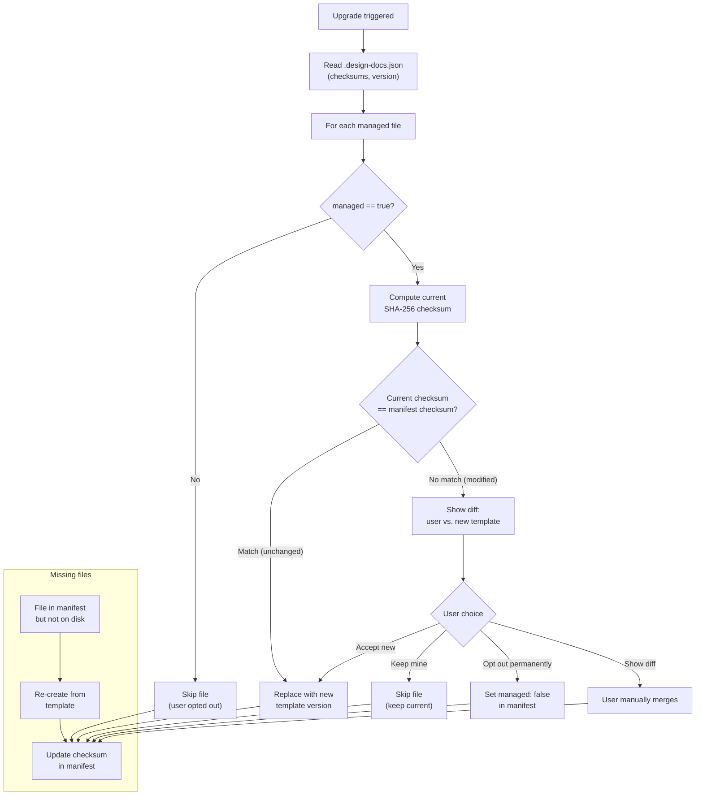
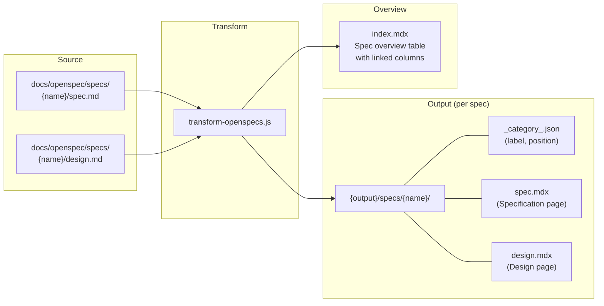

# ADR-0006: Docs Integration Mode, Upgrade Lifecycle, and Spec/Design Page Separation

## Context and Problem Statement

ADR-0004 established Docusaurus with template-based scaffolding as the documentation generation approach. Since that decision, three interconnected problems have emerged that limit the usefulness and maintainability of `/design:docs`.

**Problem 1: No integration with existing Docusaurus sites.** The current `/design:docs` skill only scaffolds a standalone `docs-site/` directory. Projects that already have a Docusaurus documentation site cannot use the design docs capability without maintaining two separate sites. There is no way to embed ADR and spec documentation into an existing site's navigation and search.

**Problem 2: No upgrade path when the plugin evolves.** The scaffold approach is fire-and-forget: templates are copied once and the user owns the result. When the plugin ships improvements to transforms, components, or styles, there is no mechanism to pull those changes into an existing installation. Users must manually diff and merge, which is error-prone and discourages upgrades.

**Problem 3: Spec and design documents share a single page.** The current spec transform combines `spec.md` and `design.md` into a single long page per specification. This makes it difficult to link directly to either document, clutters the sidebar, and forces readers to scroll past requirements to reach design decisions (or vice versa).

How should the plugin extend its documentation generation to support existing Docusaurus sites, provide a safe upgrade mechanism, and improve the information architecture of spec documentation?

## Decision Drivers

* **Existing site compatibility**: Many projects already have Docusaurus sites; the plugin must work with them, not replace them
* **Upgrade safety**: Users who customize generated files must not lose their changes when upgrading
* **Minimal disruption**: Integration into an existing site should not break existing pages, navigation, or theme configuration
* **Separation of concerns**: Spec requirements and design decisions serve different audiences and should be independently navigable
* **Discoverability**: All specs should be browsable from a single overview page with links to both sub-documents
* **Simplicity**: The upgrade mechanism must be understandable without reading source code

## Considered Options

### For integration with existing sites

* **Option A**: Dual-mode with Docusaurus plugin (scaffold vs. integration)
* **Option B**: Universal plugin-only approach (remove scaffold mode)
* **Option C**: Git submodule linking

### For upgrade lifecycle

* **Option D**: Manifest-based upgrade with checksum tracking
* **Option E**: Git-based diffing against plugin version tags
* **Option F**: No upgrade support (re-scaffold and re-customize)

### For spec/design page structure

* **Option G**: Directory-per-spec with separate pages and sidebar categories
* **Option H**: Single page with tabs for spec vs. design
* **Option I**: Keep combined single page (status quo)

## Decision Outcome

Chosen options:
- **Option A** (dual-mode with Docusaurus plugin) for site integration, because scaffold mode's zero-configuration simplicity remains valuable for greenfield projects, while integration mode addresses the real gap for teams with existing sites. Option B would sacrifice that simplicity; Option C's git submodule approach creates friction on every update.
- **Option D** (manifest-based upgrade with checksum tracking) for upgrade lifecycle, because it works in any environment without requiring git operations (unlike Option E), and it precisely distinguishes user customizations from untouched files. Option F's "re-scaffold and re-customize" approach would discourage upgrades entirely.
- **Option G** (directory-per-spec with separate pages) for spec/design structure, because separate pages are independently searchable in Docusaurus (unlike Option H's tabs, where inactive tab content is invisible to search) and independently linkable. Option I's combined page forces readers to navigate a single long document.

These three decisions work together: integration mode uses a Docusaurus build-time plugin that can be upgraded via the manifest, and the spec/design separation applies to the output of both scaffold and integration modes.

### Consequences

* Good, because projects with existing Docusaurus sites can add design documentation without a second site
* Good, because the manifest tracks exactly which files are managed and whether they have been customized, making upgrades predictable
* Good, because separate spec and design pages improve navigation and allow direct linking to either document
* Good, because the integration plugin reuses the same transform pipeline as scaffold mode, keeping behavior consistent
* Good, because the detection step (scanning for `docusaurus.config.*`) automatically guides users to the right mode
* Bad, because two modes (scaffold and integration) increase the surface area of the skill and its documentation
* Bad, because the manifest adds a new file (`.design-docs.json`) that users must understand and not delete
* Bad, because directory-per-spec output changes the URL structure, which may break existing bookmarks or links to spec pages
* Neutral, because the upgrade mechanism adds complexity but prevents the worse outcome of users falling permanently behind on improvements

### Confirmation

Implementation will be confirmed by:

1. Running `/design:docs` on a project with an existing Docusaurus site detects it and offers integration mode
2. Integration mode installs the sync plugin, components, CSS, and MDX registrations into the existing site without breaking it
3. Running `/design:docs` on a project without an existing site proceeds with scaffold mode as before
4. A `.design-docs.json` manifest is created in both modes, tracking mode, version, site directory, and file checksums
5. Re-running `/design:docs` on an already-configured project triggers upgrade flow: unchanged files are updated in place, modified files prompt the user with a diff
6. Specs with both `spec.md` and `design.md` produce two separate pages under an expandable sidebar category
7. Specs with only `spec.md` (no `design.md`) produce a single page without a category wrapper
8. An overview index page lists all specs with linked columns for Specification and Design documents
9. Files with `managed: false` in the manifest are skipped during upgrades, and users can permanently opt files out during the upgrade prompt

## Pros and Cons of the Options

### Option A: Dual-Mode with Docusaurus Plugin (Scaffold vs. Integration)

Detect existing Docusaurus sites by scanning for `docusaurus.config.{ts,js}` in common locations (`website/`, `docs-site/`, `docs/`, `./`). If found, offer integration mode. Otherwise, default to scaffold mode. Integration mode copies a self-contained Docusaurus plugin (`sync-design-docs`) into the existing site's `plugins/` directory, along with React components namespaced under `design-docs/` to avoid collisions.

* Good, because it works for both greenfield projects (scaffold) and existing documentation sites (integration)
* Good, because the integration plugin is self-contained and uses standard Docusaurus plugin APIs (`loadContent`, `getPathsToWatch`)
* Good, because namespacing components under `design-docs/` prevents collisions with existing components
* Good, because detection is automatic -- users don't need to know which mode to choose
* Bad, because maintaining two modes increases testing and documentation burden
* Bad, because differences between scaffold and integration transforms (parameterized paths vs. `__dirname`-relative) must be kept in sync

### Option B: Universal Plugin-Only Approach

Remove scaffold mode entirely. Always generate a Docusaurus plugin that can be used in any site, providing a minimal site skeleton for projects that don't have one.

* Good, because there is only one code path to maintain
* Good, because the plugin approach is more aligned with the Docusaurus ecosystem
* Bad, because it removes the simple "copy and run" experience that scaffold mode provides
* Bad, because projects without Docusaurus would need to install and configure it from scratch rather than getting a working site in one step
* Bad, because it is a breaking change for existing users of scaffold mode

### Option C: Git Submodule Linking

Use git submodules to link the plugin's template directory into the project, so updates come via `git submodule update`.

* Good, because git handles versioning and updates natively
* Bad, because git submodules are widely considered difficult to work with and error-prone
* Bad, because users cannot customize files without creating merge conflicts on every update
* Bad, because it requires the plugin to be a separate git repository, complicating the distribution model

### Option D: Manifest-Based Upgrade with Checksum Tracking

Create a `.design-docs.json` manifest when `/design:docs` first runs. The manifest records the plugin version, mode (scaffold or integration), site directory path, and SHA-256 checksums of all managed files at the time of installation. On subsequent runs, the skill compares current file checksums against the manifest to classify each file as unchanged (safe to replace), modified (show diff and ask), or missing (re-create).

* Good, because checksums precisely detect whether a user has customized a managed file
* Good, because unchanged files can be updated silently, minimizing user interaction
* Good, because the manifest is a single JSON file that is easy to inspect and understand
* Good, because it works for both scaffold and integration modes with the same mechanism
* Bad, because it adds a new file to the project root that must be committed to version control
* Bad, because if the manifest is deleted, the upgrade path is lost (must fall back to full re-scaffold)

### Option E: Git-Based Diffing Against Plugin Version Tags

Compare the user's files against the plugin's tagged releases using `git diff` to determine what has changed.

* Good, because it leverages git's built-in diffing capabilities
* Bad, because it requires the plugin to be available as a git repository at upgrade time
* Bad, because it cannot distinguish between user customizations and plugin changes without a common ancestor
* Bad, because it adds a dependency on git operations that may fail in CI or restricted environments

### Option F: No Upgrade Support

Users who want improvements must delete and re-scaffold, then re-apply customizations manually.

* Good, because it is the simplest approach with no additional mechanism needed
* Bad, because it discourages users from upgrading, leading to permanent drift
* Bad, because re-applying customizations is tedious and error-prone
* Bad, because it contradicts the goal of the plugin evolving and improving over time

### Option G: Directory-Per-Spec with Separate Pages and Sidebar Categories

Transform each spec into a directory containing up to two MDX files (`spec.mdx` and `design.mdx`) with a `_category_.json` for sidebar configuration. The sidebar shows each spec as an expandable category with "Specification" and "Design" as sub-items. Generate an overview index page listing all specs in a table with linked Specification and Design columns.

* Good, because spec requirements and design decisions are independently linkable and navigable
* Good, because the sidebar structure mirrors the logical structure (spec = category, documents = pages)
* Good, because the overview index provides a single entry point for browsing all specs
* Good, because `_category_.json` is the standard Docusaurus mechanism for sidebar configuration, requiring no custom sidebar logic
* Bad, because it changes the URL structure from `/specs/{name}` to `/specs/{name}/spec` and `/specs/{name}/design`, breaking existing links
* Bad, because specs without a `design.md` require special handling -- the transform must detect the missing file and emit a single page without a category wrapper, adding a conditional code path

### Option H: Single Page with Tabs

Keep a single page per spec but add a tab component to switch between Specification and Design views.

* Good, because it preserves the current URL structure
* Good, because tabs are a familiar UI pattern for toggling between related content
* Bad, because tabs hide content from search -- the non-active tab's content is not visible to Docusaurus search
* Bad, because it requires a custom Tab component and state management that adds complexity
* Bad, because deep linking to a specific section within a tab is more complex than linking to a separate page

### Option I: Keep Combined Single Page (Status Quo)

Continue combining spec.md and design.md into a single page.

* Good, because no changes are needed
* Bad, because long combined pages are hard to navigate
* Bad, because there is no way to link directly to just the design decisions without scrolling
* Bad, because the sidebar shows a flat list without logical grouping

## Architecture Diagrams

### Mode Detection and Selection Flow

```mermaid
flowchart TD
    start["/design:docs invoked"] --> preflight["Pre-flight checks\n(Node.js, artifacts)"]
    preflight --> scan["Scan for existing\ndocusaurus.config.*"]
    scan --> found{Existing site\nfound?}
    found -->|Yes| ask["Ask user:\nIntegrate or Scaffold?"]
    found -->|No| manifest_check_s{"`.design-docs.json`\nexists?"}
    ask -->|Integrate| manifest_check_i{"`.design-docs.json`\nexists?"}
    ask -->|Scaffold| manifest_check_s

    manifest_check_s -->|Yes| upgrade_s["Upgrade Flow\n(scaffold mode)"]
    manifest_check_s -->|No| scaffold["Scaffold Mode\n(copy templates)"]
    manifest_check_i -->|Yes| upgrade_i["Upgrade Flow\n(integration mode)"]
    manifest_check_i -->|No| integrate["Integration Mode\n(install plugin)"]

    scaffold --> write_manifest["Write .design-docs.json\n(version, mode, checksums)"]
    integrate --> write_manifest
    upgrade_s --> update_manifest["Update .design-docs.json\n(new version, checksums)"]
    upgrade_i --> update_manifest
```

### Upgrade Flow Detail



### Spec Output Structure (Directory-Per-Spec)



## More Information

### `.design-docs.json` Manifest Schema

```json
{
  "version": "1.3.0",
  "mode": "scaffold",
  "siteDir": "docs-site",
  "createdAt": "2026-02-19T00:00:00Z",
  "updatedAt": "2026-02-19T00:00:00Z",
  "files": {
    "docs-site/scripts/transform-adrs.js": {
      "checksum": "sha256:abc123...",
      "managed": true
    },
    "docs-site/src/components/StatusBadge.tsx": {
      "checksum": "sha256:def456...",
      "managed": true
    }
  }
}
```

Key fields:
- **version**: The plugin version at install/upgrade time
- **mode**: `"scaffold"` or `"integration"`
- **siteDir**: Path to the Docusaurus site directory relative to project root
- **files**: Map of managed file paths to their checksums and managed status
- **managed**: If `true`, the file is eligible for automatic upgrade. Users can set this to `false` to permanently opt a file out of upgrades.

### Integration Mode File Layout

When integration mode installs into an existing site at `{site}/`:

```
{site}/
├── plugins/
│   └── sync-design-docs/       # Build-time Docusaurus plugin
│       ├── index.js             # Plugin entry (loadContent, getPathsToWatch)
│       └── lib/                 # Transform scripts (parameterized paths)
│           ├── transform-adrs.js
│           ├── transform-openspecs.js
│           ├── transform-utils.js
│           ├── mdx-escape.js
│           ├── build-spec-mapping.js
│           └── generate-index.js
├── src/
│   ├── components/
│   │   └── design-docs/         # Namespaced React components (9 total)
│   │       ├── StatusBadge.tsx
│   │       ├── DateBadge.tsx
│   │       ├── DomainBadge.tsx
│   │       ├── PriorityBadge.tsx
│   │       ├── SeverityBadge.tsx
│   │       ├── RFCLevelBadge.tsx
│   │       ├── RequirementBox.tsx
│   │       ├── Field.tsx
│   │       └── FieldGroup.tsx
│   ├── css/
│   │   └── design-docs.css      # Design-specific styles (no theme overrides)
│   └── theme/
│       └── MDXComponents.tsx     # Merged with existing registrations
└── docs/
    └── architecture/             # Generated output (gitignored)
        ├── index.mdx
        ├── decisions/
        │   └── *.mdx
        └── specs/
            └── {name}/
                ├── _category_.json
                ├── spec.mdx
                └── design.mdx
```

### Spec/Design Sidebar Rendering

The sidebar renders specs as expandable categories:

```
Specifications
├── Docs Generation
│   ├── Specification
│   └── Design
├── Drift Introspection
│   ├── Specification
│   └── Design
└── Init and Priming
    └── Specification        (no design.md → single page, no category)
```

The `_category_.json` for each spec directory:

```json
{
  "label": "Docs Generation",
  "collapsed": true,
  "position": 4
}
```

### Spec Overview Index Page

The generated `index.mdx` includes a table linking to all spec documents:

| Component | Documents |
|-----------|-----------|
| Docs Generation | [Specification](./docs-generation/spec) / [Design](./docs-generation/design) |
| Drift Introspection | [Specification](./drift-introspection/spec) / [Design](./drift-introspection/design) |
| Init and Priming | [Specification](./init-and-priming/spec) |

### Detection Heuristic for Existing Sites

The skill scans for `docusaurus.config.ts` or `docusaurus.config.js` in these locations (excluding `docs-site/` and `node_modules/`):

1. Project root (`./`)
2. `website/`
3. `docs/`
4. Any directory at depth 1 or 2

If multiple sites are found, the skill asks the user which one to integrate with.

### Relationship to Existing Decisions

- **Extends ADR-0004**: This ADR builds on the Docusaurus scaffolding decision by adding integration mode as an alternative deployment model, an upgrade lifecycle, and improved spec output structure. ADR-0004's scaffold mode remains available and unchanged.
- **ADR-0001 (drift introspection)**: Check and audit findings appear in the generated docs; both modes must produce compatible output.
- **ADR-0003 (foundational artifacts)**: The spec.md and design.md format is preserved; this ADR only changes how they are rendered in the docs site (separate pages instead of combined).
