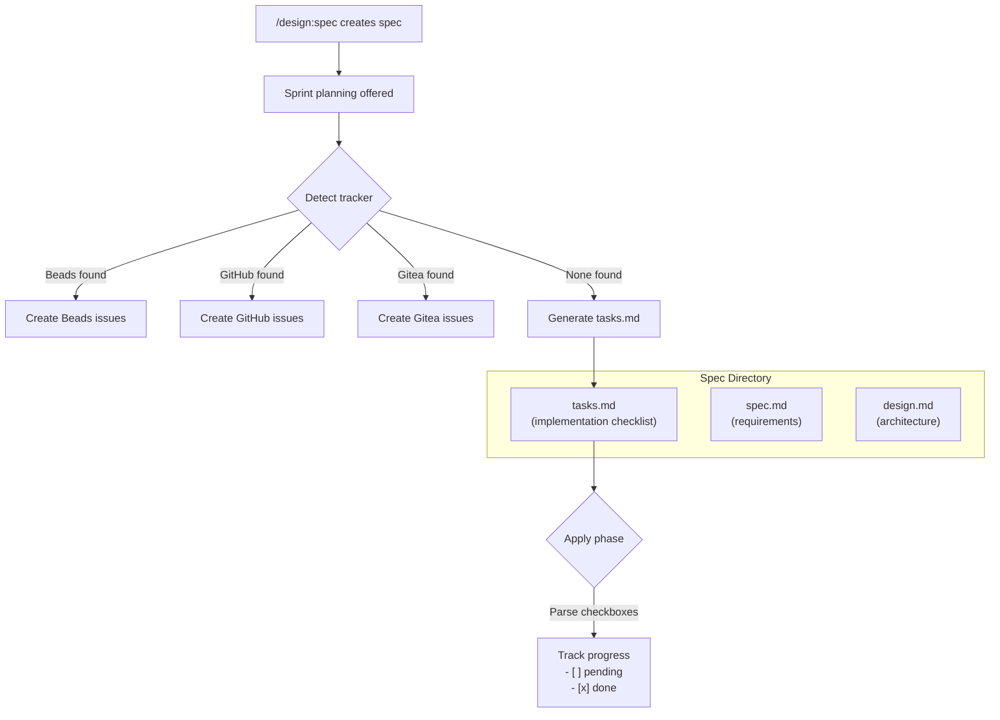

# ADR-0007: Generate tasks.md as openspec artifact when no issue tracker is available

## Context and Problem Statement

After creating a spec, the `/design:spec` skill offers sprint planning that breaks requirements into trackable work items. It detects available issue trackers (Beads, GitHub, Gitea) and creates issues in them. But when no tracker is available, the current fallback is to "output the sprint plan as a structured markdown table" — an ephemeral dump into the conversation that the user must manually act on. How should the design plugin provide durable, trackable task management for projects without an external issue tracker?

## Decision Drivers

* Projects without Beads, GitHub, or Gitea integrations still need a way to track implementation work
* The openspec artifact model already pairs `spec.md` + `design.md` — a third artifact fits naturally
* Tasks need a machine-parseable format so an "apply" phase can track completion progress
* The fallback should be durable (persisted to disk), not ephemeral (printed to conversation)
* Checkbox-based task tracking is a well-understood pattern (GitHub issues, TODO.md, etc.)

## Considered Options

* **Option A**: Generate `tasks.md` as an openspec artifact in the spec directory
* **Option B**: Keep the current markdown table output (status quo)
* **Option C**: Generate a standalone `TASKS.md` at the project root

## Decision Outcome

Chosen option: "Option A — Generate `tasks.md` as an openspec artifact", because it keeps task tracking co-located with the spec it implements, fits the existing paired-artifact model, and provides a durable, parseable format that downstream tooling can consume.

### Consequences

* Good, because tasks live alongside their governing spec, maintaining traceability
* Good, because the checkbox format (`- [ ]`) is parseable for automated progress tracking
* Good, because no external tooling or integrations are required
* Good, because it extends the openspec artifact model naturally (spec.md → design.md → tasks.md)
* Bad, because tasks are scoped per-spec rather than project-wide, which may fragment visibility across multiple specs
* Bad, because checkbox tracking lacks the metadata richness of proper issue trackers (assignees, labels, milestones)

### Confirmation

Compliance is confirmed when:
- The `/design:spec` skill's sprint planning step generates `tasks.md` in the spec directory when no tracker is detected
- The generated `tasks.md` follows the template format with numbered headings and checkbox items
- An apply phase can parse `- [ ]` / `- [x]` lines to report completion percentage

## Pros and Cons of the Options

### Option A: Generate `tasks.md` as an openspec artifact

Add `tasks.md` as a third artifact in `docs/openspec/specs/{capability-name}/`, generated during sprint planning when no issue tracker is detected.

* Good, because tasks are co-located with their spec and design — one directory tells the full story
* Good, because the `- [ ]` checkbox format is universally understood and git-diffable
* Good, because it extends the existing artifact convention without changing it
* Good, because downstream tooling (apply phase, audit, docs) can parse task status
* Neutral, because it adds a third file to the spec directory convention
* Bad, because cross-spec task visibility requires scanning multiple directories

### Option B: Keep the current markdown table output (status quo)

Continue printing a structured markdown table to the conversation when no tracker is found.

* Good, because no changes are needed
* Good, because it keeps the artifact model simple (only spec.md + design.md)
* Bad, because the output is ephemeral — lost when the conversation ends
* Bad, because users must manually copy the table and create tasks elsewhere
* Bad, because there is no way to track progress over time

### Option C: Generate a standalone `TASKS.md` at project root

Create a single project-wide `TASKS.md` file that aggregates tasks from all specs.

* Good, because all tasks are visible in one place
* Good, because it follows a common open-source convention (TASKS.md, TODO.md)
* Bad, because it creates merge conflicts when multiple specs add tasks simultaneously
* Bad, because it breaks the co-location principle — tasks are separated from their governing spec
* Bad, because a single file becomes unwieldy as specs accumulate

## Architecture Diagram

## More Information

- The `tasks.md` template uses numbered section headings (`## 1. Setup`) with checkbox items (`- [ ] 1.1 Task description`) to enable both human readability and machine parsing.
- The spec skill's sprint planning (step 8 in SKILL.md) currently falls back to a markdown table at line 53: "output the sprint plan as a structured markdown table instead."
- This ADR does not change behavior when a tracker IS available — Beads, GitHub, and Gitea integrations remain the preferred path.
- Related: ADR-0003 (foundational artifacts and formats), SPEC-0003 (foundational artifact requirements).
