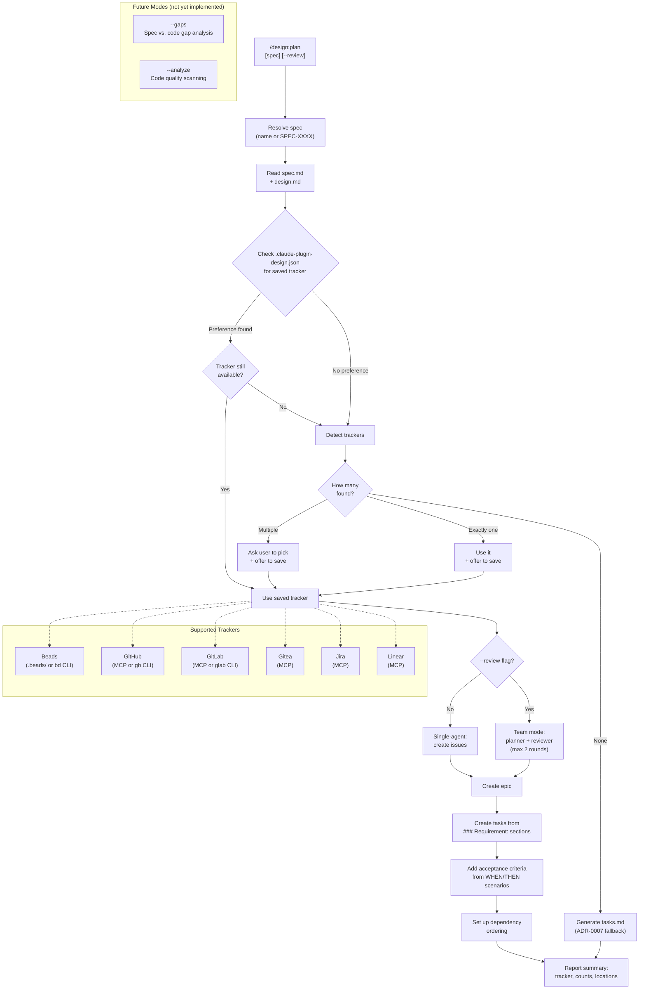

# ADR-0008: Standalone Sprint Planning Skill

## Context and Problem Statement

Sprint planning -- breaking a specification into trackable work items in an issue tracker -- was previously embedded as step 8 of the `/design:spec` skill. This coupling created two problems: (1) users could not plan sprints for specifications that already existed, and (2) the tracker support was limited to only three integrations (Beads, GitHub, Gitea). Additionally, users were prompted for tracker configuration on every invocation since there was no preference persistence mechanism.

How should the plugin provide sprint planning that works with existing specs, supports a broader tracker ecosystem, and remembers user preferences?

## Decision Drivers

* **Standalone invocation for existing specs**: Users need to plan sprints from specs created in prior sessions, not only during spec creation
* **Broader tracker ecosystem**: Teams use GitHub, GitLab, Gitea, Jira, Linear, and Beads -- limiting to three trackers excludes a significant portion of users
* **Preference persistence**: Repeatedly asking users which tracker to use and for repository/project configuration creates unnecessary friction
* **Clean separation of concerns**: Spec authoring (requirements + design) and sprint planning (issue decomposition) serve different purposes at different times in the workflow
* **Extensibility for future analysis modes**: The planning surface is a natural place to add gap analysis (`--gaps`) and code quality analysis (`--analyze`) that compare specs against implementation

## Considered Options

* **Option 1**: Extend `/design:spec` with a re-plan argument (e.g., `/design:spec SPEC-0003 --plan`)
* **Option 2**: Create a standalone `/design:plan` skill
* **Option 3**: Create a generic `/design:execute` skill that handles planning, gap analysis, and code quality in one skill

## Decision Outcome

Chosen option: "Option 2 -- Create a standalone `/design:plan` skill", because it cleanly separates spec authoring from sprint planning, allows independent evolution of each skill, and provides an intuitive invocation pattern (`/design:plan SPEC-0003`) that works for both new and existing specs. The standalone skill can support all six trackers and persist preferences to `.claude-plugin-design.json` without adding complexity to the spec skill.

### Consequences

* Good, because users can plan sprints from any existing spec without re-running the spec creation workflow
* Good, because six trackers (Beads, GitHub, GitLab, Gitea, Jira, Linear) are supported with runtime detection via ToolSearch
* Good, because tracker preferences and configuration are persisted to `.claude-plugin-design.json`, eliminating repeated prompts
* Good, because the spec skill becomes simpler -- it no longer needs tracker detection or issue creation logic
* Good, because the standalone skill can evolve to include `--gaps` and `--analyze` modes without affecting spec authoring
* Good, because the `tasks.md` fallback (ADR-0007) integrates naturally as a tracker-absent path
* Bad, because users who previously relied on step 8 of `/design:spec` for sprint planning must learn the new `/design:plan` command
* Bad, because planning logic that was co-located with spec creation is now a separate skill, requiring users to invoke two commands for the full "spec then plan" workflow
* Neutral, because `.claude-plugin-design.json` adds a new configuration file to the project root, but it only contains tracker preferences and is optional

### Confirmation

Implementation will be confirmed by:

1. `skills/plan/SKILL.md` exists and follows the established SKILL.md format with YAML frontmatter
2. Running `/design:plan SPEC-0003` reads the existing spec and creates issues in the detected tracker
3. Running `/design:plan` with no arguments lists available specs and asks the user to choose
4. The skill detects all six trackers (Beads, GitHub, GitLab, Gitea, Jira, Linear) via ToolSearch and CLI probing
5. Tracker preferences saved to `.claude-plugin-design.json` are used on subsequent invocations without re-prompting
6. When no tracker is detected, the skill generates `tasks.md` per ADR-0007
7. The `--review` flag spawns a planner/reviewer team with a maximum of 2 revision rounds
8. Every `### Requirement:` section in the spec produces at least one issue or task

## Pros and Cons of the Options

### Option 1: Extend `/design:spec` with a Re-Plan Argument

Add a `--plan` flag to the spec skill that, when combined with a spec identifier, skips creation and jumps to sprint planning. For example: `/design:spec SPEC-0003 --plan`.

* Good, because it keeps all spec-related functionality in one skill
* Good, because users who create a spec and immediately plan can stay in the same command
* Bad, because it overloads the spec skill with two distinct responsibilities (authoring and planning)
* Bad, because the argument interface becomes confusing: `--plan` changes the skill from a creation tool to a planning tool
* Bad, because tracker detection, preference persistence, and issue creation logic bloat a skill that should focus on requirements and design
* Bad, because the spec skill's allowed-tools list must include all tracker-related tools even when not planning

### Option 2: Create a Standalone `/design:plan` Skill

A new skill that accepts a spec identifier (name or SPEC-XXXX number), resolves it, reads the spec and design, detects the user's tracker, and creates issues. Supports preference persistence via `.claude-plugin-design.json` and a `--review` flag for team-based planning review.

* Good, because it has a single, clear responsibility: turn specs into trackable work items
* Good, because it can evolve independently (add trackers, add `--gaps`/`--analyze` modes) without affecting spec authoring
* Good, because the invocation pattern (`/design:plan SPEC-0003`) is intuitive and self-documenting
* Good, because preference persistence naturally belongs to a planning-focused skill
* Good, because adding a new tracker requires changes to only one skill
* Neutral, because it adds one more skill to the plugin (10 to 11)
* Bad, because the "spec then plan" workflow requires two separate commands

### Option 3: Create a Generic `/design:execute` Skill

A single skill that handles sprint planning, gap analysis, and code quality analysis through different modes (`--plan`, `--gaps`, `--analyze`).

* Good, because all "action" capabilities live in one skill, reducing the command surface
* Good, because shared logic (spec resolution, tracker detection) is naturally reused
* Bad, because three fundamentally different operations in one skill create a complex SKILL.md that is hard to maintain
* Bad, because the allowed-tools list must be the union of all modes (planning needs Write/Edit/Bash; gap analysis is read-only), violating least-privilege
* Bad, because the skill name "execute" is vague and does not communicate any specific capability
* Bad, because it front-loads complexity for modes (`--gaps`, `--analyze`) that are aspirational rather than proven

## Future Considerations

Two additional modes are under consideration for `/design:plan`. These are documented here as future possibilities, not as part of the current decision.

### Gap Analysis Mode (`--gaps`)

When invoked as `/design:plan SPEC-XXXX --gaps`, the skill would read the spec's requirements, scan the codebase for implementation, and identify requirements that are unimplemented or partially implemented. It would then create issues for the gaps found. This mode transforms the skill from "plan all work" to "plan remaining work."

### Code Quality Analysis Mode (`--analyze`)

When invoked as `/design:plan --analyze` (no spec argument required), the skill would scan the codebase for DRY violations, dead code, untested code paths, and security issues, then create issues for findings. This mode extends beyond spec compliance into general code health.

Both modes would reuse the same tracker detection and issue creation pipeline established by the core planning flow.

## Architecture Diagram

## More Information

- This ADR supersedes the sprint planning portion of the `/design:spec` skill (formerly step 8). The spec skill should be updated to remove its embedded sprint planning logic and instead suggest running `/design:plan` after spec creation.
- The `.claude-plugin-design.json` preference file uses a simple schema: `{ "tracker": "{name}", "tracker_config": {...} }`. It is merged non-destructively if the file already exists with other keys.
- The six supported trackers were chosen based on the availability of MCP tool servers and CLI integrations. Additional trackers can be added by extending the detection logic in step 4 of the SKILL.md.
- The `tasks.md` fallback (ADR-0007) is used when no tracker is detected. This maintains backward compatibility with trackerless projects.
- Related: ADR-0003 (foundational skills and artifact formats), ADR-0007 (tasks.md fallback), SPEC-0006 (tasks.md fallback requirements), SPEC-0007 (sprint planning requirements).
