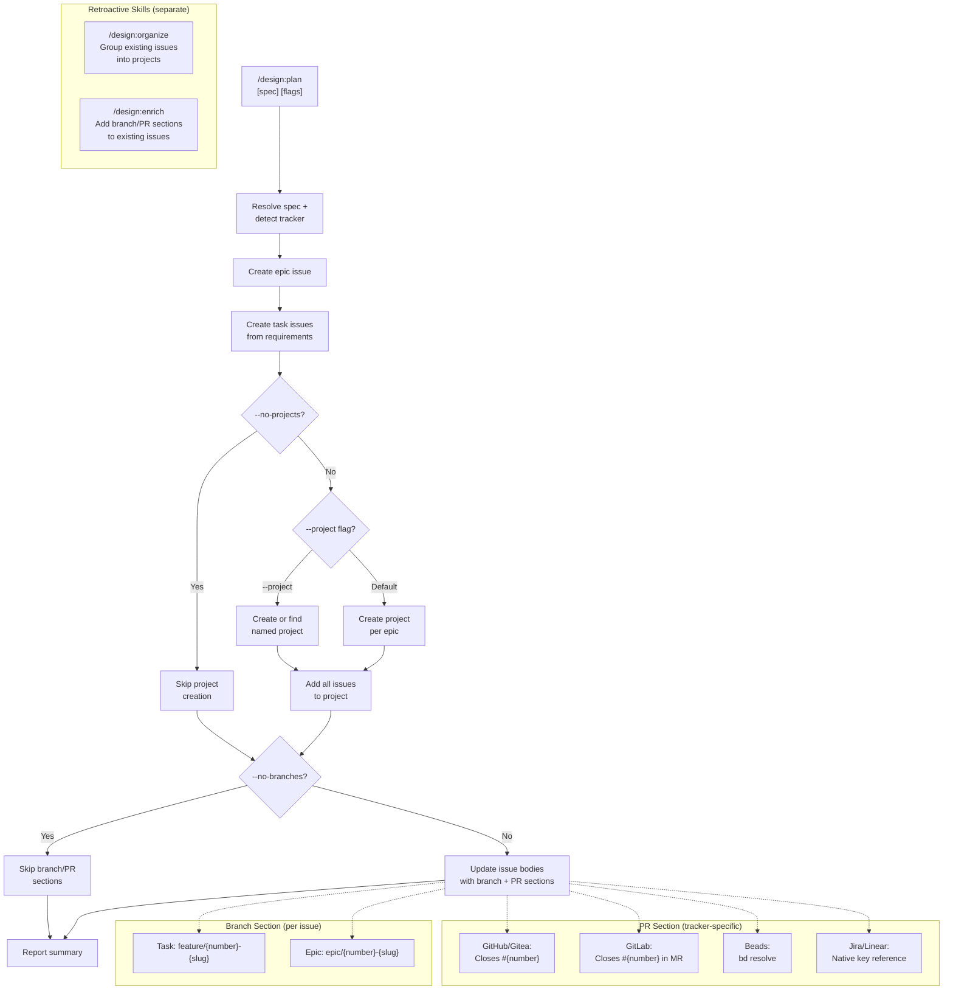
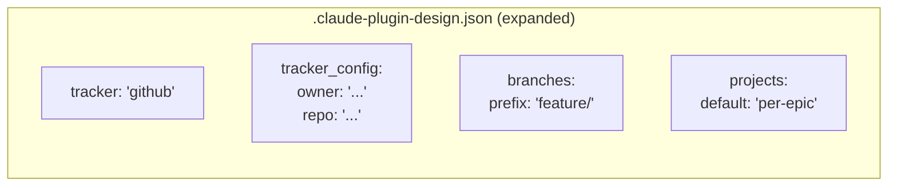

# ADR-0009: Project Grouping and Developer Workflow Conventions

## Context and Problem Statement

The `/design:plan` skill (ADR-0008, SPEC-0007) creates epics and tasks in issue trackers but does not organize them into tracker-native projects, define branch naming conventions, or specify PR close keywords. Without these conventions, teams must manually create projects, invent branch names, and remember tracker-specific close syntax for every planned issue. Additionally, two retroactive capabilities -- organizing existing issues and enriching issue bodies with developer workflow metadata -- were considered as extensions to `/design:plan` but serve fundamentally different purposes.

How should the plugin handle project grouping, branch naming, PR close keywords, and retroactive issue management to provide a complete developer workflow from spec to merged PR?

## Decision Drivers

* **Project grouping reduces tracker clutter**: Without projects, epics and tasks created by `/design:plan` float as unorganized issues, making it hard to see the full scope of a planned spec
* **Branch naming consistency**: Teams waste time debating branch names; a convention derived from issue numbers and requirement names eliminates this friction
* **PR close automation**: Each tracker has different syntax for auto-closing issues from PRs/MRs; embedding the correct syntax in issue bodies saves developers from looking it up
* **Retroactive issue management**: Users who already have issues from prior `/design:plan` runs need to add project grouping and developer workflow metadata without re-planning
* **Configurability without complexity**: Power users want to customize prefixes and disable features; casual users want sensible defaults that work without configuration

## Considered Options

* **Option 1**: Add project grouping, branch naming, and PR conventions directly to `/design:plan` as mandatory steps
* **Option 2**: Add project grouping, branch naming, and PR conventions to `/design:plan` with opt-out flags, and create separate `/design:organize` and `/design:enrich` skills for retroactive use
* **Option 3**: Create a single `/design:workflow` skill that handles project grouping, branch naming, PR conventions, and retroactive issue management all in one command
* **Option 4**: Do nothing -- let users manage projects, branches, and PR conventions manually

## Decision Outcome

Chosen option: "Option 2 -- Add conventions to `/design:plan` with opt-out flags, and create separate retroactive skills", because it provides sensible defaults for new planning runs while keeping retroactive capabilities cleanly separated. The `/design:plan` skill gains project grouping (default: one per epic, configurable via `--project` or `--no-projects`), branch naming (`feature/` and `epic/` prefixes, configurable via `--branch-prefix` or `--no-branches`), and PR close keywords (tracker-specific, embedded in issue bodies). Retroactive capabilities (`/design:organize` and `/design:enrich`) are separate skills because they operate on existing issues with different tool requirements and user interactions than forward-looking planning.

### Consequences

* Good, because new `/design:plan` runs produce fully organized issues with project grouping, branch names, and PR close syntax out of the box
* Good, because `--no-projects` and `--no-branches` let users opt out of conventions they do not want
* Good, because `--project <name>` supports the common case of a single project for an entire planning session
* Good, because branch naming is deterministic: `feature/{issue-number}-{slug}` for tasks, `epic/{issue-number}-{slug}` for epics, with slugs derived from requirement/epic names
* Good, because PR close keywords are tracker-specific and automatically correct for the detected tracker
* Good, because retroactive skills (`/design:organize`, `/design:enrich`) can evolve independently without adding complexity to the planning flow
* Bad, because project creation adds API calls that may hit rate limits, especially with GitHub Projects V2's GraphQL-only API
* Bad, because two-pass issue creation is required: issues must be created first to get their number, then updated with branch/PR sections that reference that number
* Bad, because `.claude-plugin-design.json` gains additional configuration keys (`branches.prefix`, `projects.default`), increasing its surface area
* Neutral, because the branch naming convention is opinionated (feature/epic prefixes) but configurable, balancing convention with flexibility

### Confirmation

Implementation will be confirmed by:

1. Running `/design:plan SPEC-XXXX` creates a tracker-native project named after the epic and adds all created issues to it
2. Running `/design:plan SPEC-XXXX --project "Q1 Sprint"` adds all issues to a single project named "Q1 Sprint"
3. Running `/design:plan SPEC-XXXX --no-projects` skips project creation entirely
4. Created issue bodies include a "Branch" section with `feature/{issue-number}-{slug}` for tasks and `epic/{issue-number}-{slug}` for epics
5. Created issue bodies include a "PR Convention" section with tracker-specific close keywords
6. Running `/design:plan SPEC-XXXX --no-branches` omits Branch and PR sections from issue bodies
7. Custom branch prefixes via `--branch-prefix work/` or `.claude-plugin-design.json` `branches.prefix` are respected
8. Slugs are kebab-case, derived from the requirement/epic name, and capped at 50 characters

## Pros and Cons of the Options

### Option 1: Add All Conventions as Mandatory Steps

Make project grouping, branch naming, and PR conventions always-on within `/design:plan` with no opt-out mechanism.

* Good, because every planning run produces fully consistent output
* Good, because no additional flags or configuration are needed
* Bad, because users who do not want projects, branches, or PR conventions cannot disable them
* Bad, because mandatory project creation fails for trackers that lack project support (e.g., some Beads configurations)
* Bad, because it forces conventions on teams with established practices that differ from the defaults

### Option 2: Add Conventions with Opt-Out Flags and Separate Retroactive Skills

Add project grouping, branch naming, and PR conventions to `/design:plan` with `--no-projects`, `--no-branches`, `--project <name>`, and `--branch-prefix <prefix>` flags. Create `/design:organize` and `/design:enrich` as separate skills for retroactive use on existing issues.

* Good, because sensible defaults work for most users while power users have full control
* Good, because retroactive skills have focused responsibilities and minimal allowed-tools
* Good, because the separation follows the existing plugin pattern of single-purpose skills
* Good, because `.claude-plugin-design.json` can store defaults for all configuration (branch prefix, project preference) so flags are rarely needed
* Neutral, because two new skills increase the plugin's command count
* Bad, because two-pass issue creation adds complexity (create, get number, update body)
* Bad, because the `--project` flag's semantics differ from the default behavior, which could confuse users

### Option 3: Single `/design:workflow` Skill

Create one skill that handles project grouping, branch naming, PR conventions, and retroactive issue management through different modes (`--plan`, `--organize`, `--enrich`).

* Good, because all workflow-related functionality lives in one place
* Bad, because it violates the plugin's single-purpose skill convention
* Bad, because the allowed-tools list is the union of planning (write), organizing (tracker API), and enriching (read + update) tools
* Bad, because the skill name is vague and the mode flags create a complex invocation surface
* Bad, because forward-looking planning and retroactive management have fundamentally different flows

### Option 4: Do Nothing

Let users manage projects, branches, and PR conventions manually outside the plugin.

* Good, because no additional complexity is added to the plugin
* Bad, because the "spec to merged PR" workflow has gaps that users must fill manually
* Bad, because branch naming inconsistency and incorrect PR close keywords are common pain points
* Bad, because the value proposition of automated sprint planning is diminished without end-to-end workflow support

## Architecture Diagram

## More Information

- This ADR extends the sprint planning capabilities defined in ADR-0008 and SPEC-0007. It does not change the core planning flow (spec resolution, tracker detection, issue creation) but adds project grouping and developer workflow metadata as post-creation enrichment steps.
- The branch naming convention (`feature/{issue-number}-{slug}` for tasks, `epic/{issue-number}-{slug}` for epics) follows the widely adopted Git Flow pattern with issue-number prefixes for traceability.
- Slugs are derived from the requirement or epic name using kebab-case conversion: lowercase, replace non-alphanumeric characters with hyphens, collapse consecutive hyphens, trim to 50 characters, and strip trailing hyphens.
- PR close keywords are tracker-specific because there is no universal syntax: GitHub and Gitea use `Closes #N` in PR descriptions, GitLab uses `Closes #N` in MR descriptions, Beads uses `bd resolve`, and Jira/Linear use their native key reference formats.
- Two-pass issue creation is necessary because branch and PR sections reference the issue number, which is only available after the issue is created. The skill creates the issue with the core content first, then updates the body to add the Branch and PR Convention sections.
- The `/design:organize` and `/design:enrich` retroactive skills are documented here as part of the decision rationale but will be specified separately. They are not part of `/design:plan`'s responsibility.
- Related: ADR-0008 (standalone sprint planning skill), SPEC-0007 (sprint planning requirements), ADR-0003 (foundational skills and artifact formats).
