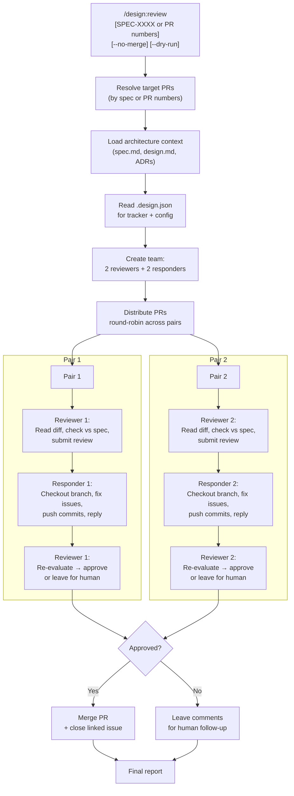
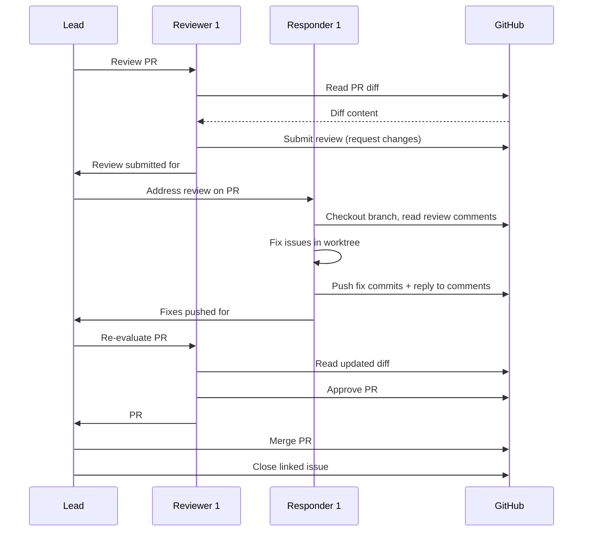

# ADR-0010: Parallel PR Review and Response Skill

## Context and Problem Statement

The `/design:work` skill (ADR-0009, SPEC-0007/0008) creates draft PRs for each implemented issue, but the review-and-merge phase remains manual. After a `/design:work` run produces 5-15 draft PRs, a human must review each one, leave comments, wait for fixes, and merge -- a bottleneck that undermines the parallelism of the implementation phase. The plugin's workflow covers spec → plan → organize → enrich → work, but stops short of closing the loop.

How should the plugin automate the PR review-and-merge cycle to complete the spec-to-merged-code pipeline?

## Decision Drivers

* **Pipeline completeness**: The plugin automates everything from decision to implementation but leaves the final merge step manual, creating a bottleneck
* **Review quality through separation of concerns**: Reviewers who did not write the code provide more objective feedback than self-review
* **Bounded iteration**: Unbounded review cycles waste compute and delay merges; a fixed round count keeps the process predictable
* **Parallelism**: Multiple PRs should be reviewed and addressed concurrently, not sequentially
* **Spec traceability**: Reviews should verify that PRs satisfy the acceptance criteria from the governing spec, not just general code quality

## Considered Options

* **Option 1**: Two pairs -- 2 reviewer agents + 2 responder agents, one back-and-forth round, then merge or escalate
* **Option 2**: One agent per PR that self-reviews and self-fixes
* **Option 3**: Sequential pipeline -- all reviews first in batch, then all responses in batch
* **Option 4**: Single reviewer agent + multiple responder agents

## Decision Outcome

Chosen option: "Option 1 -- Two pairs with one back-and-forth round", because it provides separation of concerns (reviewers never wrote the code they review), parallelism (4 agents process PRs concurrently), and bounded iteration (exactly one review-response cycle caps compute and keeps the process predictable). PRs are distributed round-robin across the two reviewer-responder pairs. After the response round, the reviewer re-evaluates: if satisfied, the PR is approved and merged; if not, it is left with comments for human follow-up.

### Consequences

* Good, because the full pipeline is closed: spec → plan → work → review → merge with no manual steps required
* Good, because separation between reviewers and responders ensures objective code review (the agent that wrote the code is not the one reviewing it)
* Good, because the one-round limit caps API usage and prevents infinite revision loops
* Good, because 2+2 agent pairs allow up to 4 PRs to be processed concurrently
* Good, because reviewers can check PR diffs against spec acceptance criteria, not just general code style
* Bad, because one round may be insufficient for complex PRs -- some issues will require human follow-up
* Bad, because 4 agents per invocation is compute-intensive, especially for small PR batches
* Bad, because auto-merging requires trust in the review quality; mismerged PRs are harder to undo than unmerged ones
* Neutral, because the `--no-merge` flag provides a safety valve for users who want automated review without automated merge

### Confirmation

Implementation will be confirmed by:

1. `skills/review/SKILL.md` exists and follows the established SKILL.md format with YAML frontmatter
2. Running `/design:review SPEC-0003` discovers all open PRs for that spec, spawns 2 reviewer + 2 responder agents, and processes them
3. Each reviewer submits a GitHub PR review (or equivalent) with line-level comments referencing spec acceptance criteria
4. Each responder checks out the PR branch, addresses feedback, pushes fix commits, and replies to review comments
5. After one round, approved PRs are merged and their linked issues are closed
6. PRs that are not approved after one round are left with comments and reported to the user
7. `--dry-run` previews which PRs would be reviewed without taking any action
8. `--no-merge` submits reviews and responses but does not merge, leaving the final merge to the user

## Pros and Cons of the Options

### Option 1: Two Pairs (2 Reviewers + 2 Responders)

Create a team with 4 agents organized into two reviewer-responder pairs. PRs are distributed round-robin. Each PR goes through exactly one review-response cycle. The reviewer submits a review with comments; the responder addresses the feedback and pushes fixes; the reviewer re-evaluates and either approves (triggering merge) or leaves comments for human follow-up.

* Good, because separation of concerns ensures reviewers never evaluate their own code
* Good, because 2 pairs allow concurrent processing of multiple PRs
* Good, because the one-round limit is simple to implement and reason about
* Good, because round-robin distribution is fair and requires no domain-aware scheduling
* Neutral, because 4 agents is a fixed cost regardless of PR count (could use fewer for 1-2 PRs)
* Bad, because responders must check out branches and push commits, requiring worktree management similar to `/design:work`
* Bad, because one round may leave complex PRs only partially addressed

### Option 2: One Agent Per PR (Self-Review)

Each PR gets a single agent that reads its own diff, identifies issues, fixes them, and merges.

* Good, because it is simple -- one agent, one PR, no coordination
* Good, because it requires fewer total agents
* Bad, because self-review has no separation of concerns -- the agent reviews code it effectively wrote (via `/design:work`)
* Bad, because there is no independent verification of spec compliance
* Bad, because the "review" is superficial since the agent already understands its own changes

### Option 3: Sequential Pipeline (Batch Review, Then Batch Response)

All PRs are reviewed first (phase 1), then all responses are made (phase 2). Reviews and responses happen in separate waves.

* Good, because the two phases are cleanly separated
* Good, because reviewers can see all PRs before any responses, enabling cross-PR consistency
* Bad, because total wall-clock time is doubled -- phase 2 cannot start until phase 1 completes
* Bad, because a reviewer-responder pair sitting idle while the other phase runs wastes time
* Bad, because cross-PR review consistency is rarely needed for spec-derived PRs that are already scoped

### Option 4: Single Reviewer + Multiple Responders

One reviewer agent reviews all PRs; multiple responder agents address feedback in parallel.

* Good, because review voice is consistent (one reviewer's style)
* Good, because responders can work in parallel
* Bad, because the single reviewer is a bottleneck -- it must finish all reviews before responders can start
* Bad, because one reviewer processing 10+ PRs sequentially negates the parallelism benefit
* Bad, because if the reviewer agent fails, the entire pipeline stalls

## Architecture Diagram

## More Information

- This ADR extends the `/design:work` pipeline (ADR-0009) by adding the review-and-merge phase. It does not modify `/design:work` -- it operates on PRs that already exist.
- The two-pair structure (2+2) is a default. For small batches (1-2 PRs), the skill may use a single pair (1+1) to avoid unnecessary agent overhead. The `.design.json` `review` section can configure `max_pairs`.
- Responders need worktree access to push fix commits. They reuse the worktrees created by `/design:work` if they still exist, or create new ones from the PR branch.
- The one-round limit is a hard constraint to prevent runaway review cycles. Complex PRs that cannot be resolved in one round are left for human follow-up with clear comments explaining what remains.
- Reviewers check against three criteria: (1) spec acceptance criteria from the linked issue, (2) governing ADR compliance, and (3) general code quality (tests pass, no regressions, clean diffs).
- Auto-merge uses the tracker's merge API (e.g., `gh pr merge --squash` for GitHub). The merge strategy (squash, merge, rebase) can be configured via `.design.json` `review.merge_strategy`.
- Related: ADR-0008 (standalone sprint planning), ADR-0009 (project grouping and developer workflow), `/design:work` (parallel issue implementation).
