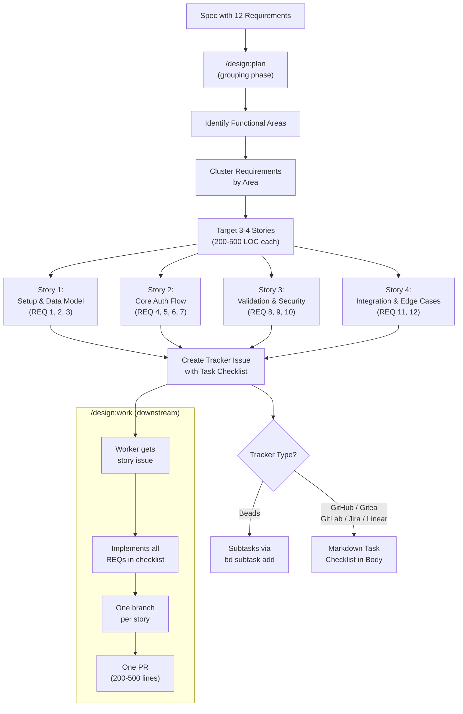

# ADR-0011: Story-Sized Issue Granularity

## Context and Problem Statement

The `/design:plan` skill (ADR-0008) currently creates one tracker issue per `### Requirement:` section in a spec. A typical spec contains 10-15 requirements, producing 10-15 issues that each map to a single narrow requirement. When `/design:work` (ADR-0008, ADR-0009) picks up these issues and creates PRs, the result is 10-15 tiny pull requests averaging 5-10 lines of code each. This over-fragmentation creates several problems:

1. **Code review overhead**: Reviewers must context-switch across many small PRs that individually lack enough context for meaningful review. A 5-line PR that adds a single validation rule cannot be evaluated without understanding the surrounding feature.
2. **Integration risk**: Tightly coupled requirements split across separate branches create merge conflicts and integration issues when they are combined into the main branch.
3. **Tracker noise**: 10-15 issues per spec floods the backlog, making it hard to see progress at a glance. Teams using GitHub Projects or Linear boards find their views cluttered with atomically small work items.
4. **Worker underutilization**: `/design:work` agents receive trivially small units of work, spending more time on git operations, PR creation, and context loading than on actual implementation.

How should `/design:plan` group spec requirements into issues that produce meaningful, reviewable pull requests while preserving traceability to individual requirements?

## Decision Drivers

* **PR size target (200-500 lines)**: Pull requests in the 200-500 line range are large enough for meaningful review but small enough to review in one sitting. Research consistently shows this range maximizes review quality.
* **Meaningful code review**: Reviewers need enough context within a single PR to understand the feature area being changed. A PR that implements "user authentication" is reviewable; a PR that implements "add email field validation" without the rest of the auth form is not.
* **Parallelism**: Stories should be independent enough that multiple `/design:work` agents can implement them concurrently without blocking each other or creating merge conflicts.
* **Tracker compatibility**: The grouping mechanism must work across all six supported trackers (Beads, GitHub, GitLab, Gitea, Jira, Linear) using each tracker's native features for sub-task representation.
* **Requirement traceability**: Every spec requirement must remain traceable to its implementing issue, even when multiple requirements are grouped into a single story.

## Considered Options

* **Option 1**: Story-sized issues with task checklists -- group related requirements by functional area into 3-4 "story" issues per spec, with individual requirements as task checklists in the issue body
* **Option 2**: Keep current one-issue-per-requirement (status quo)
* **Option 3**: Epic-only issues with no sub-breakdown -- create a single epic per spec with all requirements listed in the body

## Decision Outcome

Chosen option: "Option 1 -- Story-sized issues with task checklists", because it produces PRs in the target 200-500 line range, provides reviewers with enough context to evaluate changes meaningfully, reduces tracker noise from 10-15 issues to 3-4 per spec, and preserves full traceability from individual requirements to their implementing story via task checklists.

### Consequences

* Good, because PRs target 200-500 lines of code, within the optimal range for thorough review
* Good, because reviewers see a coherent functional area in each PR rather than disconnected fragments
* Good, because tracker boards show 3-4 stories per spec instead of 10-15 atomically small issues, improving visibility of progress
* Good, because `/design:work` agents receive substantial, meaningful units of work that justify the overhead of worktree creation and PR management
* Good, because individual requirement traceability is preserved through task checklists within story bodies
* Good, because the grouping approach works across all six supported trackers using native features (subtasks for Beads, markdown checklists for GitHub/Gitea/GitLab/Jira/Linear)
* Bad, because the AI must make judgement calls about which requirements belong together, introducing subjectivity into the grouping
* Bad, because a single story failure blocks all of its constituent requirements, whereas per-requirement issues allow partial progress
* Bad, because task checklists in issue bodies are less structured than first-class tracker issues (no individual assignees, labels, or due dates per requirement)
* Neutral, because the branch-per-story convention (replacing branch-per-requirement) reduces the total number of branches, which simplifies the git history but provides less granular bisect targets

### Confirmation

Implementation will be confirmed by:

1. Running `/design:plan SPEC-XXXX` produces 3-4 story issues (plus one epic) instead of 10-15 per-requirement issues
2. Each story issue body contains a task checklist with entries for every constituent requirement
3. Every `### Requirement:` in the spec is represented in exactly one story's task checklist
4. Story groupings reflect functional area cohesion (e.g., "Setup & Configuration", "Core Logic", "Validation & Error Handling")
5. For Beads, requirements are represented as subtasks linked to stories via `bd subtask add`
6. For GitHub, Gitea, GitLab, Jira, and Linear, requirements are represented as markdown task checklists in the story body
7. Branch naming uses one branch per story: `feature/{issue-number}-{slug}`
8. PRs created by `/design:work` from story issues average 200-500 lines of code

## Pros and Cons of the Options

### Option 1: Story-Sized Issues with Task Checklists

Group related requirements by functional area into 3-4 "story" issues per spec. Each story body contains a task checklist where each item maps to one spec requirement with its acceptance criteria. For Beads, use native subtasks (`bd subtask add`). For GitHub, Gitea, GitLab, Jira, and Linear, use markdown task checklists in the issue body.

* Good, because PRs are 200-500 lines -- large enough for meaningful review, small enough for one sitting
* Good, because related requirements (e.g., "create user" and "validate user input") ship together, giving reviewers full context
* Good, because 3-4 stories per spec reduce tracker clutter by 60-75% compared to per-requirement issues
* Good, because `/design:work` agents get substantial work units, amortizing git/PR overhead across multiple requirements
* Good, because Beads subtasks provide native tracking while markdown checklists work universally across other trackers
* Good, because grouping by functional area naturally produces independent stories that can be worked in parallel
* Neutral, because grouping heuristics (which requirements go together) require AI judgement, introducing variability
* Bad, because if a story is blocked, all of its constituent requirements are blocked
* Bad, because markdown checklists lack the structured metadata (assignees, labels, estimates) of first-class issues

### Option 2: Keep Current One-Issue-Per-Requirement (Status Quo)

Maintain the current behavior where each `### Requirement:` section produces exactly one tracker issue with its own branch and PR.

* Good, because the mapping from requirement to issue to PR is 1:1 and unambiguous
* Good, because each requirement can be independently assigned, labeled, estimated, and tracked
* Good, because a blocked requirement does not affect other requirements
* Bad, because 10-15 PRs of 5-10 lines each overwhelm reviewers with context-switching
* Bad, because tightly coupled requirements on separate branches create avoidable merge conflicts
* Bad, because tracker boards become cluttered with many small issues, obscuring overall progress
* Bad, because `/design:work` agents spend disproportionate time on git operations relative to actual implementation
* Bad, because tiny PRs do not provide enough context for meaningful code review

### Option 3: Epic-Only with No Sub-Breakdown

Create a single epic per spec containing all requirements in its body. One branch, one PR, one issue.

* Good, because it is the simplest possible approach -- one issue, one branch, one PR
* Good, because reviewers see the entire spec implementation in a single PR
* Bad, because a single PR for an entire spec can easily exceed 1000+ lines, making review impractical
* Bad, because no parallelism is possible -- only one agent can work on the spec at a time
* Bad, because a single failing test or blocked requirement halts all progress on the entire spec
* Bad, because there is no granular progress tracking -- the epic is either "open" or "closed"
* Bad, because it eliminates the value of `/design:work`'s parallel worktree architecture

## Grouping Strategy

### How Requirements Are Grouped into Stories

`/design:plan` groups requirements into stories using functional area cohesion. The AI applies the following heuristic principles using its judgement rather than a deterministic algorithm -- the groupings may vary between runs depending on the spec's structure and the relationships between requirements:

1. **Identify functional areas**: Scan all `### Requirement:` sections and cluster them by the area of the system they affect (e.g., data model, API endpoints, validation, UI, configuration).
2. **Target 3-4 stories per spec**: Aim for a number of stories that produces PRs in the 200-500 line range. For a typical spec with 10-15 requirements, this means 3-4 stories with 3-5 requirements each.
3. **Respect dependency boundaries**: Requirements that must be implemented before others should be in earlier stories. A "setup" story comes before a "core logic" story.
4. **Keep coupled requirements together**: Requirements that modify the same files or share data structures belong in the same story to avoid merge conflicts.

### Example Grouping

Given a spec with 12 requirements for an authentication feature:

| Story | Requirements | Functional Area |
|-------|-------------|-----------------|
| Story 1: Auth Setup & Data Model | REQ 1 (User model), REQ 2 (Migration), REQ 3 (Config) | Foundation |
| Story 2: Core Auth Flow | REQ 4 (Login), REQ 5 (Token generation), REQ 6 (Session management), REQ 7 (Logout) | Core Logic |
| Story 3: Validation & Security | REQ 8 (Input validation), REQ 9 (Rate limiting), REQ 10 (Password hashing) | Security |
| Story 4: Integration & Edge Cases | REQ 11 (OAuth providers), REQ 12 (Account recovery) | Extensions |

### Tracker-Specific Implementation

| Tracker | Story Representation | Requirement Tracking |
|---------|---------------------|---------------------|
| **Beads** | Story is a task under the epic | Subtasks via `bd subtask add` linked to the story |
| **GitHub** | Issue with story title | Markdown task checklist in issue body |
| **Gitea** | Issue with story title | Markdown task checklist in issue body |
| **GitLab** | Issue with story title | Markdown task checklist in issue body |
| **Jira** | Story issue type under the epic | Markdown task checklist in issue body |
| **Linear** | Issue under the project | Markdown task checklist in issue body |

### Task Checklist Format

For GitHub, Gitea, GitLab, Jira, and Linear, each story body includes a task checklist:

```markdown
## Requirements

- [ ] **REQ "User Model"** (SPEC-0003): Define user schema with email, password hash, and timestamps
  - WHEN a user is created THEN all required fields are persisted
  - WHEN email is duplicate THEN creation fails with conflict error
- [ ] **REQ "Migration"** (SPEC-0003): Create database migration for users table
  - WHEN migration runs THEN users table is created with correct schema
- [ ] **REQ "Config"** (SPEC-0003): Add auth configuration with JWT secret and token TTL
  - WHEN config is loaded THEN JWT secret and TTL are available to auth services
```

### Impact on Downstream Skills

**`/design:work`**: Workers receive story-sized issues containing 3-5 requirements each. The worker implements all requirements in the story's checklist within a single worktree and creates one PR. The PR is larger (200-500 lines) and more contextually complete, making it easier for reviewers to evaluate.

**`/design:enrich`**: Branch naming applies per story, not per requirement. Each story gets one branch: `feature/{issue-number}-{story-slug}`. The `### PR Convention` section references the story issue number.

**`/design:check` and `/design:audit`**: Requirement traceability is preserved through `// Governing: SPEC-XXXX REQ "..."` comments in code and the task checklists in story bodies. These skills can still verify that every spec requirement is implemented.

**`/design:review`** (not yet implemented): A future PR review skill would benefit from story-sized PRs. With 200-500 line PRs covering a coherent functional area, automated reviewers can evaluate whether the implementation satisfies the full set of requirements in the story's checklist rather than reviewing disconnected 5-10 line fragments. Fewer PRs per spec (3-4 instead of 10-15) also reduces the total number of review cycles needed.

## Architecture Diagram



## More Information

- This ADR modifies the issue creation behavior defined in ADR-0008 (standalone sprint planning skill). The core planning flow (spec resolution, tracker detection, preference persistence) remains unchanged; only the granularity of created issues changes from per-requirement to per-story.
- This ADR builds on the developer workflow conventions in ADR-0009 (project grouping and developer workflow conventions). Branch naming, PR close keywords, and project grouping still apply, but at the story level rather than the requirement level.
- The 200-500 line PR target is a heuristic guideline, not a hard constraint. Some stories may produce smaller or larger PRs depending on the nature of the requirements. The grouping algorithm should prioritize functional cohesion over line-count targets.
- The task checklist format preserves requirement traceability without requiring first-class sub-issues. This is a deliberate trade-off: sub-issues provide more structured tracking but increase tracker clutter, which is the problem this ADR aims to solve.
- For Beads, subtasks are used instead of markdown checklists because Beads has native subtask support that provides structured tracking without the clutter of separate issues in the main board view.
- Related: ADR-0008 (standalone sprint planning skill), ADR-0009 (project grouping and developer workflow conventions), SPEC-0007 (sprint planning requirements).
