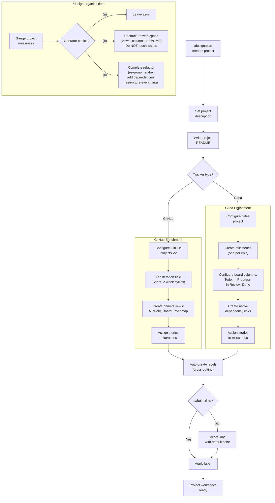
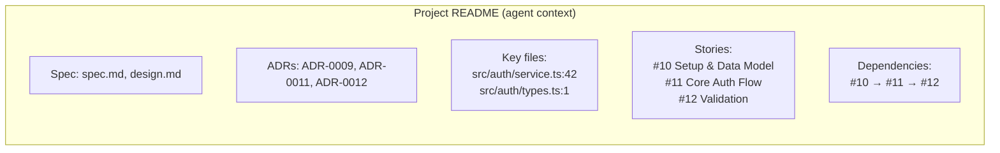

# ADR-0012: Project Workspace Enrichment

## Context and Problem Statement

Projects created by `/design:plan` (ADR-0009) and `/design:organize` are currently dumb containers -- they hold issues but provide no navigational context, views, or structure. A GitHub Project created by `/design:plan` is an empty board with a default "Table" view and no description. A Gitea project is similarly bare. This means:

1. **Agents have no project-scoped context**: When `/design:work` picks up issues from a project, it must independently rediscover architecture context (specs, ADRs, key files) every time. There is no project-level document that serves as a navigational map the way `/design:prime` serves at the repo level.
2. **Humans have no useful views**: GitHub Projects support multiple named views (list, board, roadmap), but `/design:plan` creates none. Developers must manually configure views to see their work in a useful layout.
3. **No iteration/sprint structure**: GitHub Projects support iteration fields with configurable cycle lengths, but `/design:plan` does not create them. Without iterations, the Roadmap view is non-functional and stories cannot be assigned to sprints.
4. **Gitea projects lack structure**: Gitea supports milestones (which can serve as epic buckets), board columns, and native issue dependencies, but none of these are configured by `/design:plan`.
5. **Labels are fragile**: Any skill that applies a label (e.g., `epic`, `story`) fails if the label does not already exist in the repository. This is a cross-cutting issue affecting `/design:plan`, `/design:organize`, and `/design:enrich`.
6. **`/design:organize` is coarse**: It can only create projects and add issues. It cannot restructure an existing project's views, columns, README, or dependency graph. There is no way to refactor a messy backlog without starting over.

How should the plugin enrich tracker-native projects with navigational context, structured views, iteration fields, and sane defaults so that both agents and humans can effectively navigate and manage planned work?

## Decision Drivers

* **Agent navigability**: LLM agents working on project issues need structured context -- spec references, ADR links, key file paths, symbol locations -- scoped to the project, not the entire repo. A project README serves as a scoped `/design:prime` output.
* **Human visibility**: Developers and managers need named views (list, board, roadmap) to see work in the layout that suits their workflow. Default views with sensible names eliminate manual setup.
* **Tracker feature parity**: GitHub Projects V2 and Gitea have rich feature sets (iteration fields, custom views, milestones, dependencies, board columns) that the plugin should leverage rather than ignore.
* **Graceful degradation**: Not all trackers support all features. The enrichment must degrade gracefully -- if a tracker lacks iteration support, skip it and report, rather than failing the entire operation.
* **Label resilience**: Skills should never fail because a label does not exist. Auto-creating missing labels is a small change with outsized reliability impact across the entire plugin.

## Considered Options

* **Option 1**: Full workspace enrichment -- all 7 enhancements (descriptions, READMEs, iterations, views, columns, auto-labels, organize tiers)
* **Option 2**: Minimal enrichment -- project descriptions only, no views, iterations, or columns
* **Option 3**: Status quo -- projects remain dumb containers

## Decision Outcome

Chosen option: "Option 1 -- Full workspace enrichment", because agents and humans both benefit from structured project workspaces, and the enhancements leverage existing tracker features that are simply not being configured today. The implementation is additive (no breaking changes to existing skills) and degrades gracefully per tracker capability.

The decision encompasses seven enhancements:

### 1. GitHub Project Descriptions and READMEs

Projects created by `/design:plan` and `/design:organize` receive a short description and a README. The description is a one-liner summarizing the project scope (e.g., "Implementation of SPEC-0003: JWT Authentication"). The README is a structured navigational document containing:

- **Spec reference**: Paths to `spec.md` and `design.md` with brief summaries of each
- **Governing ADRs**: List of referenced ADRs with titles and file paths
- **Key files**: Source files, modules, and directories relevant to the project scope, with line-number references to key symbols where applicable
- **Story index**: List of story issues with numbers, titles, and branch names
- **Dependencies**: Logical ordering of stories and any cross-story dependencies

This README functions as a project-scoped `/design:prime` output. When `/design:work` picks up issues from the project, it can read the README to load context instead of rediscovering it from scratch. The README is written as a GitHub Project README field (not a repo file).

### 2. GitHub Project Iteration Fields

Projects receive an iteration field named "Sprint" with a default cycle length of 2 weeks. Stories are assigned to iterations based on their dependency ordering: foundation stories go into Sprint 1, dependent stories into Sprint 2, and so on. The cycle length is configurable via `.claude-plugin-design.json`:

```json
{
  "projects": {
    "iteration_weeks": 2
  }
}
```

With iteration fields configured, the Roadmap view becomes functional, showing stories distributed across sprints.

### 3. GitHub Project Named Views

Three named views are configured on each project:

| View Name | Type | Purpose |
|-----------|------|---------|
| All Work | Table/List | Default list view showing all items with status, assignee, and sprint fields |
| Board | Board | Kanban board grouped by status |
| Roadmap | Roadmap | Timeline view using the Sprint iteration field |

These views replace the default unnamed "Table" view that GitHub creates automatically.

### 4. Gitea Project Milestones and Board Columns

For Gitea trackers:

- **Milestones as epic buckets**: Each epic maps to a Gitea milestone. Stories are assigned to their epic's milestone, providing grouped progress tracking.
- **Board columns**: Project boards are configured with four default columns: Todo, In Progress, In Review, Done. These map to the standard workflow stages.
- **Task checklists**: Gitea's native task checklist support (already used per ADR-0011) serves the story-to-requirement hierarchy.

### 5. Auto-Create Labels

When any skill attempts to apply a label that does not exist in the repository, the skill creates the label before applying it. The implementation follows a try-then-create pattern:

1. Attempt to apply the label to the issue
2. If the API returns a 404 or "label not found" error, create the label with a default color
3. Retry applying the label

Default label colors:

| Label | Color | Used By |
|-------|-------|---------|
| `epic` | `#6E40C9` (purple) | `/design:plan` |
| `story` | `#1D76DB` (blue) | `/design:plan` |
| `spec` | `#0E8A16` (green) | `/design:plan` |

This is a cross-cutting enhancement that applies to all skills touching issues: `/design:plan`, `/design:organize`, `/design:enrich`, and `/design:work`.

### 6. Gitea Native Dependencies

For Gitea trackers, `/design:plan` uses Gitea's native issue dependency API to express story ordering. When story B depends on story A, a dependency link is created so that:

- Gitea surfaces the dependency in the issue UI
- Dependency-aware workflows can respect the ordering
- `/design:work` can query dependencies via the API rather than parsing issue body text

This replaces the body-text-based dependency hints currently used across all trackers and leverages Gitea's first-class dependency support.

### 7. `/design:organize` as Backlog Refactoring

`/design:organize` gains a three-tier intervention model. When invoked, it first gauges the current state of the project (missing views, no README, unstructured columns, missing dependencies) and presents the human operator with exactly three options:

| Tier | Name | What It Does |
|------|------|-------------|
| (a) | Leave as-is | No changes. Report the current state and exit. |
| (b) | Restructure workspace | Add/fix views, columns, README, and iteration fields. Do NOT move, relabel, or modify any existing issues. |
| (c) | Complete refactor | Full restructure plus re-group issues across epics, add/fix labels, create dependency links, and update issue bodies with missing sections. |

The three tiers give operators explicit control over how invasive the reorganization is. Tier (b) is safe for production backlogs where issue state must not change. Tier (c) is for messy backlogs that need a complete overhaul.

### .claude-plugin-design.json Additions

The following keys are added to the `.claude-plugin-design.json` schema (all optional, backward-compatible):

```json
{
  "projects": {
    "default_mode": "per-epic",
    "project_ids": {},
    "views": ["All Work", "Board", "Roadmap"],
    "columns": ["Todo", "In Progress", "In Review", "Done"],
    "iteration_weeks": 2
  }
}
```

| Key | Default | Description |
|-----|---------|-------------|
| `projects.views` | `["All Work", "Board", "Roadmap"]` | Named views to create on GitHub Projects |
| `projects.columns` | `["Todo", "In Progress", "In Review", "Done"]` | Board columns for Gitea projects |
| `projects.iteration_weeks` | `2` | Sprint duration in weeks for GitHub Project iteration fields |

### Consequences

* Good, because project READMEs give agents structured, project-scoped context without needing to rediscover architecture from scratch each session
* Good, because named views (All Work, Board, Roadmap) give humans useful layouts immediately after project creation
* Good, because iteration fields make the Roadmap view functional and enable sprint-based planning
* Good, because auto-label creation eliminates a class of silent failures across all issue-touching skills
* Good, because Gitea milestones provide native epic-level progress tracking via milestone completion percentages
* Good, because Gitea native dependencies provide first-class dependency support rather than text-based hints
* Good, because `/design:organize` three-tier intervention gives operators explicit control over refactoring scope
* Good, because all enhancements degrade gracefully -- if a tracker lacks a feature (e.g., no iteration support in Gitea), the skill skips it and reports rather than failing
* Bad, because GitHub Projects V2 view and iteration configuration requires GraphQL mutations, increasing API complexity
* Bad, because project README content must be kept in sync with the underlying spec/ADR changes -- stale READMEs could mislead agents
* Bad, because `.claude-plugin-design.json` gains three new keys under `projects`, further expanding its configuration surface area
* Neutral, because the three-tier organize model adds user interaction (a prompt with three choices) to what was previously a fully automated skill

### Confirmation

Implementation will be confirmed by:

1. Running `/design:plan SPEC-XXXX` creates a GitHub Project with a description and README containing spec references, ADR links, and key file paths
2. The created GitHub Project has an iteration field named "Sprint" with a 2-week cycle
3. The created GitHub Project has three named views: "All Work" (list), "Board" (board), "Roadmap" (roadmap)
4. Running `/design:plan` against a Gitea tracker creates milestones for epics and assigns stories to them
5. Running `/design:plan` against a Gitea tracker configures board columns: Todo, In Progress, In Review, Done
6. Applying a label that does not exist (e.g., `epic` on a fresh repo) auto-creates the label and applies it successfully
7. Running `/design:plan` against a Gitea tracker creates native dependency links between ordered stories
8. Running `/design:organize` presents three tiers (leave as-is, restructure workspace, complete refactor) and executes only the chosen tier
9. `.claude-plugin-design.json` `projects.iteration_weeks` is respected when creating iteration fields
10. `.claude-plugin-design.json` `projects.views` is respected when creating named views
11. `.claude-plugin-design.json` `projects.columns` is respected when creating Gitea board columns

## Pros and Cons of the Options

### Option 1: Full Workspace Enrichment

Implement all seven enhancements: descriptions/READMEs, iteration fields, named views, Gitea milestones/columns, auto-labels, Gitea native dependencies, and three-tier organize.

* Good, because both agents and humans get structured, navigable project workspaces out of the box
* Good, because it leverages tracker features that already exist but are not being configured
* Good, because auto-label creation fixes a cross-cutting reliability issue
* Good, because the three-tier organize model gives operators explicit control
* Good, because all enhancements are additive -- no breaking changes to existing skill behavior
* Neutral, because implementation touches multiple skills (/design:plan, /design:organize, and cross-cutting label logic)
* Bad, because GitHub Projects V2 GraphQL API is complex and rate-limited
* Bad, because project READMEs can become stale if specs or ADRs change after project creation

### Option 2: Minimal Enrichment -- Descriptions Only

Add short descriptions to projects but skip views, iterations, columns, and READMEs.

* Good, because it is simple to implement -- one API call per project
* Good, because it provides some navigational context (the description)
* Bad, because agents still lack project-scoped context (no README)
* Bad, because humans still have no useful views, iterations, or board columns
* Bad, because labels still fail silently when they do not exist
* Bad, because `/design:organize` remains a coarse "dump issues into a project" tool

### Option 3: Status Quo -- Projects Remain Dumb Containers

Make no changes. Projects continue to serve only as issue groupings.

* Good, because no additional complexity is added
* Bad, because agents must rediscover architecture context every session
* Bad, because humans must manually configure views, iterations, and board columns
* Bad, because labels continue to fail silently across all issue-touching skills
* Bad, because Gitea's native features (milestones, dependencies, board columns) go unused
* Bad, because `/design:organize` cannot refactor messy backlogs

## Architecture Diagram





## More Information

- This ADR extends the project grouping capabilities defined in ADR-0009 (project grouping and developer workflow conventions). ADR-0009 established that `/design:plan` creates tracker-native projects and links them to repositories; this ADR enriches those projects with navigational context and structure.
- This ADR builds on the story-sized issue granularity defined in ADR-0011. Stories assigned to iterations and milestones are the story-sized issues from ADR-0011, not per-requirement issues.
- The project README format is intentionally similar to `/design:prime` output but scoped to a single project. This gives agents a focused context document rather than the full repository-wide prime output. Keeping the README in the tracker (as a GitHub Project field or Gitea project description) avoids adding files to the repository.
- Auto-label creation uses a try-then-create pattern rather than a check-then-create pattern to avoid race conditions and minimize API calls. The common case (label exists) requires only the apply call. The uncommon case (label missing) requires one additional create call.
- The three-tier `/design:organize` intervention model is designed for the reality that backlog refactoring is risky. Tier (b) is safe because it only changes workspace structure (views, columns, README) without touching any issue content. Tier (c) is powerful but invasive, so it requires explicit operator consent.
- GitHub Projects V2 views and iteration fields must be configured via the GraphQL API (`gh api graphql`). The REST API does not support these features. Skills must use `gh api graphql -f query='...'` for these operations.
- Gitea native dependencies use the `POST /repos/{owner}/{repo}/issues/{index}/dependencies` API endpoint. Dependencies are directional: issue A blocks issue B.
- `.claude-plugin-design.json` additions are fully backward-compatible. Existing `.claude-plugin-design.json` files without the new keys will use the defaults specified in this ADR.
- Related: ADR-0009 (project grouping and developer workflow conventions), ADR-0011 (story-sized issue granularity), ADR-0008 (standalone sprint planning skill).
