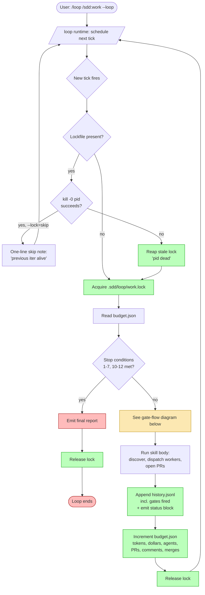
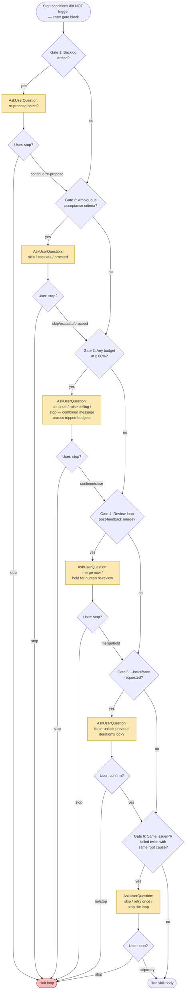

# ADR-0028: /loop Autonomous Mode for /sdd:work and /sdd:review

## Context and Problem Statement

Users want to grind down a backlog without babysitting each invocation: leave the session running, come back, and find the queue smaller — issues implemented, PRs reviewed, stories merged. The Claude Code runtime already ships a `/loop` skill ("Run a prompt or slash command on a recurring interval ... Omit the interval to let the model self-pace"). In principle, `/loop /sdd:work` and `/loop /sdd:review` deliver this behavior for free.

In practice, naive `/loop` wrapping of these two skills is hazardous. Both skills are heavyweight multi-agent orchestrators: `/sdd:work` spawns up to N worker agents in git worktrees that may still be running when the next loop tick fires; `/sdd:review` interacts with PRs whose CI is mid-flight, whose feedback is being addressed by responders, and whose merge is irreversible. The hazards split into four buckets:

1. **Concurrency races.** A second `/sdd:work` iteration can claim the same backlog issue the first iteration is already implementing in a worktree. A second `/sdd:review` iteration can re-review a PR while the responder from the previous iteration is still pushing fixes.
2. **Unbounded spend.** Without an explicit budget, the loop keeps grinding. Backlogs grow (new issues land), PRs receive new comments (loop re-reviews), and the agent pair count multiplies across iterations.
3. **Lost user-in-the-loop.** ADR-0010 picked a bounded one-round review-response cycle precisely to avoid runaway loops. Wrapping `/sdd:review` in `/loop` reintroduces the unbounded behavior unless the loop layer enforces stop conditions.
4. **No escape hatch for ambiguity.** When a story has unclear acceptance criteria, or a PR receives genuinely conflicting feedback, the conservative answer is "stop and ask a human." A loop-naive skill cannot tell the difference between "ambiguous, ask user" and "blocked, retry next iteration."

The problem: define how `/sdd:work` and `/sdd:review` cooperate with `/loop` so that autonomous backlog-grinding is safe, observable, interruptible, and conservative by default — without redesigning `/loop` itself.

## Decision Drivers

* **Conservative defaults.** The user's stated preference is "skew conservative." Novel actions, ambiguous criteria, budget escalation, and post-feedback merges all MUST pause for `AskUserQuestion` rather than guess.
* **Cost and budget visibility.** The user must always know how much has been spent, and the loop must stop before exceeding a declared ceiling — measured in iterations, PRs touched, wall-clock minutes, and **estimated dollars** (computed from cumulative token counts × per-model rates). Wall-clock alone is a poor spend proxy because a 4-agent iteration costs roughly 4× a single-agent iteration of the same duration; the dollar ceiling is the canonical spend signal.
* **Concurrency safety.** A loop tick that fires while previous worktrees or responder agents from the same skill are still active MUST NOT race them. The behavior here must be explicit, not emergent.
* **Observability between iterations.** Each loop tick should produce a one-screen status report — backlog size, PRs touched, budget remaining, stop conditions evaluated — so the user can sample and intervene.
* **Interrupt and resume.** The user must be able to halt a running loop without leaving the system in an inconsistent state (orphan worktrees, half-merged PRs, dangling labels).
* **No redesign of `/loop`.** This ADR adds a contract on top of the existing `/loop` skill; it does not modify `/loop`'s scheduling or self-pacing logic.
* **Bounded review iteration is preserved.** ADR-0010's one-round review-response cycle is a per-PR invariant. Loop iteration MUST NOT amount to "infinite review rounds on the same PR."

## Considered Options

* **Option 1**: Status quo — users wrap manually with `/loop /sdd:work` (or `/loop /sdd:review`); skills are loop-naive; safety is the user's problem.
* **Option 2**: Skill-side `--loop` flag with hard-coded conservative defaults — `/sdd:work --loop` and `/sdd:review --loop` opt into autonomous mode, where the skill itself enforces stop conditions, concurrency locks, user-prompt gates, budget ceilings, and inter-iteration telemetry. `/loop` is still the runtime that re-invokes; the flag is the contract.
* **Option 3**: Background daemon mode — the skill schedules itself in the background and runs without user prompts at all.
* **Option 4**: Pure `/loop` wrapping with no skill-side changes — the runtime handles iteration, skills stay loop-naive, the user-prompt cadence is left to whatever `/loop` decides.

## Decision Outcome

Chosen option: **"Option 2 — skill-side `--loop` flag with hard-coded conservative defaults"**, because it is the only option that preserves ADR-0010's bounded-iteration invariant, preserves the user-in-the-loop preference, and gives the skill enough information to enforce concurrency safety without touching `/loop` itself. Option 1 punts safety to the user. Option 3 is the opposite of "skew conservative." Option 4 cannot enforce per-skill invariants the runtime does not know about.

`/loop` remains the re-invocation engine. The `--loop` flag turns on the skill-side contract: stop conditions, concurrency model, user-prompt gates, budget controls, telemetry. Users invoke as `/loop /sdd:work --loop` or `/loop /sdd:review --loop --pr 142`. The interval is `/loop`'s concern; everything that happens inside an iteration is the skill's concern.

### Sub-decisions

#### Stop conditions (enumerated)

A loop iteration evaluates stop conditions on entry and on exit. Any one matching condition halts the loop and emits a final report.

| # | Condition | Applies to | Behavior |
|---|-----------|-----------|----------|
| 1 | Backlog empty after filtering (no unblocked, unworked issues) | work | Stop, report empty queue |
| 2 | PR merged, closed, or marked do-not-merge | review | Stop, report terminal state |
| 3 | Iteration budget reached (default: **5 iterations**) | both | Stop, report budget |
| 4 | PR-touch budget reached (default: **20 PRs across the loop run**) | both | Stop, report budget |
| 5 | Wall-clock budget reached (default: **60 minutes**) | both | Stop, report budget |
| 6 | Same issue/PR fails twice with the same root cause | both | Stop, escalate via `AskUserQuestion` |
| 7 | Dependency cycle detected in backlog | work | Stop, surface cycle, request manual resolution |
| 8 | User interrupt (Ctrl-C, session close, explicit `/loop stop`) | both | Stop after current iteration drains, no half-states |
| 9 | A previous iteration's lockfile holds a live PID AND `--lock=skip` is not set | both | See concurrency model below |
| 10 | `AskUserQuestion` returned "stop the loop" at any prior gate | both | Stop |
| 11 | qmd unreachable on entry, persisting for **2 consecutive iterations** | both | Stop, surface "qmd unreachable — fix per ADR-0024 and resume" with the captured error |
| 12 | Cost-budget reached (default: **\$25 USD**, computed from `tokens_in`/`tokens_out` × per-model rates) | both | Stop, report budget |

Defaults are conservative by design. Users widen budgets explicitly: `--max-iterations 20`, `--max-prs 50`, `--max-minutes 240`, `--max-dollars 100`. Budgets are inclusive across the entire `/loop` run, not per-iteration — a 20-PR ceiling means 20 across all iterations combined.

**qmd-unreachable detection (condition #11).** The wrapped skill (`/sdd:work` or `/sdd:review`) hard-fails on qmd outage per ADR-0024 sub-decision 2 ("the failure mode is fix qmd, retry") — workers exit non-zero and emit a sentinel stderr line containing the literal token `qmd-unreachable` (or, equivalently, a non-zero exit with exit code reserved for qmd-failures, e.g. `EX_QMD_UNREACHABLE=78`). The loop layer recognizes this signal and increments a per-run `qmd_failures_consecutive` counter in `budget.json`; on the second consecutive iteration carrying the signal, condition #11 trips and the loop halts with an explicit user-facing message naming ADR-0024. Any successful iteration resets the counter to zero. A single transient outage therefore costs at most one wasted tick before being followed by either a successful retry (counter reset) or a clean stop (counter trips).

#### Concurrency model

The default concurrency model is **lock-and-skip**:

* On entry, the skill writes a lockfile at `.sdd/loop/{skill}.lock` with PID, iteration number, and timestamp.
* If a lockfile already exists, the new iteration evaluates **PID liveness alone** as the staleness signal: if `kill -0 <pid>` succeeds (the process exists and the caller has permission to signal it), the lock is **held** and the new iteration **skips** silently — a one-line note lands in the iteration report: "Previous iteration N still active (pid {pid}) — skipping this tick." If `kill -0 <pid>` fails with `ESRCH` (process gone), the lock is **stale** and the new iteration reaps it and claims a fresh lock. PID liveness is the **sole authoritative** staleness signal — the presence or absence of worktrees and team members is **NOT** a staleness signal because (a) `skills/work/SKILL.md` Rules require worktrees for failed issues to be preserved indefinitely as the manual-pickup hand-off, so live worktrees can long outlive the iteration that created them; and (b) `TeamCreate` failures cause `/sdd:work` to fall back to single-agent mode where there are no team members to enumerate. Worktrees and team membership are orthogonal cleanup state, not lock state.
* On graceful exit, the lockfile is removed. On crash, the lockfile is reaped on the next iteration's PID-liveness check.
* On platforms where PID semantics differ (notably Windows, where `kill -0` is unavailable), the implementation MUST use the platform-equivalent liveness probe (e.g., `OpenProcess` + `GetExitCodeProcess`); ambiguous results MUST be treated as "alive" (skip the iteration) and a one-line warning surfaced.
* `--lock=skip` (default): skip the iteration on contention.
* `--lock=wait`: block this iteration until the previous one finishes (use only with `--max-minutes` to bound wait time).
* `--lock=force` (DISCOURAGED): override the lock. Triggers `AskUserQuestion` confirmation each time — the user must reaffirm.

Concurrency invariants:

* `/sdd:work --loop` MUST NOT pick up an issue that is already labeled `in-progress` by a sibling iteration's worktree.
* `/sdd:review --loop` MUST NOT submit a new review on a PR whose previous-iteration responder has not yet pushed fixes (verify by checking the latest PR head SHA against the SHA the previous iteration recorded).
* CI mid-flight is not a lock contention condition — it is a per-PR readiness condition handled by the existing `/sdd:review` CI gate (skip until green).

#### User-prompt gates (`AskUserQuestion`)

The default is to ask the user before doing anything novel. A novel action is one whose blast radius extends beyond the current iteration's scoped change. The following gates MUST trigger `AskUserQuestion` even in loop mode:

| Gate | Trigger | Question |
|------|---------|----------|
| Backlog drift | Backlog has shifted (new high-priority issues, removed issues) since the last iteration started | "Backlog changed since last iteration. Re-propose the next batch?" |
| Ambiguous acceptance criteria | Issue lacks a `### Acceptance Criteria` section, or has TBD/TODO markers | "Issue #N has ambiguous criteria. Skip, escalate, or proceed with my best interpretation?" |
| Budget escalation | An iteration would push past 80% of any budget (iterations, PRs, minutes, **dollars**) | "Approaching {budget} ceiling ({used}/{total}). Continue, raise ceiling, or stop?" — combined into a single prompt across all simultaneously-tripped budgets per "Multi-budget gate batching" below. |
| Post-feedback merge | `/sdd:review` would merge a PR after responder addressed human review comments | "Responder addressed human feedback on PR #N. Merge now or hold for human re-review?" |
| Force-unlock | `--lock=force` requested | "Force-unlock previous iteration's lock? This may corrupt in-flight work." |
| Repeated failure | Same issue/PR has failed in two consecutive iterations | "Issue/PR #N failed twice with: {root-cause}. Skip, retry once more, or stop the loop?" |

These prompts are NOT debounced across iterations — each gate is re-evaluated on every tick. The loop trades a few prompts per session for the safety guarantee that the skill never silently changes behavior.

#### Budget controls

Budgets are declared at loop entry and persisted in `.sdd/loop/{skill}.budget.json`. The file holds:

```json
{
  "started_at": "2026-05-09T14:32:00Z",
  "max_iterations": 5,
  "max_prs": 20,
  "max_minutes": 60,
  "max_dollars": 25.00,
  "iterations_used": 2,
  "prs_touched": ["#141", "#142", "#143", "#145"],
  "comments_pushed": 7,
  "merges_attempted": 1,
  "minutes_elapsed": 18,
  "tokens_in": 1843210,
  "tokens_out": 412057,
  "agents_dispatched": 6,
  "dollars_estimate": 14.92,
  "rate_table_source": "CLAUDE.md SDD config (or built-in default)"
}
```

On every tick, the skill reads the file, increments the relevant counters, evaluates stop conditions 3–5 and 12 (cost), writes the file back. The PR set is deduped — a PR re-reviewed across two iterations counts once toward `max_prs`. The `tokens_in`/`tokens_out`/`agents_dispatched` counters are cumulative across the entire loop run; `dollars_estimate` is recomputed each tick as `Σ(tokens_in × rate_in + tokens_out × rate_out)` over each model used, where the per-model rate table is sourced (in priority order): (1) a `### Loop Cost Rates` block in CLAUDE.md's `### SDD Configuration`, (2) a built-in default table compiled into the plugin and surfaced via `/sdd:config show`. The chosen source is recorded in `rate_table_source` for auditability. `agents_dispatched` is the cumulative count of worker / reviewer / responder Task spawns across the run and is the rough fan-out proxy used in iteration-cost reporting.

The two review-loop counters (`comments_pushed`, `merges_attempted`) are the meaningful budget surface for `/sdd:review --loop --pr <single>` (see "Single-PR review loop semantics" below); they are also tracked for `/sdd:work --loop` for symmetry but are typically dominated by `prs_touched` there.

CLI overrides (all optional):

* `--max-iterations N` (default 5)
* `--max-prs N` (default 20)
* `--max-minutes N` (default 60)
* `--max-dollars N` (default 25 USD; set to 0 to disable the cost ceiling)
* `--budget-file PATH` (default `.sdd/loop/{skill}.budget.json`)

Budgets reset only when the user explicitly invokes a fresh loop run (no resume) or deletes the budget file.

##### Single-PR review loop semantics

`/sdd:review --loop --pr <N>` watches a single PR across iterations, so the `prs_touched` budget collapses (`prs_touched = 1` forever) and never trips condition #4. For this mode the meaningful budget counters are:

* `iterations_used` (against `max_iterations`)
* `minutes_elapsed` (against `max_minutes`)
* `comments_pushed` (informational; uncapped by default but visible)
* `merges_attempted` (informational; uncapped by default but visible)
* `tokens_in` / `tokens_out` / `dollars_estimate` (against `max_dollars`)

The 80% budget-escalation gate fires only on iterations, minutes, and dollars in single-PR review mode; the `prs_touched` and PR-touch dimensions are documented as inactive for that mode and are not surfaced in the gate question.

##### Multi-budget gate batching

When two or more budgets cross 80% in the same tick, the 80% budget-escalation gate fires **once** with a combined message listing every budget that tripped (e.g., "Approaching iterations (4/5), minutes (49/60), and dollars (\$21.00/\$25.00). Continue, raise ceiling(s), or stop?"). When any budget reaches 100% in the same tick that another crosses 80%, the 100%-stop wins (stop conditions 3, 4, 5, 12 take precedence over the gate) and the gate is suppressed.

#### Telemetry and observability

Each iteration emits a status block to stdout (visible in the session) and appends a JSON line to `.sdd/loop/{skill}.history.jsonl`:

```
## Loop Iteration 3/5 — /sdd:work --loop

Started: 2026-05-09T14:50:00Z
Backlog: 12 unblocked, 4 blocked, 0 in-progress
Iteration plan: implement #143, #145, #149 (3 of 4 max-agents)

Budget remaining: 2 iterations, 16 PRs, 42 minutes

Stop conditions evaluated: none triggered
Concurrency: lock acquired (previous iteration drained at 14:48)

Outcome: 3 PRs opened (#151, #152, #153). 1 issue (#149) escalated for ambiguous criteria.

Next tick: scheduled by /loop
```

The corresponding `.sdd/loop/{skill}.history.jsonl` line schema is:

```json
{
  "iteration": 3,
  "skill": "work",
  "started_at": "2026-05-09T14:50:00Z",
  "ended_at": "2026-05-09T14:58:00Z",
  "outcome": "ok",
  "prs_touched_this_iter": ["#151", "#152", "#153"],
  "agents_dispatched_this_iter": 3,
  "tokens_in_this_iter": 412300,
  "tokens_out_this_iter": 98417,
  "dollars_this_iter": 3.21,
  "budget_snapshot": {
    "iterations_used": 3,
    "prs_touched_total": 7,
    "minutes_elapsed": 24,
    "tokens_in": 1843210,
    "tokens_out": 412057,
    "dollars_estimate": 14.92,
    "qmd_failures_consecutive": 0
  },
  "gates": [
    {"name": "ambiguous-criteria", "question": "Issue #149 has ambiguous criteria. Skip, escalate, or proceed?", "answer": "escalate", "at": "2026-05-09T14:54:13Z"},
    {"name": "backlog-drift", "question": "Backlog changed since last iteration. Re-propose?", "answer": "continue", "at": "2026-05-09T14:50:42Z"}
  ],
  "stop_conditions_fired": []
}
```

The `gates` field is the most important debug surface for "why did the loop stop?" — every `AskUserQuestion` invocation across the iteration is captured, including the verbatim question text, the user's answer (`continue`, `stop`, `skip`, `escalate`, `raise`, or free-text), and the timestamp.

**Sensitive content note.** `gates[].question` may interpolate user-supplied content (issue bodies, PR titles, branch names) and `gates[].answer` may include free-text user input. The `history.jsonl` file MUST be treated as containing potentially-sensitive content: it is written to a project-local path (`.sdd/loop/`) covered by the project's standard ignore rules, MUST NOT be uploaded to telemetry without explicit user opt-in, and SHOULD be sanitized per a project convention if one is declared in CLAUDE.md (e.g., a `### Loop Logging` block enumerating redaction patterns). Where no convention is declared, the file is documented as treat-as-secret in the same class as `.env` and tracker tokens.

The history JSONL is the source of truth for `--resume`. A new `/loop /sdd:work --loop --resume` reads the most recent history line and continues from the recorded budget state.

##### Resume contract

`--resume` is the recovery path after a session crash, host reboot, or explicit pause. The contract on entry is:

* **Restored from the last `history.jsonl` entry (authoritative):** `iterations_used`, `prs_touched`, `minutes_elapsed`, `tokens_in`, `tokens_out`, `agents_dispatched`, `dollars_estimate`, `comments_pushed`, `merges_attempted`, `qmd_failures_consecutive`, the iteration counter, and the user's prior gate answers (consumed only as audit context — they are NOT replayed).
* **Recomputed from scratch:** the next iteration's stop-condition evaluation, the next iteration's gate evaluation (so a stale "continue" answer cannot rubber-stamp the resumed run), the per-iteration timestamp and elapsed-since-last-tick wall-clock delta.
* **Lockfile handling:** treated as stale per the PID-liveness rule from "Concurrency model" above. If the recorded PID is dead, the lockfile is reaped and a fresh lock is claimed for the resumed iteration. If the recorded PID is *alive* (extremely rare on resume — implies the prior process did not actually crash), the resume aborts with a one-line note directing the user to use `--lock=force` or wait for the live process to exit.
* **In-flight worktrees and open PRs from the prior crashed iteration:** inspected exactly **once** at resume entry, before the first new iteration begins. For each open PR or active worktree referenced in the last `history.jsonl` entry, the loop compares the recorded branch HEAD SHA against the current remote HEAD: if they match, the artifact is **re-attached** silently and the resumed run proceeds; if they have diverged (someone pushed, force-pushed, or rebased), the loop pauses and surfaces the drift via `AskUserQuestion` ("PR #N has diverged since the prior iteration crashed — re-attach, skip, or stop the loop?"). Worktrees with no associated open PR are reported but not auto-cleaned, consistent with `skills/work/SKILL.md` Rules ("MUST preserve worktrees for failed issues — never auto-clean failures").

### Consequences

* Good, because the user gets autonomous backlog-grinding without losing the user-in-the-loop preference.
* Good, because budgets are explicit and inclusive across iterations — no silent runaway spend.
* Good, because lock-and-skip is the safest concurrency model: the worst case is a wasted tick, never a corrupted worktree.
* Good, because ADR-0010's bounded-iteration invariant per PR is preserved — `/loop` re-invokes the skill, but each invocation still does at most one review-response round per PR.
* Good, because the user-prompt gates list is enumerated, not vibes-based — adding a new gate is an ADR change, not a quiet edit.
* Good, because telemetry between iterations gives the user a sampling point to intervene without halting the loop manually.
* Bad, because six user-prompt gates can feel chatty on a long autonomous run. Mitigated by the explicit goal: chatty is the conservative default; users who want quieter autonomy can lower budgets so the loop ends sooner instead of relaxing gates.
* Bad, because budget-file-on-disk adds a small failure surface (file corruption, race with another shell). Mitigated by atomic writes (write-temp + rename) and the lockfile.
* Bad, because the lockfile-and-stale-PID dance is OS-dependent — on Windows, the `kill -0` liveness check is unavailable and the platform-equivalent probe must be used. Mitigated by treating ambiguous lock state as "active" by default (skip the iteration) and surfacing a one-line warning.
* Neutral, because `--lock=force` exists as an escape hatch but requires an `AskUserQuestion` confirmation every use.

### Confirmation

Compliance is confirmed by:

1. `skills/work/SKILL.md` documents the `--loop` flag with all default budgets (iterations, PRs, minutes, dollars) and gates, governed by this ADR.
2. `skills/review/SKILL.md` documents the `--loop` flag with the post-feedback-merge gate explicitly cross-referenced to ADR-0010's bounded-iteration rule, and the single-PR review semantics from "Single-PR review loop semantics" above.
3. Both skills implement the `.sdd/loop/{skill}.lock`, `.budget.json`, and `.history.jsonl` files at the documented paths, with `budget.json` carrying the documented cost fields (`tokens_in`, `tokens_out`, `agents_dispatched`, `dollars_estimate`, `comments_pushed`, `merges_attempted`) and `history.jsonl` lines carrying the documented `gates[]` field.
4. An integration test runs `/loop /sdd:work --loop --max-iterations 5 --max-prs 1` against a fixture backlog with two ready stories and asserts the loop stops at iteration 2 with `prs_touched`-budget exhaustion as the recorded stop cause (replaces the prior `--max-prs 0 --dry-run` test, which conflated dry-run with budget enforcement).
5. An integration test runs `/loop /sdd:review --loop --pr {N}` while a previous iteration's lockfile holds a **live** PID and asserts the new iteration skips with the expected "previous iter alive" note; a parallel test with a **dead** PID asserts the lock is reaped and the new iteration proceeds — confirming that PID liveness is the sole staleness signal (Concern 1).
6. A sandbox test triggers each of the six user-prompt gates and asserts `AskUserQuestion` is called with the documented question text and that each invocation appears as a `gates[]` entry in the next `history.jsonl` line.
7. An integration test simulates qmd unreachable for 2 consecutive iterations and asserts the loop halts with stop condition #11 (qmd-unreachable-after-N-attempts), surfacing the ADR-0024 remediation message; a parallel test with a single transient outage followed by recovery asserts the counter resets and the loop continues (Concern 3).
8. An integration test exhausts the cost budget by setting `--max-dollars 0.01` against a non-zero workload and asserts stop condition #12 fires, with `dollars_estimate >= max_dollars` recorded in the final `history.jsonl` line (Concern 2).
9. An integration test resumes a loop after killing the prior iteration mid-flight: the test asserts (a) the lockfile is treated as stale per PID-liveness, (b) any open PR from the prior iteration is inspected once and either re-attached on matching HEAD or surfaced via `AskUserQuestion` on drift, (c) budget counters resume from the last `history.jsonl` line (Concern 4).
10. A spec follows this ADR (named e.g. SPEC-00XX "Loop Autonomous Mode for Work and Review") translating these sub-decisions into RFC-2119 requirements.

## Pros and Cons of the Options

### Option 1: Status quo — manual `/loop` wrapping

The user invokes `/loop /sdd:work` directly; the skill is loop-naive; safety, budget, and concurrency are the user's responsibility.

* Good, because zero plugin work — `/loop` already exists and works for simple commands.
* Good, because no new flags or files to document.
* Bad, because two heavyweight multi-agent skills running in a tight `/loop` will race their own previous iterations. Lockfiles and stop conditions are not concerns the runtime can solve.
* Bad, because budgets are nonexistent — a user can leave `/loop /sdd:work` running overnight and wake up to a five-figure bill.
* Bad, because the user-in-the-loop preference is silently violated; the skill makes novel decisions every iteration without prompting.
* Bad, because ADR-0010's bounded-iteration invariant is violated (loop = unbounded review-response cycles).

### Option 2: Skill-side `--loop` flag (chosen)

The skill itself enforces all loop-mode contracts; `/loop` is the re-invocation engine.

* Good, because every safety property (stop conditions, concurrency, gates, budgets, telemetry) is enforceable by the skill that knows its own invariants.
* Good, because preserves ADR-0010's per-PR bounded iteration.
* Good, because additive — does not modify `/loop` itself.
* Good, because the contract surface is documented in one place per skill.
* Bad, because adds three on-disk artifacts per skill (lock, budget, history) and the failure modes that come with them.
* Bad, because chatty by default — six gates can prompt several times per long run.

### Option 3: Background daemon mode

The skill schedules itself in the background, runs without user interaction.

* Good, because maximally autonomous — true "set and forget."
* Bad, because the opposite of "skew conservative" — every novel decision happens silently.
* Bad, because the daemon itself is a new install/management surface (similar to ADR-0026's rejection of the file-watching daemon for similar reasons).
* Bad, because no clean way to interrupt or resume short of killing the process, which leaves orphan worktrees and dangling labels.
* Bad, because invisible to the user during the run — telemetry would have to push notifications, which is a separate plumbing problem.

### Option 4: Pure `/loop` wrapping with no skill changes

Skills stay loop-naive. The runtime handles iteration. Whatever safety the runtime offers is what users get.

* Good, because no skill-side complexity.
* Good, because the runtime might (someday) add generic budget/lock primitives.
* Bad, because skill invariants (per-PR bounded iteration, worktree exclusivity, label-state machines) are not invariants the runtime can know about.
* Bad, because user-prompt gates require domain knowledge — what is "ambiguous criteria" in a generic `/loop`? — so the runtime cannot enforce them.
* Bad, because effectively equivalent to Option 1 at the user-experience layer.

## Architecture Diagram

The first diagram shows the high-level loop control flow with the stale-lock-reap path explicit. The second diagram zooms on the six `AskUserQuestion` gates so all of them are visible — this is the contract surface the user actually interacts with.





## More Information

* This ADR extends ADR-0010 by preserving its bounded-iteration invariant under loop wrapping. ADR-0010 caps review-response rounds at one per PR per `/sdd:review` invocation; this ADR caps how many invocations can happen across a `/loop` run via the iteration and PR budgets.
* This ADR extends ADR-0017 by clarifying that the parallelism cap (max-parallel-agents) is per-iteration, not per-loop-run. A single iteration of `/sdd:work --loop` MAY spawn up to `max-parallel-agents` workers; the next iteration MAY spawn another batch only after the previous workers terminate (enforced by the lockfile).
* `/loop` itself is unchanged. The contract is on the skill side. Other skills (e.g., `/sdd:audit`, `/sdd:check`) are not in scope for this ADR — autonomous looping for read-only skills is a different conversation.
* The implementation will land in a separate spec (RFC-2119 requirements for each sub-decision) and PRs that modify `skills/work/SKILL.md` and `skills/review/SKILL.md`. This ADR is documentation-only.
* The user-prompt gate list is intentionally not exhaustive — future ADRs may add gates for novel decisions discovered in production. The principle ("ask before doing anything novel") is the durable contract; the specific gate list is the v1 enumeration.
* Out of scope for this ADR: scheduled-agent integration via the `schedule` skill (cron-style remote runs), web-dashboard observability, multi-machine loop coordination. Each of those is a separate decision once V1 produces telemetry to inform it.
