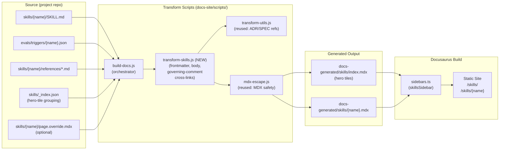

# ADR-0029: Auto-Generate Docusaurus Skill Pages from `skills/*/SKILL.md`

## Context and Problem Statement

The SDD plugin's user-facing docs site (per ADR-0004) renders ADRs and specs from their source markdown via the `docs-site/scripts/build-docs.js` transform pipeline. Skill documentation, by contrast, is hand-authored in a single monolithic file, `docs-site/content/guides/commands.mdx`, which currently inlines 15+ skills (`/sdd:adr`, `/sdd:spec`, `/sdd:plan`, `/sdd:work`, `/sdd:review`, …) into one ~500-line page. Each `skills/{name}/SKILL.md` already carries the canonical frontmatter (`name`, `description`, `argument-hint`, `allowed-tools`) plus structured body sections (`## Process`, `## Rules`, governing comments) that Claude Code itself loads as the source of truth at runtime.

This produces two concrete failures:

1. **Drift.** Every change to a `SKILL.md` requires a parallel hand-edit to `commands.mdx`. PR #131 (v5 user docs) is currently patching ~15 skills' worth of accumulated drift by hand — proof that the synchronization burden is too high.
2. **Discoverability.** Inlining 15 skills on one page means there are no per-skill deep-links (only fragment anchors), no per-skill sidebar entries, and no hero-tile landing surface. Users searching for `/sdd:work` land in a wall of text.

How should the plugin generate skill documentation so that the source of truth is the skill itself (per ADR-0015 markdown-native philosophy), the published site stays aligned without manual sync, and each skill gets a stable, deep-linkable page?

## Decision Drivers

* **Source-of-truth alignment with ADR-0015.** `SKILL.md` is what Claude Code loads at runtime. Anything user-facing should derive from the same file, not a parallel hand-maintained copy.
* **Discoverability and deep-linking.** Each skill needs a stable URL (`/skills/{name}`) suitable for sharing in PR descriptions, GitHub issues, and Slack.
* **Per-skill maintenance independence.** A change to `skills/work/SKILL.md` should regenerate only `/skills/work` — not require touching a 500-line monolith that other skills also live in.
* **Build-script complexity ceiling.** The transform pipeline already has 9 scripts under `docs-site/scripts/`. Adding a 10th is acceptable; adding five more is not. Keep the new transform simple and orthogonal to the existing ADR/spec transforms.
* **Editorial freedom for prose.** Some skills want hand-tuned overview prose, examples, or screenshots that don't fit the SKILL.md schema. The generator must not preclude editorial enrichment.
* **Hero-tile index is non-negotiable.** The landing surface for skills must be a clickable tile grid sourced from frontmatter — not a bullet list, not a table.
* **Cross-link governing artifacts.** Per ADR-0020, `<!-- Governing: ADR-XXXX, SPEC-XXXX REQ "..." -->` comments in `SKILL.md` carry the ADR/spec lineage. The generator should turn these into rendered cross-links.

## Considered Options

* **Option 1**: Status quo — keep the monolithic `commands.mdx`, hand-edit on every skill change.
* **Option 2**: Hand-author per-skill MDX pages — split the current `commands.mdx` into 15 files, one per skill, but keep them hand-maintained.
* **Option 3**: Auto-generate per-skill pages and a hero-tile index from `SKILL.md` frontmatter + structured body sections (proposed).
* **Option 4**: Hybrid — auto-generate a scaffold page per skill, and let authors override any section via a sibling `skills/{name}/page.override.mdx` that, if present, replaces the generated content for that section.

## Decision Outcome

Chosen option: **"Option 4 — Hybrid auto-generation with optional per-skill overrides"**, because it captures the alignment and zero-drift benefits of Option 3 while preserving the editorial escape hatch needed for the small number of skills (e.g., `/sdd:plan --scrum`, `/sdd:work`) whose user-facing prose materially exceeds what the SKILL.md schema can carry. In practice 95% of skills will use the pure auto-generated path; the override hatch exists so the docs aren't held hostage to the SKILL.md schema for the remaining 5%.

### Sub-decisions

**1. Schema extracted from `SKILL.md`.** The new transform script (`transform-skills.js`) reads each `skills/{name}/SKILL.md` and extracts:

| Source | Becomes |
|--------|---------|
| Frontmatter `name` | Page title, sidebar label, URL slug (`/skills/{name}`) |
| Frontmatter `description` | Page subtitle, hero-tile description, `<meta>` description |
| Frontmatter `argument-hint` | "Usage" code block |
| Frontmatter `allowed-tools` | Collapsed "Required Tools" detail block (advanced/debug) |
| `# {Title}` and intro paragraph | Page overview (first paragraph after H1, before `## Process`) |
| `<!-- Governing: ... -->` comments | "Governing Artifacts" sidebar with cross-links to ADR/spec pages |
| `## Process` body | "Process" section, headers demoted by one level so the page H1 is unique |
| `## Rules` body | "Rules" section |
| `evals/triggers/{name}.json` (where `should_trigger: true`) | "Example Invocations" section, up to 5 representative queries |
| `references/*.md` (sibling files in skill dir, if any) | "Reference" appendix, one collapsible section per file |

Sections are emitted in this fixed order: Title → Subtitle → Usage → Overview → Example Invocations → Process → Rules → Reference → Governing Artifacts. The body of `SKILL.md` after the frontmatter is otherwise transformed verbatim through the same MDX-escape utility used by ADR/spec transforms.

**2. Hero-tile index (`/skills/`).** The transform also generates `docs-generated/skills/index.mdx`, a landing page rendering one `<SkillTile>` per skill. Each tile carries: skill name, `description` (truncated to ~140 chars), and `argument-hint`, linking to `/skills/{name}`. Tiles are grouped by the workflow stage that already exists in `commands.mdx` (Creating Artifacts, Sprint Planning, Implementation, Drift Detection, Discovery, Documentation, Session Management, Lifecycle Management) — the grouping is encoded in a small `skills/_index.json` manifest committed alongside the skills, not via per-skill frontmatter (which would couple the source of truth to a UI concern).

**3. Governing-comment cross-linking.** Each `<!-- Governing: ADR-XXXX (note), SPEC-YYYY REQ "name" -->` comment becomes a "Governing Artifacts" pill list at the top of the page. ADR-XXXX renders as `[ADR-XXXX](/decisions/ADR-XXXX-slug)`, SPEC-YYYY renders as `[SPEC-YYYY](/specs/{slug}/spec#req-anchor)`. The generator reuses `transform-utils.js` `transformAdrReferences` and `transformSpecReferences` to keep link resolution consistent with the rest of the pipeline.

**4. Example invocations from `evals/triggers/{name}.json`.** Eval triggers (per ADR-0021) already curate realistic user phrasings. The generator picks the first 5 entries with `should_trigger: true` (or all of them if fewer than 5) and renders them as a code block. This gives every skill a "what does someone say to invoke this?" surface without authoring duplicate examples.

**5. Override hatch.** If `skills/{name}/page.override.mdx` exists, the transform skips generation for that skill and copies the override into `docs-generated/skills/{name}.mdx` directly. This is the override file's full content — it does not merge with the generated content. The ADR explicitly recommends *against* using overrides as a default; they exist for the prose-heavy edge cases.

**6. Pipeline integration.** A new script `docs-site/scripts/transform-skills.js` is added and wired into `docs-site/scripts/build-docs.js` after `transform-openspecs` (so spec mappings are available for governing-comment cross-links) and before `generate-graph` (so generated skill pages can participate in the artifact graph if we ever extend the graph to skills). No new external dependencies. No changes to `.github/workflows/deploy-docs.yml` — the workflow already runs `npm run build` on every push to main, which will pick up the new transform automatically.

**7. Sidebar / route shape.** A new `skillsSidebar` is added to `docs-site/sidebars.ts` and exposed in `docusaurus.config.ts` navbar between "Guides" and "ADRs". Routes:

* `/skills/` — hero-tile index
* `/skills/{name}` — per-skill page

**8. Migration plan for `commands.mdx`.** The current `docs-site/content/guides/commands.mdx` is **not deleted in this ADR's implementation PR**. Instead:

* Step 1 (the implementing PR for this ADR): generate `/skills/*` alongside the existing `commands.mdx`. Both routes resolve.
* Step 2 (a follow-up PR): replace the body of `commands.mdx` with a single redirect-style page ("This page has moved to [/skills/](/skills/). Per-skill pages are at [/skills/{name}](/skills/adr).") and update the navbar/footer links.
* Step 3 (a later PR, after one release cycle): delete `commands.mdx` entirely. Inbound links are then handled by Docusaurus's built-in 404 fallback or, optionally, a `client-redirects` plugin entry.

This staged migration keeps the v5 PR #131 work shippable without blocking on the autogen rollout.

### Consequences

* Good, because skill docs always reflect `SKILL.md` source-of-truth — drift becomes structurally impossible
* Good, because each skill gets a stable, deep-linkable URL (`/skills/work`) suitable for sharing
* Good, because hero-tile landing surface aligns the docs site with how users actually discover skills (browse, then drill in)
* Good, because per-skill maintenance independence — touching one SKILL.md regenerates only that skill's page
* Good, because governing-comment cross-links surface ADR/spec lineage on every skill page (per ADR-0020), making the artifact graph visible from the skill side
* Good, because example invocations are reused from `evals/triggers/*.json`, eliminating a second authoring surface
* Good, because the override hatch (`page.override.mdx`) preserves editorial freedom for the few skills that need it
* Good, because no new CI workflow is required — the existing `.github/workflows/deploy-docs.yml` runs `npm run build` on every push to `main`, which now includes the skill transform
* Bad, because the `transform-skills.js` script must handle MDX-unsafe content in `SKILL.md` body (curly braces in `${}` examples, angle brackets in `<tool>` tags) — mitigated by reusing `mdx-escape.js`
* Bad, because a new `skills/_index.json` manifest is introduced for hero-tile grouping; this is an additional source-of-truth file (mitigated by keeping it small and lint-checkable in CI)
* Bad, because the override hatch creates a temptation to forgo SKILL.md updates and just edit the override — mitigated by the ADR explicitly framing overrides as edge-case-only
* Neutral, because `commands.mdx` lives on temporarily during the staged migration; not deleted in this ADR's implementing PR

### Confirmation

Implementation will be confirmed by:

1. `npm run build` (in `docs-site/`) emits one `.mdx` file per skill in `docs-generated/skills/` plus an `index.mdx` hero-tile landing page.
2. The route `/skills/{name}` resolves for every skill present in `skills/`.
3. The `/skills/` index page renders one tile per skill with the correct `description` and `argument-hint`.
4. Removing `docs-site/content/guides/commands.mdx` does not break the deployed site — all inbound nav/footer links resolve to `/skills/` or a per-skill page.
5. A `<!-- Governing: ADR-0023, SPEC-0018 REQ "..." -->` comment in any `SKILL.md` renders on the corresponding skill page as cross-links to the ADR and spec pages.
6. Editing `skills/work/SKILL.md` and re-running the build updates `/skills/work` and only `/skills/work`.
7. Creating `skills/example/page.override.mdx` causes the generator to use the override verbatim, ignoring the auto-generated scaffold for that skill.

## Pros and Cons of the Options

### Option 1: Status Quo (monolithic `commands.mdx`)

* Good, because zero new build-pipeline complexity
* Good, because authors retain full editorial control over the skill docs
* Bad, because every change to a `SKILL.md` requires a parallel hand-edit — drift is the default state
* Bad, because no per-skill deep links — only fragment anchors in a 500-line page
* Bad, because no hero-tile discoverability surface
* Bad, because PR #131 already proves the maintenance burden is unsustainable at 18 skills

### Option 2: Hand-Authored Per-Skill MDX Pages

* Good, because per-skill deep links and per-skill maintenance independence
* Good, because zero new build-pipeline complexity
* Bad, because still requires hand-sync between `SKILL.md` and the per-skill MDX page — drift is still structurally possible
* Bad, because doubles the surface area to maintain (one SKILL.md + one MDX per skill)
* Bad, because the hero-tile index either becomes another hand-maintained file or requires a generator anyway

### Option 3: Pure Auto-Generation (no override hatch)

* Good, because zero drift — `SKILL.md` is the only source
* Good, because per-skill deep links and hero-tile index for free
* Good, because changes to one skill regenerate only that skill's page
* Bad, because skills with prose needs that exceed the SKILL.md schema have no escape valve
* Bad, because pushes editorial concerns into `SKILL.md`, which is consumed by Claude Code at runtime — bloating runtime context with editorial prose is a real cost

### Option 4: Hybrid Auto-Generation with Override Hatch (chosen)

* Good, because zero drift for 95% of skills, with an editorial escape valve for the rest
* Good, because per-skill deep links and hero-tile index without coupling editorial concerns to runtime context
* Good, because the override hatch is opt-in per skill — the default path stays simple
* Bad, because two paths (auto-generated and override) increase mental overhead — mitigated by ADR-level guidance that overrides are edge-case-only
* Bad, because the override hatch could be abused to skip SKILL.md updates — mitigated by reviewer norms and `/sdd:check` drift detection on overrides

## Architecture Diagram

## More Information

### Why now

The v5 user-docs PR (#131) is patching ~15 skills' worth of drift in `commands.mdx` by hand. That PR is the proof that the current model doesn't scale. This ADR proposes the structural fix; the implementing PR will follow once this ADR is accepted, at which point #131's hand-patched content can be retired in favor of the generated pages.

### Relationship to existing ADRs

* **Extends ADR-0004** (Docusaurus for Documentation Site Generation): adds a third transform alongside ADRs and specs.
* **Extends ADR-0015** (Markdown-Native Configuration): applies the same source-of-truth-is-markdown principle to user-facing docs that already governs runtime config.
* **Related to ADR-0020** (Governing Comment Reform): the generator depends on the canonical `<!-- Governing: ... -->` comment shape to render artifact cross-links.
* **Related to ADR-0023** (Frontmatter DAG): future work could add skills as a fourth artifact kind in the graph — not in scope for this ADR.

### Out of scope for this ADR

* The actual implementation of `transform-skills.js` — that is a separate spec/PR.
* Adding skills to the artifact graph (ADR-0023). Skills participate via governing comments today; first-class graph nodes would be a separate ADR.
* Internationalization of generated skill pages.
* Versioned skill docs (Docusaurus versioning is unused project-wide; not introducing it for skills alone).
