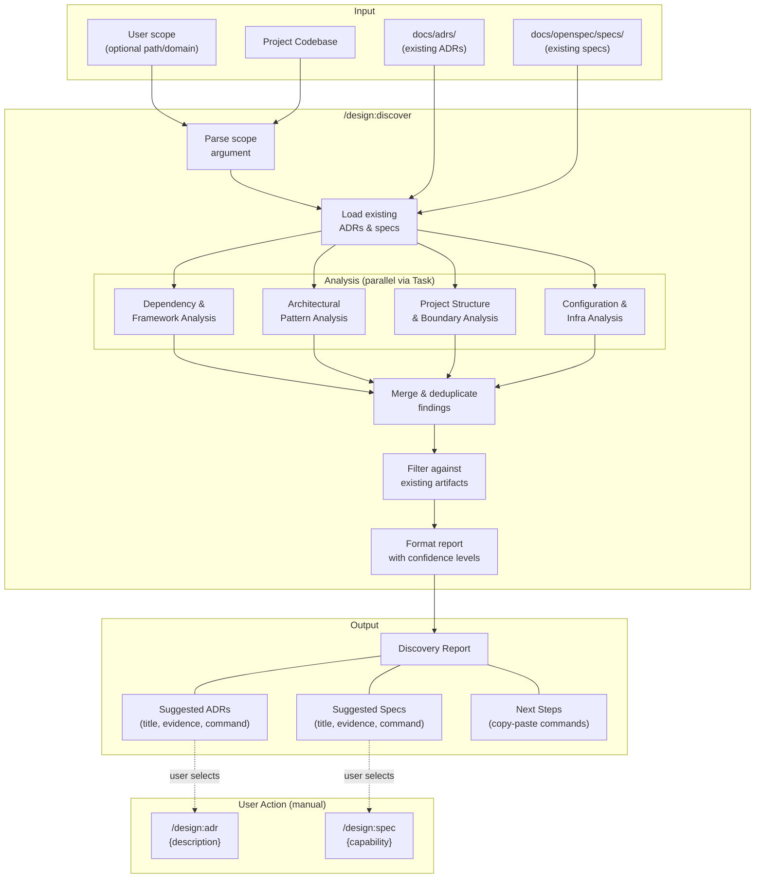

# Design: Codebase Discovery

## Context

The design plugin assumes users start by writing ADRs and specs, then build code that conforms to them. In practice, most teams adopt the plugin on projects that already have significant codebases with implicit architectural decisions embedded in dependency choices, code structure, and configuration. There is no way to bootstrap a design artifact library from existing code. This capability adds `/design:discover` to reverse-engineer what the code implies and suggest artifacts the user can selectively create. See ADR-0005 for the full decision rationale.

## Goals / Non-Goals

### Goals
- Enable existing projects to adopt the design plugin without starting from scratch
- Identify implicit architectural decisions across dependencies, patterns, structure, and infrastructure
- Identify subsystem boundaries worthy of formal specification
- Produce actionable suggestions with evidence and ready-to-use commands
- Avoid duplicating decisions already captured in existing ADRs and specs
- Support scoped analysis for large codebases

### Non-Goals
- Auto-generating ADRs or specs (users decide what to formalize)
- Replacing manual architectural review or discovery sessions
- Analyzing code quality, performance, or security (those are different concerns)
- Tracking changes over time (re-run the skill as the project evolves)

## Decisions

### Suggestion-only output over auto-generation

**Choice**: The skill produces a report of suggestions; it does not create any files.
**Rationale**: Auto-generating artifacts removes user agency and risks polluting the artifact directories with low-quality drafts. The suggestion approach lets users evaluate each recommendation and decide what's worth formalizing. This aligns with the plugin's existing pattern where creation skills (`/design:adr`, `/design:spec`) are the only file-writing entry points.
**Alternatives considered**:
- Auto-generate draft ADRs/specs with `proposed`/`draft` status: Removes user control; cleanup burden if suggestions are wrong
- Interactive mode asking per-suggestion: Slows down the process; better to present everything and let the user choose

### Single skill over split or audit extension

**Choice**: A single `/design:discover` skill rather than splitting into ADR/spec discovery or extending `/design:audit`.
**Rationale**: Decision discovery and spec boundary discovery draw on the same codebase exploration -- understanding the auth system reveals both "chose JWT" (ADR) and "auth API boundary" (spec). Extending audit would overload a skill with a fundamentally different purpose (validation vs. discovery).
**Alternatives considered**:
- Two skills (`/design:discover:adrs`, `/design:discover:specs`): Redundant analysis; introduces unused sub-namespace pattern
- `--discover` flag on `/design:audit`: Conflates validation with discovery; different output formats needed

### Parallel exploration for large codebases

**Choice**: Use Task tool to spawn parallel Explore agents for different analysis categories.
**Rationale**: Analyzing dependencies, patterns, structure, and infrastructure are independent tasks that can run concurrently. Parallel exploration reduces wall-clock time significantly on large codebases.
**Alternatives considered**:
- Sequential analysis: Simpler but slower; acceptable for small projects but scales poorly
- Always parallel: Unnecessary overhead for small projects; skill should decide based on project size

### Confidence indicators on suggestions

**Choice**: Each suggestion includes a confidence level (high/medium/low) based on evidence strength.
**Rationale**: Not all discoveries are equally certain. A `package.json` dependency is strong evidence (high confidence), while an inferred pattern from code structure is weaker (medium/low). Confidence helps users prioritize which suggestions to act on.
**Alternatives considered**:
- No confidence levels: Simpler output but treats all suggestions equally, which they aren't
- Numeric scores: Over-precise for semantic analysis; three levels are sufficient

## Architecture

## Risks / Trade-offs

- **Quality varies by codebase**: Well-structured projects with clear conventions produce better suggestions than sprawling monoliths. Mitigation: confidence indicators signal uncertainty; evidence citations let users evaluate.
- **Large codebase performance**: Analyzing every file in a large project may be slow. Mitigation: scope argument limits analysis; parallel exploration agents reduce wall-clock time.
- **Over-suggestion**: The skill may suggest too many ADRs/specs, overwhelming the user. Mitigation: group related decisions; prioritize high-confidence suggestions; limit to the most significant findings.
- **Under-suggestion**: Implicit decisions embedded in code idioms rather than explicit declarations may be missed. Mitigation: analyze patterns and structure, not just configuration files; accept that some decisions require human insight.
- **Stale on re-run**: If the user creates some suggested artifacts but not all, re-running discover should not re-suggest the ones already created. Mitigation: duplicate avoidance reads existing artifacts every run.

## Open Questions

- Should the report include a "priority" ranking beyond confidence (e.g., "document this first because other decisions depend on it")?
- Should the skill support a `--review` flag for team-based discovery (explorer + reviewer), or is single-agent sufficient for a read-only report?
- What is the maximum number of suggestions before the report becomes unwieldy? Should there be a cap with a "run with --all to see everything" option?
