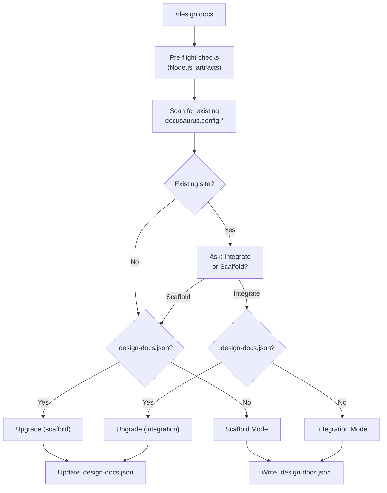
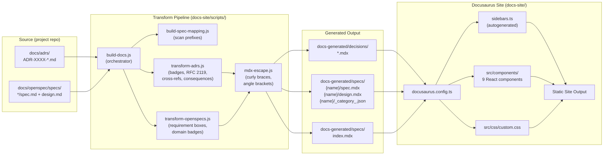
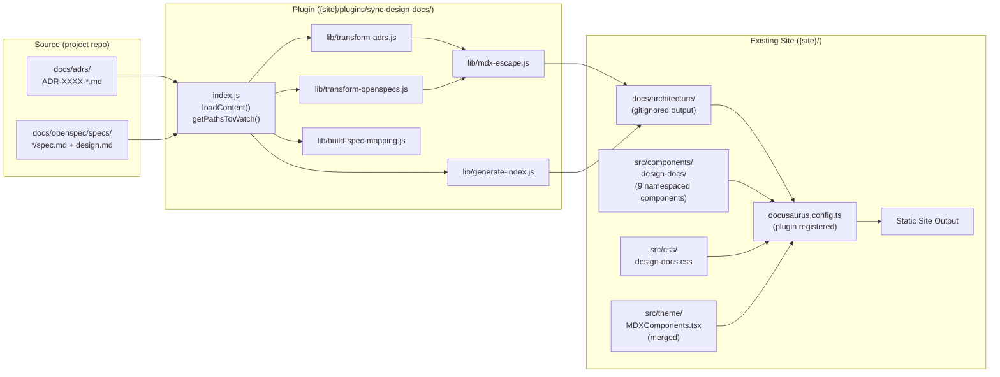
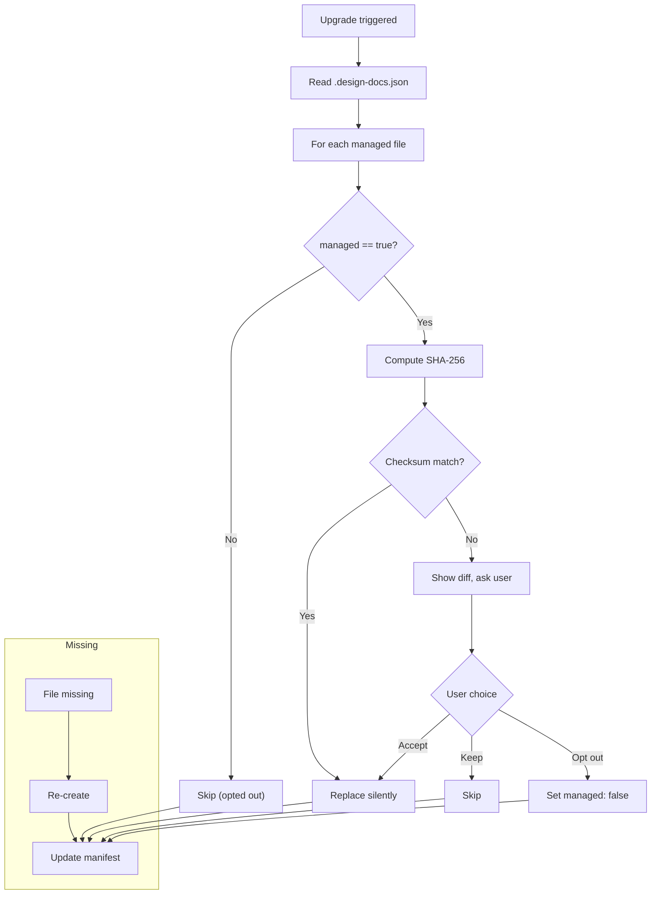

# Design: Documentation Site Generation

## Context

Teams accumulate ADRs and specs as markdown files in the repository. These lack discoverability -- no search, no cross-referencing, no visual distinction for RFC 2119 keywords, and no way to share with stakeholders who don't use Git. This capability adds `/design:docs` to generate Docusaurus documentation from design artifacts, supporting both standalone scaffolding and integration into existing Docusaurus sites, with manifest-based upgrades and separate spec/design pages. See ADR-0004 for the original scaffolding decision and ADR-0006 for integration mode, upgrade lifecycle, and spec/design separation.

## Goals / Non-Goals

### Goals
- Scaffold a complete, working Docusaurus site from templates in one command
- Integrate design documentation into existing Docusaurus sites via a build-time plugin
- Transform ADRs and specs into rich MDX with custom React components
- Provide live editing with file watching and hot reload
- Produce deployable static output for GitHub Pages or any CDN
- Give users full ownership of the generated site (copy, don't link)
- Provide a safe upgrade path when the plugin ships improvements
- Render spec requirements and design decisions as separate, independently navigable pages

### Non-Goals
- Hosting or deployment automation (users deploy via their own CI/CD)
- Custom theme creation (the default Docusaurus theme with custom CSS is sufficient)
- OpenAPI spec rendering (only if the project has one, and it's not included by default)
- Automatic conflict resolution during upgrades (users must review modified file diffs)

## Decisions

### Docusaurus over other static site generators

**Choice**: Docusaurus 3.9 with React, MDX, and the classic preset.
**Rationale**: Best combination of native MDX support, React component model for rich rendering, built-in Mermaid via `@docusaurus/theme-mermaid`, and mature ecosystem with dark mode, search, and sidebar generation out of the box.
**Alternatives considered**:
- MkDocs with Material: No native JSX; custom components require Jinja2 macros; Python dependency
- VitePress: Vue-based (different ecosystem); no native MDX; smaller plugin ecosystem
- Astro Starlight: Newer/less mature; Mermaid requires extra config; island architecture adds complexity

### Copy-then-customize over scaffold-from-scratch

**Choice**: `cp -r` the entire `templates/docusaurus/` directory, then customize only `package.json` and `docusaurus.config.ts`.
**Rationale**: Templates are production-ready, not skeletons. Copying gives users full ownership and avoids the plugin needing to generate code at runtime.
**Alternatives considered**:
- Runtime code generation: More flexible but harder to maintain and debug
- Symlinks to plugin templates: Users can't customize without modifying the plugin

### Separate docs-generated directory

**Choice**: Transform output goes to `docs-generated/` at the project root, not into `docs-site/docs/`.
**Rationale**: Keeps generated MDX clearly separated from source. Makes it obvious what is a build artifact versus source content.
**Alternatives considered**:
- Output into `docs-site/docs/`: Mixes generated and source files; confusing for version control

### Centralized MDX escaping

**Choice**: All MDX v3 escaping logic lives in `mdx-escape.js` rather than being scattered across transform scripts.
**Rationale**: Single source of truth for escape rules. Easier to test and maintain. Preserves JSX component tags while escaping literal curly braces and angle brackets.
**Alternatives considered**:
- Per-transform escaping: Duplicated logic; inconsistent behavior between ADR and spec transforms

### Dual-mode: scaffold vs. integration (ADR-0006)

**Choice**: Detect existing Docusaurus sites and offer two modes -- scaffold (standalone `docs-site/`) or integration (build-time plugin into existing site).
**Rationale**: Scaffold mode's zero-configuration simplicity remains valuable for greenfield projects, while integration mode addresses the real gap for teams with existing Docusaurus sites. A universal plugin-only approach would sacrifice scaffold mode's simplicity.
**Alternatives considered**:
- Universal plugin-only: Removes the simple "copy and run" experience; breaking change for existing users
- Git submodule linking: Submodules are error-prone; customizations create merge conflicts on every update

### Build-time Docusaurus plugin for integration mode (ADR-0006)

**Choice**: Integration mode installs a self-contained Docusaurus plugin (`sync-design-docs`) that runs transforms during the `loadContent()` lifecycle phase and watches source files via `getPathsToWatch()`.
**Rationale**: `loadContent()` is the standard Docusaurus hook for generating content before the build. The plugin is self-contained with its own transform scripts (parameterized for the existing site's paths), requiring no modifications to the existing site's build pipeline beyond registering the plugin.
**Alternatives considered**:
- Pre-build script: Requires users to modify their build commands; not integrated with Docusaurus HMR
- Custom Docusaurus preset: Overly heavy; presets are meant for bundling multiple plugins and themes

### Component namespacing under `design-docs/` (ADR-0006)

**Choice**: In integration mode, React components are installed to `{site}/src/components/design-docs/` rather than directly into `{site}/src/components/`.
**Rationale**: Prevents naming collisions with existing components in the site. A project may already have a `StatusBadge.tsx` with different behavior.
**Alternatives considered**:
- Direct placement in `src/components/`: Risk of overwriting existing components with the same names
- Prefixed filenames (e.g., `DesignStatusBadge.tsx`): Requires changing all component references in transforms; inconsistent with scaffold mode

### Manifest-based upgrade with checksum tracking (ADR-0006)

**Choice**: Create a `.design-docs.json` manifest at the project root tracking plugin version, mode, site directory, and SHA-256 checksums of all managed files. On re-run, compare checksums to classify files as unchanged (safe to replace), modified (show diff and ask), or missing (re-create).
**Rationale**: Checksums precisely detect user customizations without requiring git operations. Works in any environment (CI, restricted shells). The manifest is a single inspectable JSON file.
**Alternatives considered**:
- Git-based diffing against version tags: Requires plugin as a git repo at upgrade time; can't distinguish user changes from plugin changes without a common ancestor
- No upgrade support: Discourages upgrades; users permanently drift from improvements

### Managed file opt-out (ADR-0006)

**Choice**: Each file in the manifest has a `managed: boolean` field. Users can set `managed: false` to permanently exclude a file from upgrades.
**Rationale**: Some users will heavily customize specific files (e.g., CSS, a particular component). Rather than repeatedly prompting them on every upgrade, opt-out provides a permanent resolution.
**Alternatives considered**:
- No opt-out (always prompt for modified files): Annoying for files the user has intentionally diverged

### Directory-per-spec with separate pages (ADR-0006)

**Choice**: Transform each spec into a directory with separate `spec.mdx` and `design.mdx` files, using `_category_.json` for Docusaurus sidebar configuration. Specs with only `spec.md` (no `design.md`) emit a single page without a category wrapper.
**Rationale**: Separate pages are independently searchable and linkable. `_category_.json` is the standard Docusaurus sidebar mechanism, requiring no custom sidebar logic. The conditional handling for single-document specs avoids the awkward appearance of a category with a single child.
**Alternatives considered**:
- Tabbed single page: Tab content is invisible to Docusaurus search; deep linking into tabs is complex
- Combined single page (status quo): Long pages are hard to navigate; no direct linking to design decisions

### Spec overview index page (ADR-0006)

**Choice**: Generate an `index.mdx` in the specs output directory with a table listing all specs and linked columns for Specification and Design documents.
**Rationale**: Provides a single entry point for browsing all specs. The table format makes it easy to see at a glance which specs have design documents and which don't.
**Alternatives considered**:
- Sidebar-only navigation: No overview; users must expand each category to find documents
- Auto-generated landing page from Docusaurus: Less control over formatting; can't include the linked table

## Architecture

### Mode Selection

### Scaffold Mode Pipeline

### Integration Mode Pipeline

### Upgrade Flow

## Risks / Trade-offs

- **MDX v3 escaping complexity**: Curly braces and angle brackets in source markdown must be escaped without breaking JSX components. Mitigation: centralized `mdx-escape.js` with thorough edge-case handling.
- **Node.js dependency**: Docusaurus requires Node.js >= 20. Mitigation: pre-flight check in the skill reports the dependency clearly.
- **Heavy node_modules**: Docusaurus sites have large dependency trees. Mitigation: acceptable trade-off for the rich component model.
- **Transform pipeline maintenance**: 5 scripts must be kept in sync as ADR/spec formats evolve. Mitigation: shared utilities in `transform-utils.js` reduce duplication.
- **Dual-mode surface area**: Two modes (scaffold and integration) double the testing and documentation burden. Mitigation: both modes share the same transform pipeline; integration mode reuses scaffold mode's scripts with parameterized paths.
- **Manifest deletion**: If `.design-docs.json` is deleted, upgrade tracking is lost. Mitigation: the skill detects this case and offers to re-create the manifest by checksumming existing files.
- **URL structure change**: Separating spec/design into directory-per-spec changes URLs from `/specs/{name}` to `/specs/{name}/spec` and `/specs/{name}/design`. Mitigation: this is a one-time breaking change documented in ADR-0006; existing bookmarks will need updating.
- **Integration transform sync**: Integration mode's parameterized transform scripts must stay in sync with scaffold mode's `__dirname`-relative scripts. Mitigation: the integration templates are shipped alongside the scaffold templates and tested together.

## Open Questions

- Should the docs site include a changelog page generated from git history?
- Should the transform pipeline support custom component injection via user configuration?
- Should the upgrade flow support a `--force` flag to replace all files without prompting?
