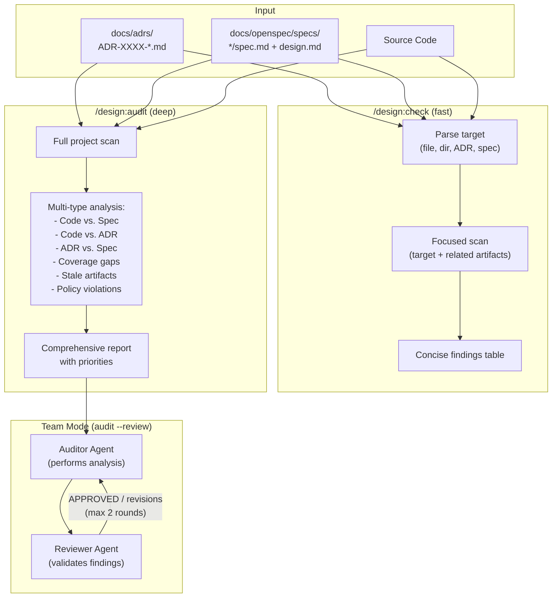

# Design: Drift Introspection Skills

## Context

The design plugin provides skills for creating and managing ADRs and specs, but has no mechanism for validating that implementation code remains aligned with these governing documents. As projects evolve, drift between design artifacts and code is inevitable. This capability adds two skills -- `/design:check` (fast, focused) and `/design:audit` (deep, comprehensive) -- to detect and report that drift. See ADR-0001 for the full decision rationale.

## Goals / Non-Goals

### Goals
- Provide fast feedback during development with `/design:check`
- Provide thorough analysis during reviews with `/design:audit`
- Produce actionable findings with specific file paths and line references
- Support the existing `--review` team pattern for `/design:audit`

### Non-Goals
- Auto-fixing drift (a future `/design:sync` skill may address this)
- Enforcing drift checks as CI gates (users can integrate manually)
- Replacing manual code review -- the skills augment, not replace, human judgment

## Decisions

### Layered approach over single command

**Choice**: Two separate skills (`/design:check` and `/design:audit`) differentiated by depth and scope.
**Rationale**: Maps to natural developer workflows -- quick checks while coding, deep audits at review time. A single command that tries to do everything becomes unwieldy.
**Alternatives considered**:
- Single `/design:drift` skill: SKILL.md becomes too complex; `--review` mode is awkward for quick checks
- Multiple specialized skills (`/design:gaps`, `/design:compliance`): Nearly doubles the plugin command count; cross-cutting findings don't fit neatly into categories

### LLM-native semantic analysis

**Choice**: Leverage Claude's semantic understanding for drift detection rather than syntactic pattern matching.
**Rationale**: Design artifacts are natural-language documents. Detecting whether code "matches" an ADR requires understanding intent, not just keyword matching.
**Alternatives considered**:
- Regex-based drift detection: Too brittle for natural-language requirements; high false-positive rate

### Structured findings output

**Choice**: Markdown tables with severity levels (critical, warning, info) for all output.
**Rationale**: Structured output is parseable by downstream tools and consistent across both skills. Severity levels help users prioritize.
**Alternatives considered**:
- Free-form prose: Harder to scan and act on; inconsistent across runs

## Architecture

## Risks / Trade-offs

- **False positives**: Semantic analysis may flag intentional deviations as drift. Mitigation: include "info" severity for uncertain findings and provide recommendations rather than assertions.
- **Context window limits**: Large codebases may exceed context for comprehensive audits. Mitigation: `/design:audit` scans incrementally by artifact, not by loading everything at once.
- **Overlapping output**: `/design:check` and `/design:audit` may produce overlapping findings on the same target. This is acceptable since they serve different use cases.

## Open Questions

- Should `/design:check` support a `--fix` flag to suggest updates to drifted artifacts?
- Should audit findings be cacheable to avoid re-analyzing unchanged files?
