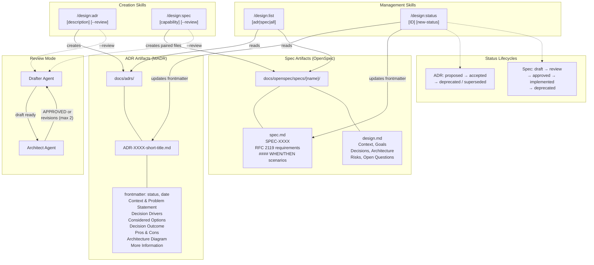

# Design: Foundational Design Artifact Formats and Core Skills

## Context

The design plugin needed standard formats for recording architectural decisions and formal specifications before any other capabilities could be built. Without standardized formats, teams would produce inconsistent documents that are hard to cross-reference, review, and maintain. This capability establishes MADR for ADRs, OpenSpec for specifications, and four core skills for artifact lifecycle management. See ADR-0003 for the full decision rationale.

## Goals / Non-Goals

### Goals
- Adopt community-standard formats with established tooling and documentation
- Ensure structured templates that guide authors toward completeness
- Separate requirements ("what") from design rationale ("how") in specifications
- Provide core lifecycle management without requiring manual file editing
- Establish consistent plugin UX patterns for all skills

### Non-Goals
- Custom format design (community adoption outweighs minor fit advantages)
- Full BDD/Gherkin test automation integration
- Version control or branching for design artifacts

## Decisions

### MADR over other ADR formats

**Choice**: MADR (Markdown Architectural Decision Records) version 3.0.
**Rationale**: Most widely adopted format with structured sections that guide completeness. YAML frontmatter enables tooling. Extensible enough to add a mandatory Architecture Diagram section.
**Alternatives considered**:
- Y-Statements: Too concise for multi-option analysis; no metadata support
- Nygard format: Lacks considered-alternatives sections; no standard frontmatter
- Custom format: Zero community adoption; maintenance burden

### OpenSpec paired files over single document

**Choice**: OpenSpec with paired spec.md (requirements) + design.md (architecture/rationale).
**Rationale**: Cleanly separates "what" from "how", allowing each to evolve independently and be reviewed by different stakeholders. RFC 2119 keywords in spec.md enable unambiguous normative statements.
**Alternatives considered**:
- RFC-style single document: Too long for complex capabilities; mixes concerns
- Gherkin/BDD: Too rigid for non-behavioral requirements; no RFC 2119 support
- Custom format: No community adoption or tooling

### Four core skills

**Choice**: `/design:adr`, `/design:spec`, `/design:list`, and `/design:status` as the foundational skill set.
**Rationale**: Covers creation, discovery, and lifecycle management -- the minimal complete set for artifact management.
**Alternatives considered**:
- Fewer skills (combine list + status): Different operations with different risk profiles (read-only vs. file modification)
- More skills (separate gap analysis, cross-referencing): Addressed by ADR-0001's drift skills

### Scenario heading level at ####

**Choice**: Scenarios use exactly `####` (h4) headings in spec.md.
**Rationale**: This specific level enables downstream tooling (the `/design:docs` Docusaurus generator) to reliably parse and render scenarios with RequirementBox components. Using `###` or bullets would cause silent failures.
**Alternatives considered**:
- `###` headings: Conflicts with requirement headings at the same level
- Bullet-list scenarios: Not parseable by the transform pipeline

## Architecture

## Risks / Trade-offs

- **Template overhead**: MADR's full template can feel heavyweight for trivial decisions. Mitigation: accept that documentation overhead is the price of consistency.
- **Paired-file drift**: spec.md and design.md in the same capability can drift from each other. Mitigation: `/design:check` and `/design:audit` (ADR-0001) detect this.
- **Format lock-in**: Adopting MADR and OpenSpec means accepting their conventions. Mitigation: both formats are extensible (e.g., added mandatory Architecture Diagram section to MADR).

## Open Questions

- Should `/design:status` support batch updates (e.g., deprecate all ADRs related to a superseded capability)?
- Should the plugin enforce a minimum set of MADR sections or allow authors to skip optional ones?
