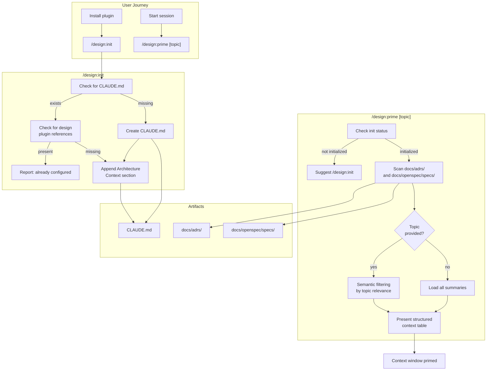

# Design: Initialization and Context Priming

## Context

The design plugin lacks an onboarding story. Users install the plugin and must discover capabilities through trial and error. There is no way to orient Claude to a project's existing architectural landscape at the start of a session. This capability adds `/design:init` for one-time project setup and `/design:prime` for per-session context loading. See ADR-0002 for the full decision rationale.

## Goals / Non-Goals

### Goals
- Provide a one-command onboarding experience with `/design:init`
- Enable fast session startup with `/design:prime` loading relevant context
- Support topic-focused priming to conserve context window tokens
- Ensure idempotent, safe initialization that never corrupts existing `CLAUDE.md`

### Non-Goals
- Auto-running `/design:prime` via Claude Code hooks on session start (future work)
- Plugin configuration or shared settings management via `/design:init`
- Priming with non-design artifacts (e.g., README, code comments)

## Decisions

### Separate skills over combined command

**Choice**: Two distinct skills (`/design:init` and `/design:prime`) with different responsibilities and frequencies of use.
**Rationale**: Initialization is a one-time file-modification operation; priming is a per-session read-only operation. Combining them conflates different operations behind one name and confuses users about what happens on repeat runs.
**Alternatives considered**:
- Single `/design:init` that also primes: "init" implies one-time use, but priming is per-session; wastes tokens if user only wants file setup
- Single `/design:prime` that auto-inits: "prime" modifying files is a surprising side effect; no way to run init separately

### Semantic topic filtering

**Choice**: Use Claude's semantic understanding for topic filtering rather than keyword matching.
**Rationale**: `/design:prime security` should surface ADRs about authentication, authorization, and encryption -- not just those with "security" in the title.
**Alternatives considered**:
- Keyword search: Misses semantically related artifacts; poor recall

### Read-only prime with minimal tools

**Choice**: `/design:prime` uses only Read, Glob, and Grep in its allowed-tools.
**Rationale**: Priming should never modify files. Restricting tools enforces this constraint at the skill level.
**Alternatives considered**:
- Full tool access: Unnecessary and risky for a read-only operation

## Architecture

## Risks / Trade-offs

- **Two-command learning curve**: Users must learn both `init` and `prime`. Mitigation: `prime` detects uninitialized state and suggests `init`.
- **Context window consumption**: Loading all artifacts wastes tokens for large projects. Mitigation: topic filtering keeps priming selective.
- **Semantic filtering accuracy**: Topic matching depends on Claude's interpretation. Mitigation: err on the side of inclusion (load more rather than less).

## Open Questions

- Should `/design:init` also set up shared plugin settings from `marketplace.json`?
- Should `/design:prime` output a token count estimate so users know the context cost?
