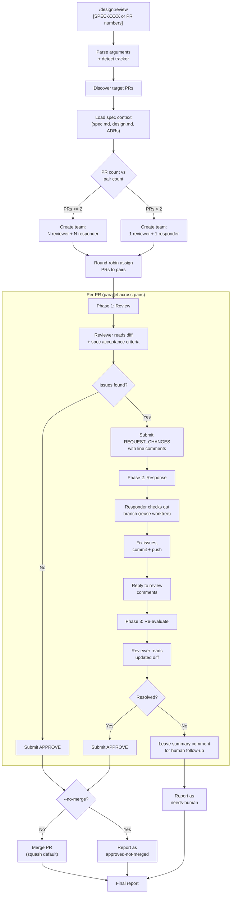
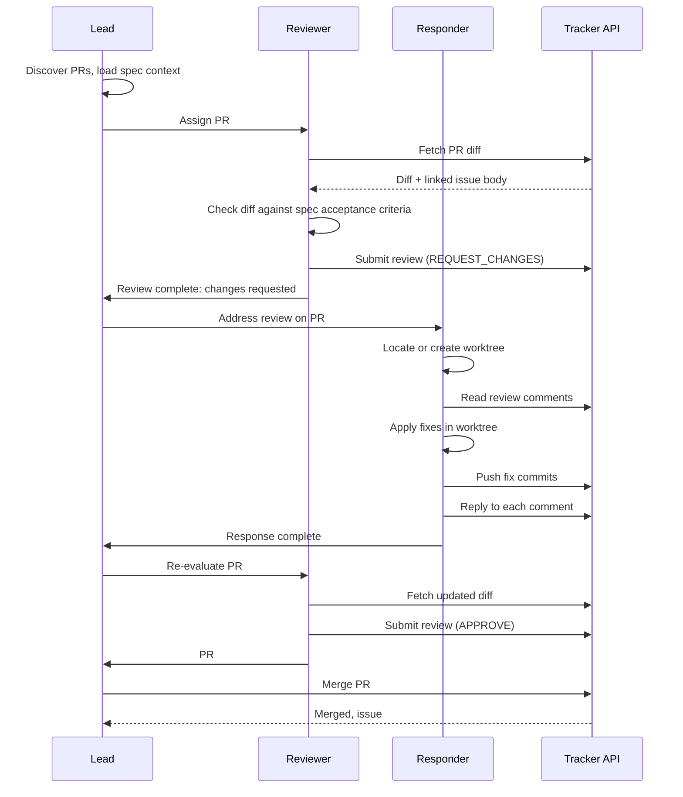
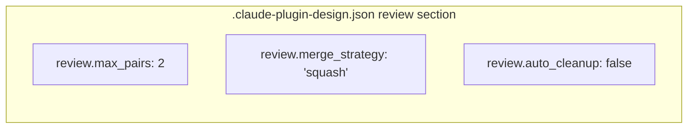

# Design: Parallel PR Review and Response

## Context

The design plugin's workflow pipeline covers architectural decisions (ADR), specifications (spec), sprint planning (plan), issue organization (organize), developer conventions (enrich), and parallel implementation (work). The final manual step -- reviewing, addressing feedback, and merging PRs -- is the remaining bottleneck. ADR-0010 decided to automate this with a `/design:review` skill that uses reviewer-responder agent pairs. This design document describes how to implement that decision. See ADR-0010 and SPEC-0009.

## Goals / Non-Goals

### Goals
- Automate PR review with spec-aware feedback that checks acceptance criteria, not just style
- Address review comments by pushing fix commits and replying to each comment
- Merge approved PRs automatically (with opt-out via `--no-merge`)
- Process multiple PRs concurrently using agent pairs
- Bound the review cycle to exactly one round to prevent runaway compute
- Reuse existing worktrees from `/design:work` when available

### Non-Goals
- Replacing human review for security-critical or high-risk changes
- Multi-round review cycles (one round only; human picks up unresolved items)
- Modifying the `/design:work` skill or its PR creation behavior
- Supporting trackerless environments (a live tracker with PR/MR support is required)
- Running CI/CD pipelines or waiting for external check suites

## Decisions

### Reviewer-responder pairs over single-agent processing

**Choice**: Organize agents into dedicated reviewer-responder pairs rather than having one agent per PR that self-reviews.
**Rationale**: Separation of concerns is the core value of code review. An agent that wrote code (via `/design:work`) and then reviews its own output provides no independent verification. Dedicated reviewers who only read diffs and check spec compliance provide genuine quality assurance. Dedicated responders who only fix issues keep the roles clean.
**Alternatives considered**:
- Self-reviewing agent: No separation of concerns; the review adds no value beyond what the implementation agent already verified
- Single shared reviewer: Bottleneck; cannot start responses until all reviews are done

### Round-robin PR distribution

**Choice**: Distribute PRs across pairs using simple round-robin (PR 1 → Pair 1, PR 2 → Pair 2, PR 3 → Pair 1, ...).
**Rationale**: PRs from `/design:work` are already scoped to individual issues with clear boundaries. Domain-aware scheduling (grouping related PRs to one pair) adds complexity with minimal benefit since each PR is self-contained. Round-robin is fair, deterministic, and requires no analysis of PR content.
**Alternatives considered**:
- Domain-based grouping: Over-engineered for independent, issue-scoped PRs
- Shortest-queue-first: Adds dynamic scheduling complexity; round-robin is sufficient

### One review-response round

**Choice**: Exactly one round of review → response → re-evaluation per PR.
**Rationale**: ADR-0010 established bounded iteration as a key driver. One round catches the majority of issues (spec compliance, missing tests, obvious bugs) while keeping compute predictable. Complex issues that survive one round are better handled by humans who can make judgment calls the agent cannot.
**Alternatives considered**:
- Two rounds: Doubles compute cost; diminishing returns after first round
- Unbounded rounds: Risk of infinite loops; unpredictable cost

### Reuse `/design:work` worktrees

**Choice**: Responders check for existing worktrees at `.claude/worktrees/{branch-name}` before creating new ones.
**Rationale**: `/design:work` creates worktrees that may still exist (especially if `auto_cleanup` is false). Reusing them avoids redundant checkouts and preserves any local state. If the worktree was cleaned up, the responder creates a fresh one from the remote branch.
**Alternatives considered**:
- Always create new worktrees: Wastes time re-checking out code that may already be local
- Require worktrees to exist: Too strict; users who cleaned up after `/design:work` would be blocked

### Squash merge as default

**Choice**: Default merge strategy is squash, configurable via `.claude-plugin-design.json` `review.merge_strategy`.
**Rationale**: Squash produces clean commit history (one commit per PR) which aligns with the "one issue, one branch, one PR" convention from `/design:plan`. Teams that prefer merge commits or rebases can configure their preference.
**Alternatives considered**:
- Merge commit default: Preserves individual commits but clutters history for agent-generated code
- Rebase default: Risk of rewriting public history if branches were shared

## Architecture

## Risks / Trade-offs

- **One round may be insufficient**: Complex PRs with deep architectural issues may not be fully resolved in one review-response cycle. Mitigation: the skill leaves clear comments explaining what remains, and the report lists unresolved PRs for human follow-up.
- **Auto-merge trust**: Merging without human approval requires trust in the reviewer agent's judgment. Mitigation: the `--no-merge` flag provides a safety valve; users can review approvals before manually merging.
- **Merge conflicts**: If multiple PRs touch overlapping files, merging one may cause conflicts in another. Mitigation: the skill handles merge failures gracefully, reports the conflict, and continues with remaining PRs. The user can resolve conflicts and re-run `/design:review` for the affected PRs.
- **Compute cost**: 4 agents (2 pairs) per invocation is compute-intensive. Mitigation: adaptive pair count reduces to 1 pair for small batches; `.claude-plugin-design.json` `review.max_pairs` provides control.
- **Worktree state**: Reused worktrees from `/design:work` may have uncommitted changes or be on the wrong commit. Mitigation: responders should `git pull` and verify they are on the correct branch before making changes.
- **Tracker API rate limits**: Submitting reviews, pushing commits, and merging in rapid succession may hit rate limits. Mitigation: sequential processing within each pair (review → response → merge) provides natural pacing; individual failures are reported and skipped.

## Open Questions

- Should the skill support reviewing PRs across multiple repositories (e.g., a monorepo with multiple specs)?
- Should reviewers enforce a minimum test coverage threshold before approving?
- Should the skill post a summary comment on each PR before closing (e.g., "Reviewed and merged by /design:review")?
- Should there be a `--strict` flag that requires ALL review comments to be addressed before approving (vs. the default which allows the reviewer to approve with minor unresolved items)?
