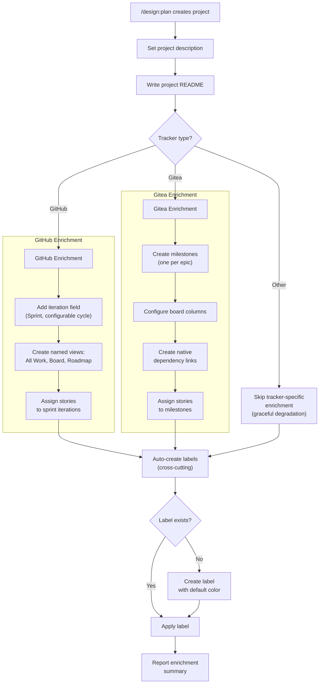
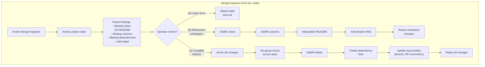
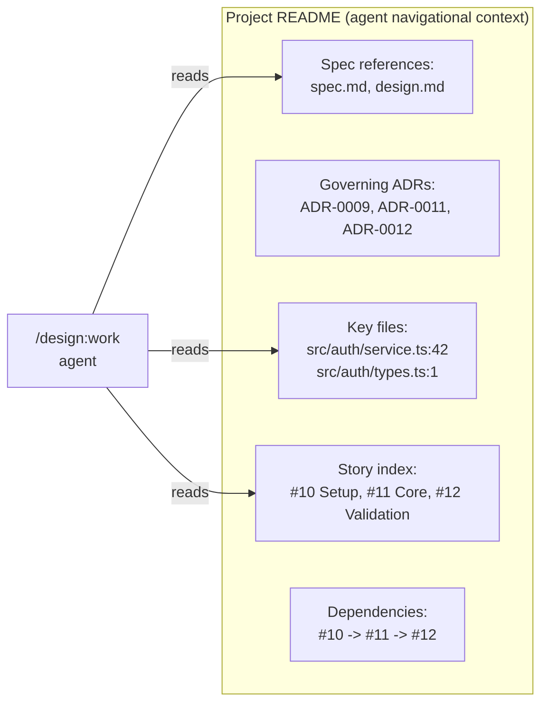
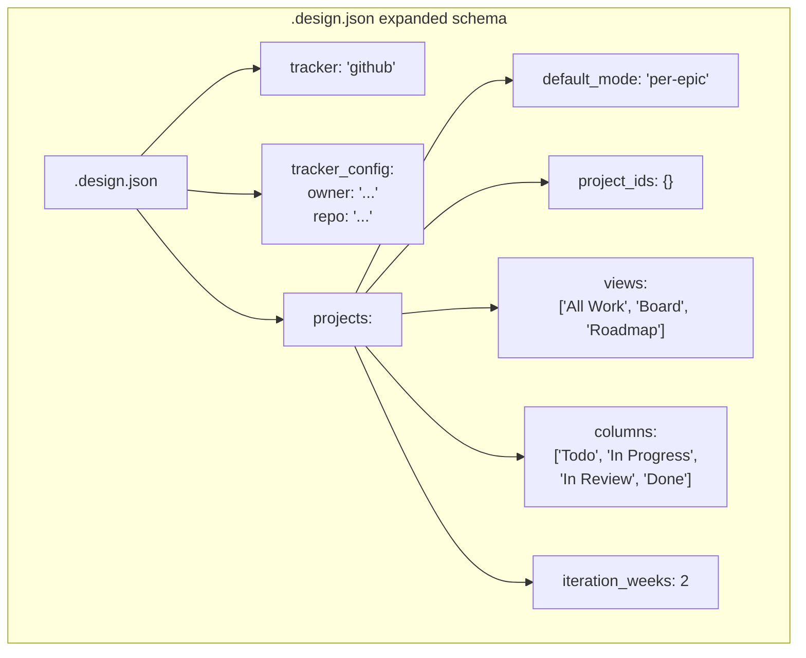

# Design: Project Workspace Enrichment

## Context

Projects created by `/design:plan` (ADR-0009, SPEC-0007) and `/design:organize` are currently dumb containers -- they hold issues but provide no navigational context, views, or structure. A GitHub Project created by `/design:plan` is an empty board with a default "Table" view and no description. A Gitea project is similarly bare. This means agents have no project-scoped context (they must independently rediscover architecture context every time), humans have no useful views (they must manually configure boards and roadmaps), and tracker-native features like iteration fields, milestones, and dependencies go unused.

ADR-0012 decided to implement full workspace enrichment: project descriptions and READMEs, iteration fields, named views, Gitea milestones and board columns, auto-label creation, Gitea native dependencies, and a three-tier `/design:organize` intervention model. This spec formalizes those decisions into implementable requirements. See ADR-0012, ADR-0009, and ADR-0011.

## Goals / Non-Goals

### Goals
- Enrich GitHub Projects with a description, README, iteration field ("Sprint"), and three named views (All Work, Board, Roadmap)
- Enrich Gitea projects with milestones (one per epic), board columns (Todo/In Progress/In Review/Done), and native dependency links
- Auto-create labels across all issue-touching skills using a try-then-create pattern, eliminating silent label-not-found failures
- Upgrade `/design:organize` to a three-tier intervention model: leave as-is, restructure workspace, or complete refactor
- Add `.design.json` keys for `projects.views`, `projects.columns`, and `projects.iteration_weeks` (all optional, backward-compatible)
- Degrade gracefully when a tracker lacks a feature -- skip the enrichment step and report, never fail the entire operation

### Non-Goals
- Syncing README content when specs or ADRs change after project creation (stale READMEs are accepted as a known trade-off)
- Supporting iteration fields on trackers other than GitHub Projects V2 (Gitea, GitLab, Jira, and Linear lack equivalent features)
- Adding labels to `.design.json` configuration (label colors are hardcoded defaults; customization is a future concern)
- Modifying the core issue creation flow in `/design:plan` -- enrichment is a post-creation step
- Implementing a project README refresh or update command (future work)
- Supporting custom view types beyond the three defaults (Table, Board, Roadmap)

## Decisions

### README as project field vs. repository file

**Choice**: Store the project README as a GitHub Project README field, not as a file in the repository.
**Rationale**: A repository file would require committing to the repo and would clutter the source tree with tracker-specific metadata. The GitHub Projects V2 API supports a README field that is scoped to the project and visible in the project's sidebar. This keeps navigational context where it belongs -- in the project -- and avoids coupling the repository's file tree to tracker state. For Gitea, which lacks a project README field, the README content is placed in the project description (which supports markdown).
**Alternatives considered**:
- Repository file (e.g., `docs/projects/PROJECT-README.md`): Clutters the repo; requires git commits for tracker metadata
- Issue pinned to the project: Not discoverable by agents; not structurally distinct from work items
- Comment on the epic issue: Buried in the issue timeline; not a first-class project artifact

### GraphQL for GitHub views and iterations

**Choice**: Use the GitHub Projects V2 GraphQL API (`gh api graphql`) for creating iteration fields, named views, and setting the project README.
**Rationale**: The GitHub REST API does not support Projects V2 features (views, iteration fields, custom fields). The GraphQL API is the only path. The `gh` CLI supports `gh api graphql -f query='...'` which allows embedding GraphQL mutations directly. This avoids requiring a separate GraphQL client or MCP tool. The trade-off is increased API complexity and separate rate limits, but the operations are infrequent (once per project creation).
**Alternatives considered**:
- REST API: Does not support Projects V2 features; only works for classic projects (deprecated)
- MCP tool for GraphQL: Would require an MCP server that wraps GitHub GraphQL; adds a dependency
- Skip views and iterations entirely: Leaves projects as dumb containers, which is the problem ADR-0012 aims to solve

### Try-then-create for labels

**Choice**: Use a try-then-create pattern for label application: attempt to apply the label, and if the API returns a "label not found" error, create the label with a default color and retry.
**Rationale**: The common case (label exists) requires only one API call. The uncommon case (label missing, typically on first run in a fresh repo) requires two additional calls (create + retry). A check-then-create pattern would require two calls in the common case (check + apply), which is strictly worse. The try-then-create pattern also avoids race conditions when multiple skills run concurrently.
**Alternatives considered**:
- Check-then-create: Two API calls in the common case; worse performance
- Pre-create all labels at skill initialization: Requires knowing all possible labels upfront; brittle if new labels are added
- Fail and report: Current behavior; the ADR explicitly rejects this as unreliable

### Three-tier organize model

**Choice**: `/design:organize` gauges project messiness and presents exactly three options: (a) leave as-is, (b) restructure workspace only, (c) complete refactor.
**Rationale**: Backlog refactoring is risky. Some operators want to add views and README without touching any issues (tier b). Others want a full overhaul (tier c). The three-tier model makes the blast radius explicit. Tier (a) is an escape hatch. Tier (b) is safe for production backlogs. Tier (c) is for messy backlogs that need a complete reset. This replaces the current behavior where `/design:organize` can only create projects and add issues -- it cannot restructure an existing project.
**Alternatives considered**:
- Always restructure everything: Too invasive; no control over what changes
- Two tiers (do nothing / do everything): No middle ground for workspace-only changes
- Granular per-feature toggles (e.g., `--add-views`, `--add-readme`, `--fix-labels`): Too many flags; cognitive overload for operators

### Gitea milestones as epic buckets

**Choice**: Map Gitea milestones to epics, so each epic gets a milestone and its stories are assigned to that milestone.
**Rationale**: Gitea does not have a first-class "project" concept equivalent to GitHub Projects V2. Milestones are the closest native feature for grouping issues by scope. They provide progress tracking (percentage of closed issues), deadline support, and a dedicated view. Using milestones for epics leverages a feature that is already well-integrated into the Gitea UI.
**Alternatives considered**:
- Gitea labels for grouping: Labels do not provide progress tracking or a dedicated view
- Gitea project boards only: Boards group by status, not by scope; cannot represent epic hierarchy
- Skip Gitea enrichment: Would leave Gitea users with no enrichment at all

### Gitea native dependencies over body-text hints

**Choice**: Use Gitea's native issue dependency API (`POST /repos/{owner}/{repo}/issues/{index}/dependencies`) for story ordering instead of embedding dependency hints in issue body text.
**Rationale**: Gitea has first-class dependency support that surfaces in the issue UI, is queryable via API, and is understood by dependency-aware workflows. Body-text hints are fragile (they can be edited or misformatted), not machine-readable without parsing, and invisible to Gitea's dependency UI. Using native dependencies makes `/design:work` able to query unblocked stories via API instead of parsing issue bodies.
**Alternatives considered**:
- Body-text dependency hints (current approach): Not machine-readable; invisible to Gitea UI
- Custom field for dependencies: Gitea does not support custom issue fields
- Skip dependencies for Gitea: Loses dependency ordering, which is critical for `/design:work`

## Architecture

## Risks / Trade-offs

- **GitHub Projects V2 GraphQL API complexity**: View creation, iteration field configuration, and README setting all require GraphQL mutations with specific field IDs and project node IDs. The API is complex, has separate rate limits from the REST API, and requires the `project` OAuth scope. Mitigation: the skill uses `gh api graphql` which handles authentication automatically. Operations are infrequent (once per project). Failures degrade gracefully.

- **Stale project READMEs**: The README is generated at project creation time from the current state of specs, ADRs, and source files. If these artifacts change after project creation, the README becomes stale and may mislead agents. Mitigation: this is accepted as a known trade-off. A future `/design:refresh` skill could update READMEs. The README includes file paths (not content), so moderate spec drift does not immediately invalidate it.

- **Iteration assignment heuristics**: Assigning stories to sprints based on dependency depth is a rough heuristic. Some stories may have equal depth but different effort levels, leading to unbalanced sprints. Mitigation: the iteration assignment is a starting point, not a commitment. Operators can reassign stories between sprints in the GitHub UI. The skill does not attempt to estimate effort.

- **Gitea API limitations**: Gitea's project board API is less mature than GitHub's Projects V2. Column configuration and milestone management may require multiple API calls with varying levels of support across Gitea versions. Mitigation: the skill uses MCP tools discovered via `ToolSearch` and degrades gracefully if specific operations are unavailable.

- **Label color conflicts**: If a repository already has an `epic` label with a different color, the auto-create logic will not fire (the label exists). This means label colors are only set on first creation, not enforced. Mitigation: this is acceptable. Label colors are cosmetic. Enforcing colors on existing labels would be surprising and invasive.

- **Three-tier organize interaction**: The three-tier model adds a user prompt to what was previously a fully automated skill. Operators must make a choice before the skill proceeds. Mitigation: the prompt is a single question with three clear options. Tier (b) is the "safe default" for most cases.

- **Configuration surface area**: `.design.json` gains three new keys under `projects` (`views`, `columns`, `iteration_weeks`). This increases the configuration surface area. Mitigation: all keys are optional with sensible defaults. Most users will never need to set them. The keys are backward-compatible -- existing `.design.json` files continue to work unchanged.

## Migration Plan

### Updating `/design:plan` SKILL.md

1. **After step 5.6 (project grouping)**, add a new step 5.7: "Workspace enrichment". This step reads `.design.json` `projects` configuration and enriches the newly created project:
   - Set project description
   - Write project README (GitHub: project field; Gitea: project description)
   - Create iteration field with configured cycle length (GitHub only)
   - Create named views (GitHub only)
   - Assign stories to sprint iterations based on dependency depth (GitHub only)
   - Create milestones and assign stories (Gitea only)
   - Configure board columns (Gitea only)
   - Create native dependency links (Gitea only)

2. **Wrap label application** across all issue-creation steps with the try-then-create pattern. This is cross-cutting: it applies in steps 5.1 (epic creation), 5.2 (story creation), and 5.6 (project grouping) wherever labels are applied.

3. **Read `.design.json` `projects` keys** during step 4.1 (check saved preference) alongside existing `tracker` and `tracker_config` reads.

### Updating `/design:organize` SKILL.md

1. **Add a messiness assessment step** between "Find existing issues" (current step 5) and "Create project groupings" (current step 7). The assessment scans the project for missing views, README, columns, iterations, dependencies, and labels.

2. **Replace the direct project creation flow** with a three-tier prompt: the skill presents the assessment findings and asks the operator to choose (a), (b), or (c).

3. **Tier (b)** executes the workspace enrichment steps from `/design:plan` on the existing project without touching any issues.

4. **Tier (c)** executes tier (b) plus the existing organize logic (re-grouping issues, adding labels, creating dependencies, updating issue bodies).

### Updating `/design:enrich` SKILL.md

1. **Wrap label application** with the try-then-create pattern. When `/design:enrich` applies labels like `epic` or `story`, it should auto-create missing labels instead of failing.

### Cross-cutting: Auto-label creation

The try-then-create label pattern must be added to every skill that applies labels:
- `/design:plan` (step 5.1 epic label, step 5.2 story label, step 5.6 spec label)
- `/design:organize` (step 7 when re-labeling in tier c)
- `/design:enrich` (step 7 when updating issue labels)
- `/design:work` (if it applies labels during worktree operations)

## Open Questions

- Should the project README include estimated effort or complexity per story (derived from requirement/scenario count)?
- When `/design:organize` tier (c) re-groups issues, should it ask for confirmation per issue or batch all changes?
- Should the "Sprint" iteration field name be configurable via `.design.json`, or is a fixed name sufficient?
- For GitHub Projects V2, should the skill attempt to set the "Board" view as the default view, or leave the "All Work" table view as default?
- Should the auto-label creation pattern be extracted into a shared utility (e.g., a helper section in the SKILL.md template) to avoid duplicating the try-then-create logic across four skills?
