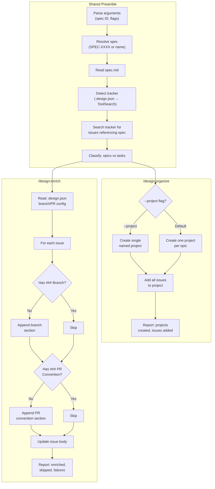
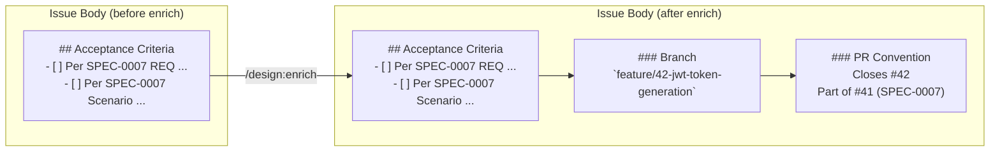
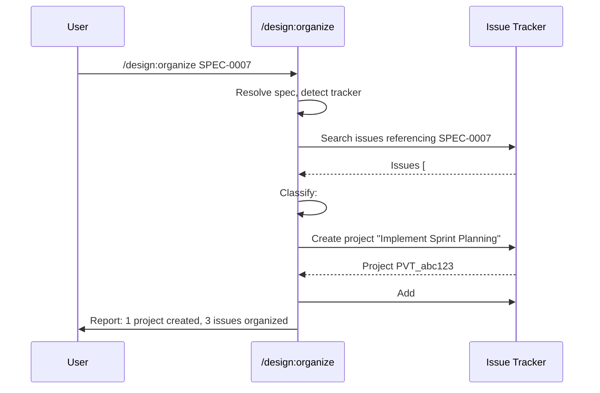
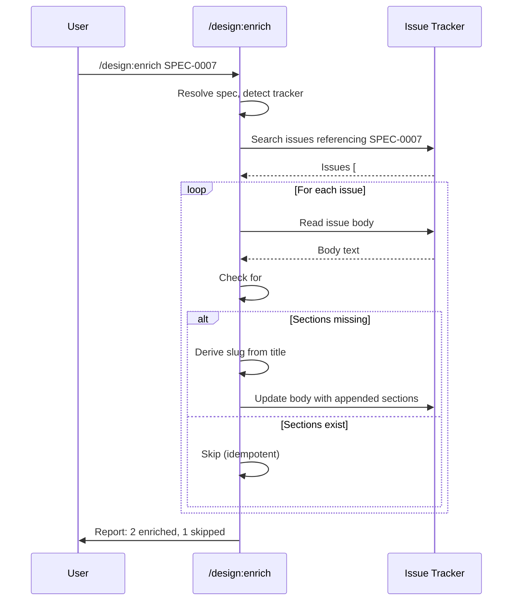

# Design: Retroactive Issue Management

## Context

ADR-0009 decided to add project grouping and developer workflow conventions (branch naming, PR close keywords) to the `/design:plan` skill, with opt-out flags. It also decided to create two separate retroactive skills -- `/design:organize` and `/design:enrich` -- for applying these conventions to issues that already exist. SPEC-0007 covers the forward-looking additions to `/design:plan`; this spec (SPEC-0008) covers the retroactive skills exclusively. See ADR-0009 and SPEC-0007.

## Goals / Non-Goals

### Goals
- Enable retroactive project grouping for issues created by prior `/design:plan` runs
- Enable retroactive branch naming and PR convention enrichment for existing issue bodies
- Share spec resolution and tracker detection logic with `/design:plan` for consistency
- Support dry-run previews so users can verify changes before applying them
- Be idempotent: safe to run multiple times without duplicating projects or sections
- Read `.design.json` for saved preferences to minimize re-prompting

### Non-Goals
- Re-creating issues (both skills operate on existing issues only)
- Modifying acceptance criteria or issue content beyond appending `### Branch` and `### PR Convention` sections
- Supporting `--review` mode (both are utility skills, not authoring skills)
- Syncing issue state back to spec artifacts
- Creating issues for requirements that lack corresponding tracker issues (use `/design:plan` instead)
- Supporting trackerless environments (both skills require a live tracker connection)

## Decisions

### Separate skills over combined skill

**Choice**: Two separate skills (`/design:organize` and `/design:enrich`) rather than a single `/design:workflow` or a mode flag on `/design:plan`.
**Rationale**: Organize and enrich operate on different tracker primitives. Organize creates projects and manages membership (no issue content changes). Enrich modifies issue bodies (no project operations). Their allowed-tools overlap but their concerns do not. A user may want to organize without enriching, or vice versa. Separate skills follow the plugin's single-purpose skill convention (see ADR-0003).
**Alternatives considered**:
- Combined `/design:workflow` skill with `--organize` and `--enrich` flags: Violates single-purpose convention; forces a large allowed-tools union; confusing invocation surface
- Flags on `/design:plan` (`--retroactive`): Overloads planning with a fundamentally different operation (modifying existing issues vs. creating new ones)

### Shared spec resolution and tracker detection

**Choice**: Reuse the same spec resolution (SPEC number or capability name) and tracker detection (`.design.json` → ToolSearch + CLI probing) flows from `/design:plan`.
**Rationale**: Users already understand these patterns from `/design:plan`. Consistency reduces cognitive load and ensures `.design.json` preferences work identically across all three skills. The duplication is in the SKILL.md instructions only -- there is no shared code to maintain.
**Alternatives considered**:
- Accept only SPEC numbers (not capability names): Inconsistent with `/design:plan`; users would have to look up the SPEC number
- Skip `.design.json` and always prompt: Adds friction; defeats the preference persistence from ADR-0008

### Issue discovery via tracker search

**Choice**: Search for issues containing the spec number (e.g., "SPEC-0007") in their body text using the tracker's native search API.
**Rationale**: Every issue created by `/design:plan` includes a spec reference in its body (per SPEC-0007, Requirement: Issue Creation Flow). Searching by spec number reliably discovers these issues. Tracker-native search is fast and requires no local state.
**Alternatives considered**:
- Maintain a local issue manifest in `.design.json`: Adds complexity; goes stale when issues are deleted or moved
- Search by label (e.g., `spec:SPEC-0007`): Not all trackers support structured labels; `/design:plan` does not currently set labels

### Epic classification heuristics

**Choice**: Classify issues as epics if their title starts with "Implement " or they have an `epic` label.
**Rationale**: `/design:plan` creates epics with titles following the pattern "Implement {Capability Title}" (SPEC-0007). The `epic` label provides a fallback for manually created epics or tracker-specific labeling conventions. These heuristics are simple, deterministic, and match the existing planning output.
**Alternatives considered**:
- Require an explicit `epic` label: Too strict; `/design:plan` doesn't currently add labels
- Use the tracker's native epic type (GitHub Projects item type, Jira epic issue type): Not all trackers distinguish epic types; adds tracker-specific branching to classification logic

### Two-pass enrichment (read then update)

**Choice**: For each issue, read the body first to check for existing sections, then update with appended content.
**Rationale**: Idempotency requires checking whether `### Branch` and `### PR Convention` sections already exist. Blindly appending would create duplicates. The two-pass approach (read body, check for sections, append if missing, write) is the simplest way to achieve idempotency.
**Alternatives considered**:
- Track enriched issues in `.design.json`: Adds local state that can go stale; the issue body is the source of truth
- Use a marker comment instead of section headers: Less readable; section headers serve as useful documentation for developers

## Architecture

## Risks / Trade-offs

- **Tracker search accuracy**: Searching issue bodies for "SPEC-XXXX" may return false positives if the spec number appears in unrelated contexts (e.g., comments referencing the spec). Mitigation: the spec number format is distinctive (`SPEC-` prefix with zero-padded digits); false positives are unlikely and harmless (the skill checks for epic/task classification before acting).
- **GitHub Projects V2 API complexity**: GitHub Projects V2 uses a GraphQL-only API with separate concepts for projects, items, and fields. The `gh project create` and `gh project item-add` CLI commands abstract most of this, but edge cases (organization vs. user projects, project visibility) may require additional handling. Mitigation: use `ToolSearch` to discover MCP tools first; fall back to CLI; graceful failure on project creation errors.
- **Rate limiting during enrichment**: Enriching many issues involves one read and one write API call per issue. For large specs with 20+ tasks, this could hit rate limits. Mitigation: the skill processes issues sequentially; individual failures are reported and skipped without blocking the rest.
- **Issue body format assumptions**: The enrichment skill assumes issue bodies are markdown and that appending `### Branch` sections at the end is appropriate. If trackers use different body formats (e.g., Jira's wiki markup), the appended content may not render correctly. Mitigation: the `### Branch` and `### PR Convention` sections use simple markdown that renders acceptably in most contexts.
- **Stale `.design.json` project IDs**: If a project is deleted from the tracker but its ID remains cached in `.design.json`, the organize skill will attempt to reuse it and fail. Mitigation: the skill handles project-not-found errors gracefully and falls back to creating a new project.
- **Epic classification heuristics may miss custom epics**: The "Implement " title prefix and `epic` label heuristics may not catch epics created with different naming conventions. Mitigation: these heuristics match `/design:plan`'s output; manually created epics would need to follow the convention or be labeled.

## Open Questions

- Should `/design:organize` support linking tasks to epics within a project (e.g., GitHub Projects V2 parent-child relationships) or just add all items flat?
- Should `/design:enrich` offer to create the branch in git (not just document it in the issue body)?
- Should there be a combined `/design:organize --enrich` shorthand to run both in sequence?
- When `/design:plan` creates issues with branch/PR sections (per SPEC-0007 updates), should `/design:enrich` detect and respect those as already-enriched?
