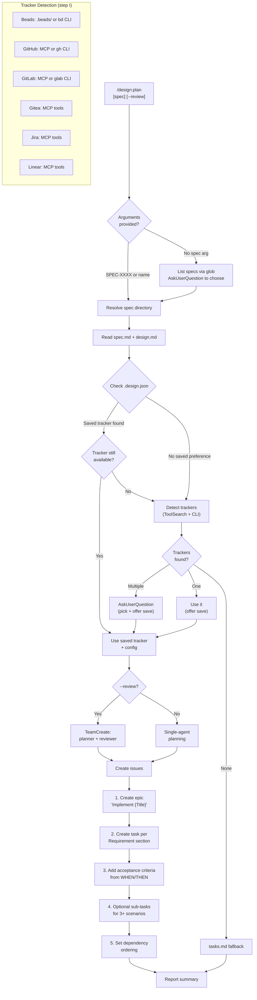
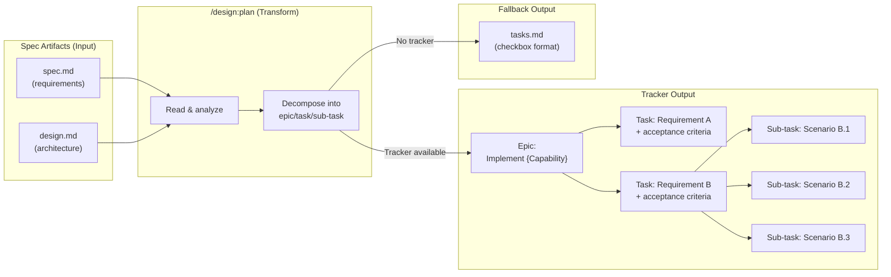
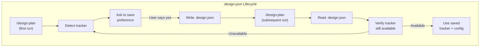

# Design: Sprint Planning

## Context

Sprint planning was previously embedded as step 8 of the `/design:spec` skill, which limited it to planning only during spec creation and supported only three trackers (Beads, GitHub, Gitea). Users with existing specs had no way to generate work items, and users with GitLab, Jira, or Linear were excluded. ADR-0008 decided to extract sprint planning into a standalone `/design:plan` skill with broader tracker support, preference persistence, and a clean separation from spec authoring. See ADR-0008 and SPEC-0007.

## Goals / Non-Goals

### Goals
- Enable sprint planning for any existing spec, not just newly created ones
- Support six issue trackers (Beads, GitHub, GitLab, Gitea, Jira, Linear) with runtime detection
- Persist tracker preferences and configuration to `.design.json` to avoid repeated prompts
- Decompose spec requirements into an epic/task/sub-task hierarchy with traceability
- Fall back to `tasks.md` generation (SPEC-0006) when no tracker is available
- Support `--review` mode for team-based plan review

### Non-Goals
- Replacing or modifying the spec authoring workflow (`/design:spec`)
- Syncing issues back to spec artifacts when tracker state changes
- Supporting tracker-specific features beyond issue creation (boards, sprints, labels)
- Implementing `--gaps` or `--analyze` modes (documented as future considerations)
- Tracking issue completion status from within the plugin

## Decisions

### Standalone skill over spec extension

**Choice**: Create `/design:plan` as its own skill rather than extending `/design:spec` with a `--plan` flag.
**Rationale**: Spec authoring and sprint planning are fundamentally different activities: one produces requirements and design documents, the other produces trackable work items. Coupling them forces users to invoke the spec workflow just to re-plan, and it bloats the spec skill's allowed-tools list with tracker-related tools. A standalone skill has a focused responsibility and can evolve independently.
**Alternatives considered**:
- Extend `/design:spec` with `--plan` flag: Overloads the spec skill; confusing argument semantics
- Generic `/design:execute` skill: Too broad; bundles unrelated modes under a vague name

### Runtime tracker detection via ToolSearch

**Choice**: Use `ToolSearch` at runtime to probe for MCP tool servers, supplemented by CLI availability checks (`gh --version`, `glab --version`, `bd --version`).
**Rationale**: MCP tool availability is dynamic -- users may add or remove tool servers between sessions. Static configuration would go stale. ToolSearch discovers what is actually available at invocation time, and CLI fallbacks cover tools that expose a command-line interface without MCP.
**Alternatives considered**:
- Static tracker configuration in plugin.json: Goes stale; cannot adapt to environment changes
- Require user to specify tracker on every invocation: Adds friction; ignores detectable information

### Preference persistence to `.design.json`

**Choice**: Store tracker choice and configuration in a `.design.json` file at the project root. The skill checks this file before running detection.
**Rationale**: Most projects consistently use one tracker. Asking the user to confirm their tracker on every invocation is unnecessary friction. A project-root JSON file is version-controllable, shareable with teammates, and inspectable without special tooling. The merge-on-write approach (`tracker` and `tracker_config` keys only) avoids clobbering other potential keys.
**Alternatives considered**:
- In-memory preference (per-session): Lost between sessions; no benefit for returning users
- Environment variable: Not version-controllable; not shareable across team members
- Store in CLAUDE.md: Mixes tooling config with human-readable instructions

### Epic-to-task-to-sub-task hierarchy

**Choice**: Create an epic for the overall spec, tasks for each `### Requirement:` section, and optional sub-tasks for complex requirements with 3+ scenarios.
**Rationale**: This mirrors the spec's structure directly: the spec is the epic, requirements are tasks, and scenarios are potential sub-tasks. The mapping provides traceability between spec artifacts and tracker issues. Sub-tasks are optional to avoid over-decomposition for simple requirements.
**Alternatives considered**:
- Flat task list (no epic): Loses grouping and spec-level context
- One task per scenario: Too granular; floods the tracker with small issues
- Custom hierarchy based on design.md architecture: Harder to trace back to spec requirements

### Acceptance criteria from WHEN/THEN scenarios

**Choice**: Derive acceptance criteria directly from the spec's WHEN/THEN scenarios, formatted as checkboxes with spec references.
**Rationale**: The spec already defines verifiable behavior through its scenarios. Translating these directly into acceptance criteria ensures issues are testable against the spec, not against invented criteria. The `Per SPEC-XXXX Scenario "Name"` format maintains traceability.
**Alternatives considered**:
- Free-form acceptance criteria: Loses traceability to spec; may drift from actual requirements
- Link to spec without extracting criteria: Forces developers to read the full spec for each task

## Architecture

## Risks / Trade-offs

- **Tracker API variability**: Each of the six trackers has different APIs, terminology (epic vs. initiative vs. project), and capabilities. Mitigation: the skill uses `ToolSearch` to discover available operations at runtime rather than assuming a fixed API; the SKILL.md provides tracker-specific guidance for config gathering.
- **Stale preferences**: If a user switches trackers (e.g., migrates from GitHub to Jira), the saved preference in `.design.json` will be wrong. Mitigation: the skill validates that the saved tracker is still available and warns + falls through to detection if not.
- **Over-decomposition**: Breaking every requirement into tasks and every complex requirement into sub-tasks could flood the tracker. Mitigation: sub-tasks are only created for requirements with 3+ scenarios; the review mode (`--review`) provides a check against over-decomposition.
- **Spec drift**: If the spec changes after planning, the created issues may not reflect the current requirements. Mitigation: the skill does not track previously created issues; the proposed `--gaps` mode (future) would address this by comparing spec requirements against implementation and existing issues.
- **MCP tool naming instability**: ToolSearch patterns like `mcp__*github*` depend on MCP server naming conventions that could change. Mitigation: CLI fallbacks (`gh`, `glab`, `bd`) provide a secondary detection path; patterns are broad enough to match common naming variations.

## Migration Plan

1. The `/design:spec` SKILL.md's step 8 (sprint planning) should be replaced with a note directing users to `/design:plan` for sprint planning after spec creation.
2. No data migration is needed -- existing specs are fully compatible since `/design:plan` reads the same `spec.md` and `design.md` format.
3. The `tasks.md` fallback behavior is unchanged from SPEC-0006; it now lives in the plan skill instead of the spec skill.

## Open Questions

- Should `/design:plan` detect and skip requirements that already have corresponding issues in the tracker (idempotent re-planning)?
- Should the skill support partial planning (e.g., plan only requirements that match a filter or tag)?
- When `--gaps` mode is implemented, should it compare against tracker issues, `tasks.md`, or both?
- Should the planning report include estimated effort or complexity scores derived from the spec's scenario count?
