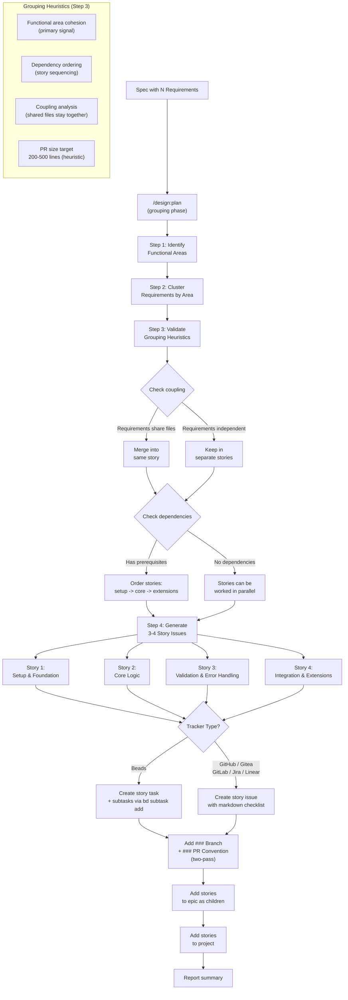
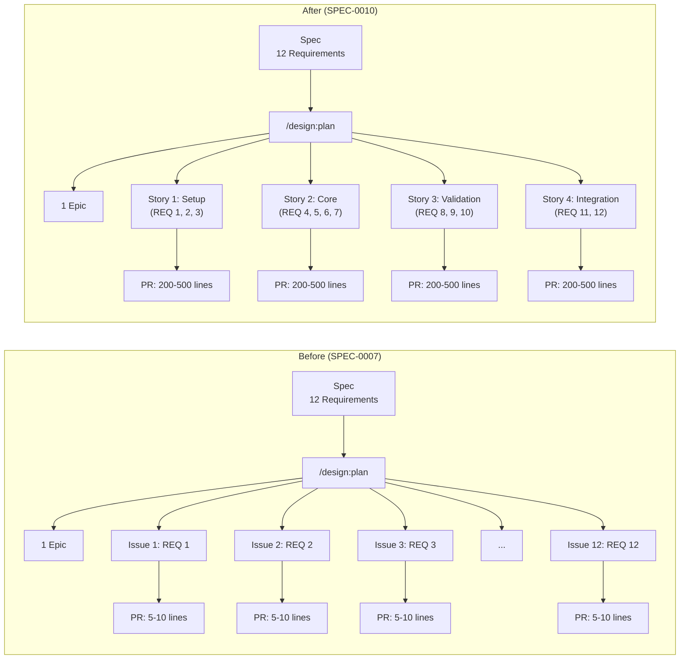
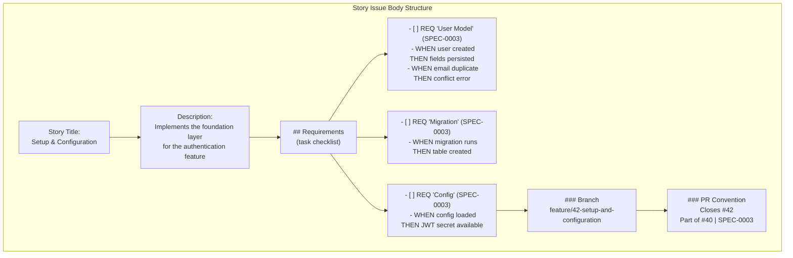

# Design: Story-Sized Issue Granularity

## Context

The `/design:plan` skill (ADR-0008, SPEC-0007) currently creates one tracker issue per `### Requirement:` section in a spec. For a typical spec with 10-15 requirements, this produces 10-15 issues that each map to a single narrow requirement. When `/design:work` picks up these issues and creates PRs, the result is 10-15 tiny pull requests averaging 5-10 lines of code each. This over-fragmentation causes code review overhead (reviewers context-switch across many small PRs), integration risk (coupled requirements on separate branches create merge conflicts), tracker noise (10-15 issues per spec flood the backlog), and worker underutilization (agents spend more time on git operations than implementation). ADR-0011 decided to change the granularity from per-requirement to per-story, grouping related requirements into 3-4 story-sized issues that target PRs in the 200-500 line range. See ADR-0011 and SPEC-0010.

## Goals / Non-Goals

### Goals
- Group spec requirements into 3-4 story-sized issues by functional area instead of creating one issue per requirement
- Target PRs in the 200-500 line range for optimal review quality
- Preserve full traceability from individual requirements to their implementing story via task checklists
- Support all six trackers with native features: Beads subtasks, markdown checklists for GitHub/Gitea/GitLab/Jira/Linear
- Maintain backward compatibility for tracker detection, preference persistence, project grouping, PR conventions, and all existing flags
- Ensure story issues are consumable by `/design:work` and `/design:review` without modifications to those skills

### Non-Goals
- Implementing a deterministic grouping algorithm -- grouping uses AI judgement and may vary between runs
- Enforcing the 200-500 line target as a hard constraint -- functional cohesion takes priority
- Changing the epic structure -- one epic per spec is preserved
- Modifying `/design:work` or `/design:review` skill logic -- stories are structurally compatible with existing consumption patterns
- Adding new `.design.json` keys or flags -- story-sized grouping is the new default behavior, not an opt-in feature
- Providing a way to override the grouping (e.g., a `--per-requirement` flag to restore old behavior)

## Decisions

### Grouping by functional area cohesion

**Choice**: Group requirements into stories based on the functional area of the system they affect, using AI judgement rather than a deterministic algorithm.
**Rationale**: Spec requirements naturally cluster by functional area (e.g., data model, API, validation, configuration). These clusters correspond to the files and modules that will be modified, so grouping by functional area minimizes merge conflicts between parallel workers and gives reviewers a coherent unit of change. A deterministic algorithm (e.g., group every N requirements) would ignore these natural boundaries and produce stories that mix unrelated concerns.
**Alternatives considered**:
- Fixed-count grouping (every 3-4 requirements per story): Ignores functional boundaries; may split coupled requirements across stories
- Dependency-graph-based grouping: Over-engineered for this use case; dependency ordering is handled separately as story sequencing
- User-defined grouping via config: Adds complexity; the AI's judgement is sufficient and users can adjust by editing stories after creation

### Target 3-4 stories per typical spec

**Choice**: Aim for 3-4 stories for a typical spec with 10-15 requirements, scaling down to 1-2 stories for smaller specs.
**Rationale**: 3-4 stories with 3-5 requirements each produces PRs in the 200-500 line range that research consistently shows maximizes review quality. Fewer stories (1-2) would produce oversized PRs that are hard to review in one sitting. More stories (5+) would recreate the fragmentation problem this change aims to solve.
**Alternatives considered**:
- 2 stories per spec: PRs too large (500-1000 lines), harder to review
- 5-7 stories per spec: Still fragmented; marginal improvement over per-requirement issues
- Dynamic target based on line-count estimation: Over-engineered; the 3-4 story heuristic works well in practice

### Task checklists over sub-issues

**Choice**: Use task checklists in story bodies (markdown checkboxes for most trackers, Beads subtasks) rather than creating child issues for each requirement within a story.
**Rationale**: The purpose of story-sized grouping is to reduce tracker noise. Creating child issues for each requirement would restore the 10-15 issue count that this change aims to eliminate. Task checklists provide requirement traceability within the story body without polluting the tracker board. Beads is an exception because its native subtask feature provides structured tracking without board clutter.
**Alternatives considered**:
- Sub-issues for every requirement: Restores the tracker noise problem; defeats the purpose of grouping
- No traceability (just story description): Loses the mapping from individual requirements to implementation
- External traceability doc: Adds a maintenance burden; checklists in the issue body are self-contained

### PR size as heuristic, not constraint

**Choice**: The 200-500 line target is a guiding heuristic. Functional cohesion always takes priority.
**Rationale**: Some functional areas naturally produce more or fewer lines of code. A "setup" story with configuration and data model requirements might produce 100 lines, while a "core logic" story might produce 600 lines. Splitting the core logic story to meet the 500-line cap would break functional cohesion and create the same review context problems that per-requirement issues cause. The heuristic guides the initial grouping, but the AI should not artificially split or merge stories to hit the target.
**Alternatives considered**:
- Hard 500-line cap with automatic splitting: Would break functional cohesion for large requirements
- No line-count guidance at all: Would remove a useful signal for how many stories to create
- Per-requirement line estimation before grouping: Over-engineered; the AI can estimate holistically

### Beads subtasks vs. markdown checklists

**Choice**: Use Beads native subtasks (`bd subtask add`) for requirement tracking within stories, while all other trackers use markdown task checklists.
**Rationale**: Beads has first-class subtask support that provides structured tracking (individual status, completion tracking) without creating separate issues on the board. This is strictly better than markdown checklists for Beads users. GitHub, Gitea, GitLab, Jira, and Linear do not have an equivalent lightweight sub-task mechanism that avoids board clutter, so markdown checklists are the best option.
**Alternatives considered**:
- Markdown checklists for all trackers including Beads: Ignores Beads' superior native feature
- Native sub-issues for GitHub/Jira/Linear where available: Creates the board clutter that story grouping aims to eliminate

### No new flags or configuration

**Choice**: Story-sized grouping is the new default behavior. There is no `--per-requirement` flag to restore old behavior and no new `.design.json` keys.
**Rationale**: The per-requirement behavior is strictly worse -- it produces tiny PRs, creates tracker noise, and underutilizes workers. There is no use case where a user would prefer 10-15 five-line PRs over 3-4 reviewable PRs. Adding a flag to restore inferior behavior adds complexity without value.
**Alternatives considered**:
- `--per-requirement` flag for backward compatibility: No one wants the old behavior; the flag would never be used
- `--stories N` flag to control story count: Over-engineered; the AI's judgement is sufficient

## Architecture

## Risks / Trade-offs

- **Grouping subjectivity**: The AI makes judgement calls about which requirements belong together. Different runs may produce different groupings for the same spec. Mitigation: the heuristics (functional area cohesion, coupling analysis, dependency ordering) provide consistent guiding principles. The `--review` mode allows a reviewer agent to validate groupings. In practice, the natural functional boundaries in most specs produce stable, predictable groupings.

- **Single story failure blocks multiple requirements**: If a story is blocked (e.g., tests fail, implementation stuck), all of its constituent requirements are blocked. With per-requirement issues, other requirements could proceed independently. Mitigation: stories are grouped by functional area, so a blocked story typically means the entire functional area is blocked -- independent requirements in other stories can still proceed. The 3-4 story structure limits the blast radius compared to a single-epic approach.

- **Task checklists lack structured metadata**: Markdown checkboxes cannot have individual assignees, labels, due dates, or status beyond checked/unchecked. This is less structured than per-requirement tracker issues. Mitigation: the trade-off is deliberate -- the goal is to reduce tracker noise. For teams that need per-requirement tracking, the Beads subtask path provides structured metadata. For other trackers, the checklist provides sufficient traceability for most workflows.

- **Downstream skill assumptions**: `/design:work` and `/design:review` were designed for per-requirement issues. Story issues are structurally larger (more requirements per issue, larger PRs). Mitigation: both skills consume issues based on structural sections (`### Branch`, `### PR Convention`, acceptance criteria) that are preserved in story issues. Workers implement all requirements in the checklist and create one PR. Reviewers evaluate the PR against all checklist items. No core logic changes are needed.

- **Small specs produce trivially few stories**: A spec with 2-3 requirements produces 1 story, which is functionally identical to the per-requirement approach. Mitigation: this is acceptable. The optimization targets typical specs with 10-15 requirements. Small specs do not suffer from the over-fragmentation problem.

- **Large requirements may exceed PR size target**: A single requirement that produces 500+ lines of code will result in a story that exceeds the target range, even if it is the only requirement in its story. Mitigation: the PR size target is a heuristic, not a constraint. Functional cohesion takes priority. The story may include a note that the PR will exceed the typical size.

## Migration Plan

1. **Update `/design:plan` SKILL.md**: Replace step 5.2 ("Create tasks from requirements") with the new story-grouping logic. The epic creation (step 5.1), acceptance criteria format (step 5.3), dependency ordering (step 5.4), project grouping (step 5.6), and branch/PR enrichment steps are unchanged.

2. **Modify task creation to story creation**: Instead of iterating over each `### Requirement:` section and creating one issue per requirement, the skill now:
   - Scans all requirements and identifies functional areas
   - Clusters requirements into 3-4 stories
   - Creates one issue per story with a task checklist in the body
   - For Beads, creates subtasks instead of checklist items

3. **Update acceptance criteria format**: The per-issue acceptance criteria section from SPEC-0007 is replaced by the task checklist format. Each checklist item includes the requirement name, spec reference, normative statement, and WHEN/THEN scenarios.

4. **Preserve branch and PR convention sections**: These sections now reference the story issue number instead of the per-requirement issue number. No format changes are needed.

5. **Update the review protocol**: When `--review` is used, the reviewer additionally checks that story groupings are functionally cohesive and that every requirement appears in exactly one story.

6. **No data migration needed**: Existing issues created by prior `/design:plan` runs are unaffected. The change only affects future planning runs. Existing per-requirement issues are still consumable by `/design:work`.

## Open Questions

- Should the skill provide a way to preview the proposed grouping before creating issues (e.g., a `--dry-run` that shows the grouping without creating anything)?
- When `/design:plan` is run with `--review`, should the reviewer specifically validate that coupled requirements (shared files) are in the same story?
- Should the task checklist include all WHEN/THEN scenarios from the requirement, or only the key scenarios (e.g., top 2-3)?
- For Beads, should subtask completion automatically update the parent story's status?
