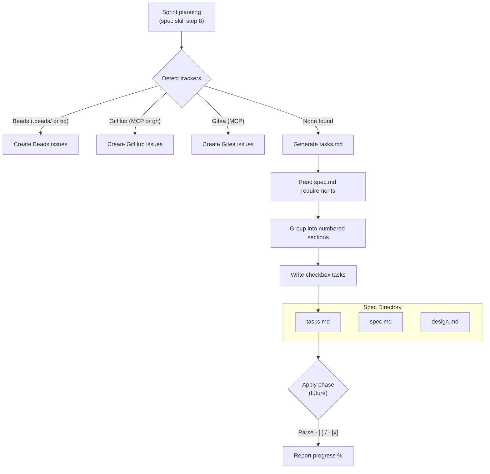

# Design: Tasks.md Fallback for Trackerless Projects

## Context

The `/design:spec` skill's sprint planning step (step 8 in SKILL.md) detects issue trackers in priority order: Beads, GitHub, Gitea. When none are found, the current behavior is to "output the sprint plan as a structured markdown table instead" — ephemeral output lost when the conversation ends. ADR-0007 decided to generate a durable `tasks.md` artifact instead, co-located with the spec's existing `spec.md` and `design.md`. See ADR-0007 and SPEC-0003.

## Goals / Non-Goals

### Goals
- Provide durable task tracking for projects without external issue trackers
- Generate machine-parseable checkbox format that downstream tooling can consume
- Maintain co-location with governing spec artifacts
- Derive tasks from spec requirements for traceability

### Non-Goals
- Replacing external issue trackers when they're available
- Supporting task metadata beyond checkbox state (assignees, labels, milestones)
- Project-wide task aggregation across multiple specs
- Building a standalone apply/progress-tracking tool (that's a separate capability)

## Decisions

### Co-located artifact over project-root file

**Choice**: Place `tasks.md` in `docs/openspec/specs/{capability-name}/` alongside `spec.md` and `design.md`.
**Rationale**: Maintains the openspec co-location principle — one directory tells the full story of a capability. A project-root `TASKS.md` would break traceability and create merge conflicts when multiple specs generate tasks.
**Alternatives considered**:
- Project-root `TASKS.md`: Fragments traceability; merge conflicts across specs
- No file (status quo markdown table): Ephemeral; no progress tracking possible

### Checkbox format over structured YAML/JSON

**Choice**: Markdown checkboxes (`- [ ]` / `- [x]`) with `X.Y` numbering.
**Rationale**: Universally understood, git-diffable, renderable by any markdown viewer, and trivially parseable with a regex. YAML/JSON would add tooling requirements and reduce human readability.
**Alternatives considered**:
- YAML task list: Machine-friendly but human-hostile for quick scanning
- JSON task array: Same issues as YAML plus no rendering in markdown viewers
- GitHub-flavored task lists without numbering: Loses section structure and ordering

### Conditional generation (only when no tracker found)

**Choice**: Generate `tasks.md` ONLY when no issue tracker is detected. Do not generate it alongside tracker-created issues.
**Rationale**: Avoids duplication. When a tracker exists, tasks live in the tracker. When none exists, tasks live in `tasks.md`. Never both.
**Alternatives considered**:
- Always generate `tasks.md` as a summary: Creates drift between tracker state and file state
- Generate and sync bidirectionally: Over-engineered for the fallback use case

## Architecture

## Risks / Trade-offs

- **Fragmented visibility**: Tasks scoped per-spec means no single view across all specs. Mitigation: `/design:list` or `/design:audit` could be extended to scan `tasks.md` files and aggregate status.
- **Manual completion tracking**: Checkboxes must be toggled manually (or by an agent). Mitigation: an apply-phase skill could auto-mark tasks as it implements them.
- **Staleness**: If the spec changes after `tasks.md` is generated, tasks may drift. Mitigation: `/design:check` could compare `tasks.md` against `spec.md` requirements.

## Migration Plan

1. Update the `/design:spec` SKILL.md to replace the markdown table fallback (step 8, "none found" branch) with `tasks.md` generation
2. Add `tasks.md` template documentation to the skill instructions
3. No breaking changes — existing specs without `tasks.md` are unaffected

## Open Questions

- Should `/design:check` validate `tasks.md` alignment with `spec.md` requirements?
- Should `/design:list` include task completion percentages when `tasks.md` files exist?
- Should the apply phase be a separate skill (`/design:apply`) or integrated into existing workflows?
